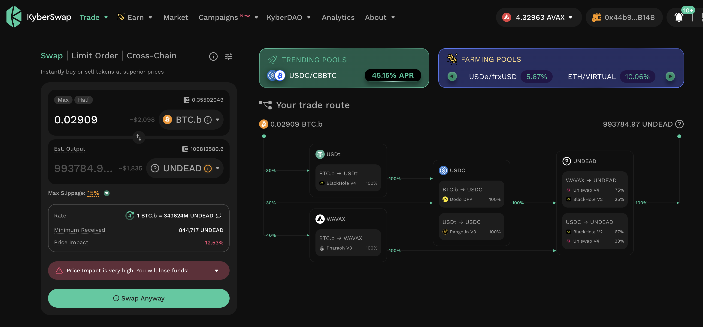
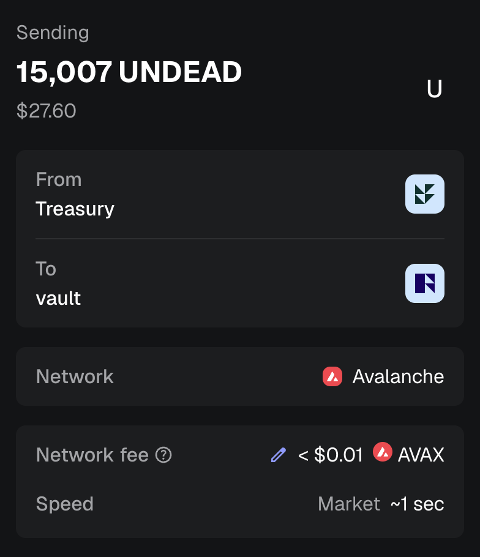
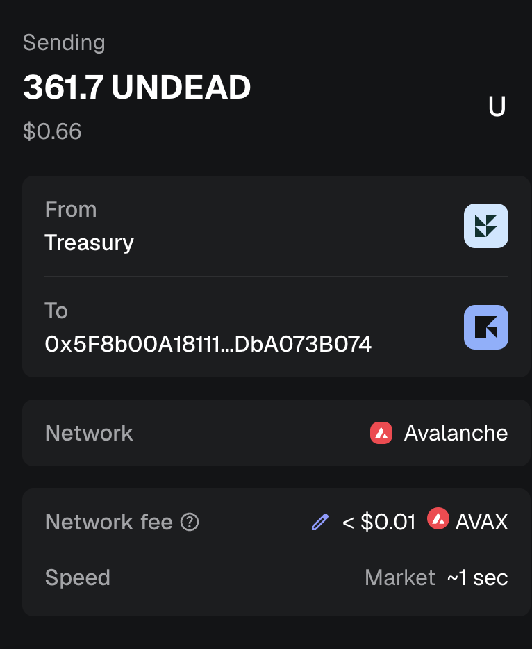
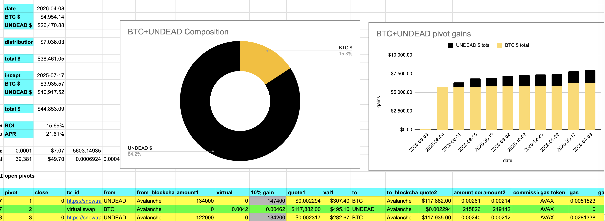
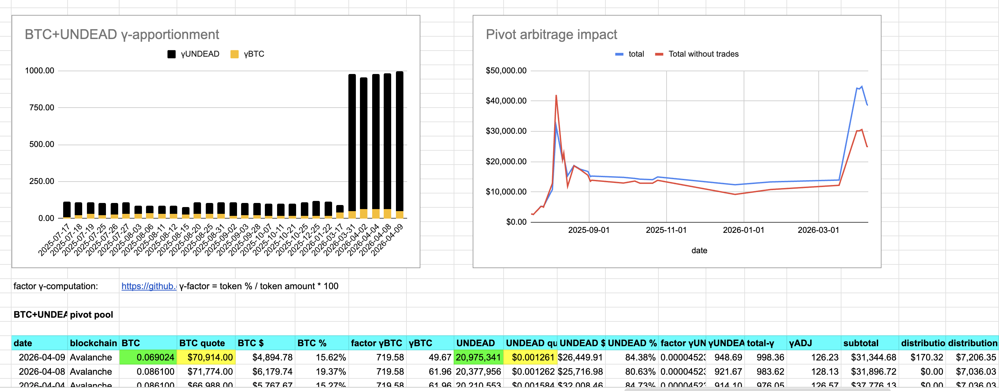
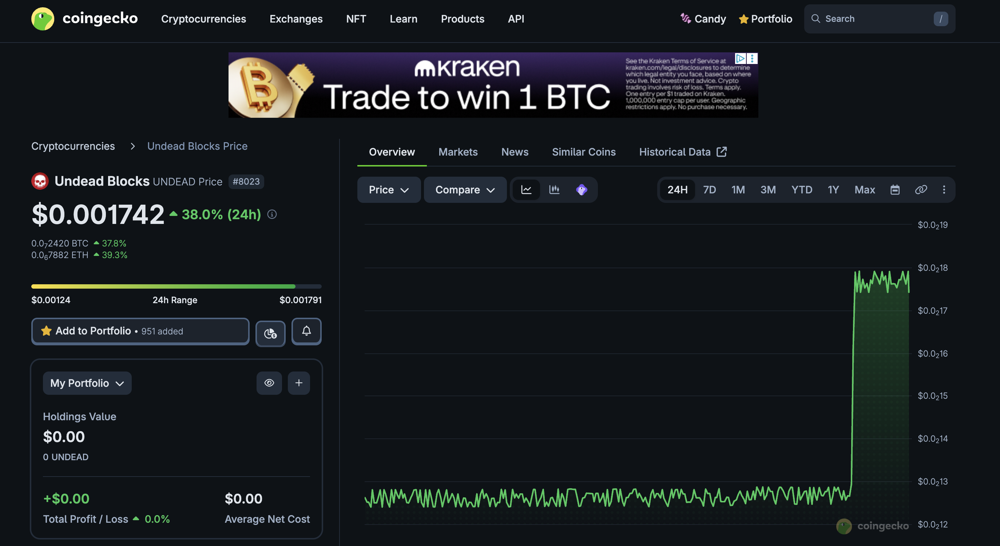

# PIVOTS

G'day, pivoteurs

## BTC+UNDEAD

I close a UNDEAD-on-BTC pivot close of

0.02909 $BTC -> 990k $UNDEAD

for gains of: 

* actual ROI: 15.30% / 82.96% APR projected 💥💥💥

I distribute or reinvest gains to stakers. 

Today is starting well!

### Open pivots

I open a BTC-on-UNDEAD pivot and an UNDEAD-on-BTC hedge. 

The BTC+UNDEAD pivot pool composition and apportionment are as charted. 

# UNDEAD

In other news:

It looks like somebody got interested in $UNDEAD. 

# `dusk`

The `dusk`-reports, which recommend which pivots to close, is now in the 
pipeline for automation and the daily reports are now being reposed on github.

Because of the 50% price-increase for $UNDEAD most of the recommendations for 
today we had to pass on.
