# Distributions

G'day, pivoteurs!

Now that we did a close pivot/open pivot end-to-end on BTC+UNDEAD, today, 
let's distribute gains from the [AVAX+UNDEAD close pivot on 
2026-03-31](https://x.com/pivocateur/status/2038995015226077330) and open 
new pivots on that pivot pool, ... cleaning up, as it were.

# Automation

Before I could get to distributions, however, I did some β-testing work with 
the dev-team for the UX, and I worked with @ParisBrand32180 where he 
automated `dusk` that makes close-pivot calls (now automated) and put that 
work into our testing framework.

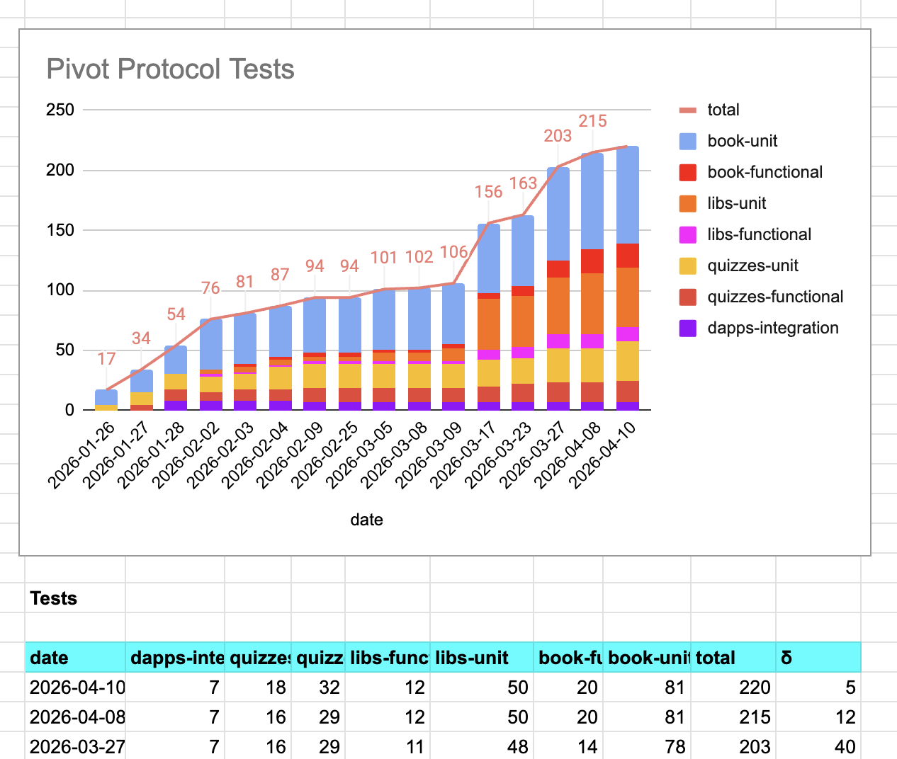
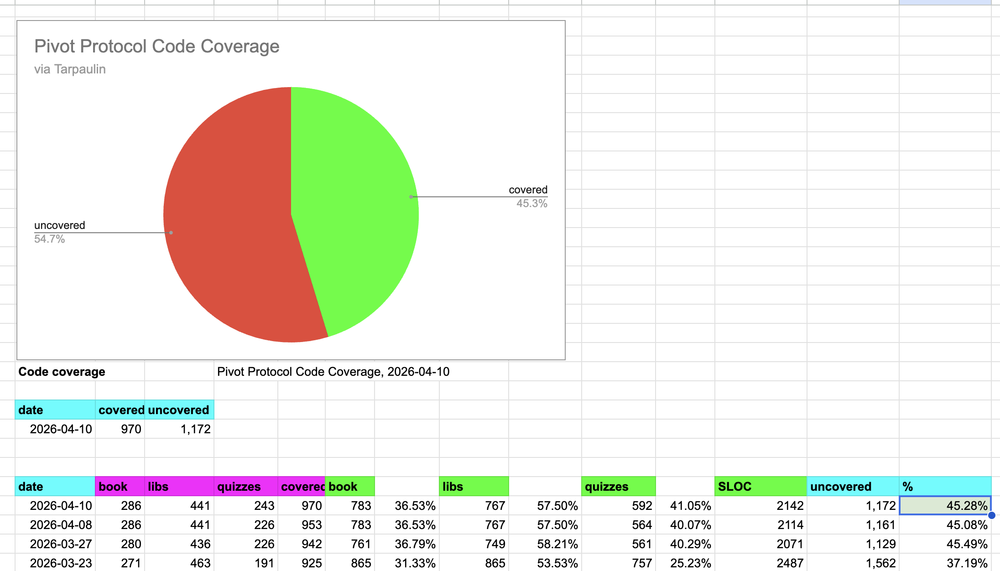

Automation: ...UP!

# AVAX+UNDEAD

## Distributions

Okay!

I finally got to distribute the gains and move some $UNDEAD to the $UNDEAD 
vault.

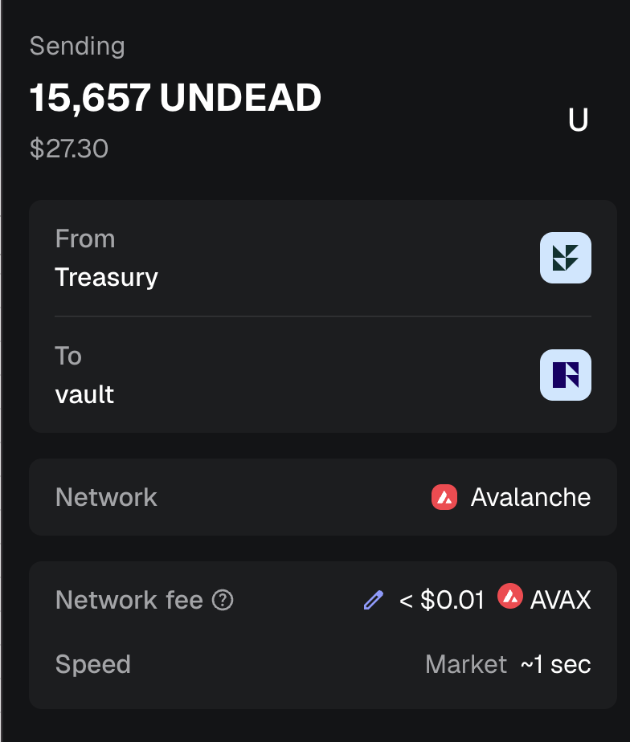
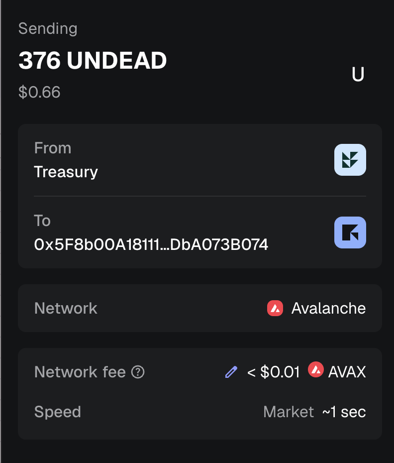

Funny thing: the pivot made the gains when $UNDEAD was $0.0012; $UNDEAD is now 
trading at $0.0017, up 50%, turning a $250-gain to a $275-one, which is nice. 

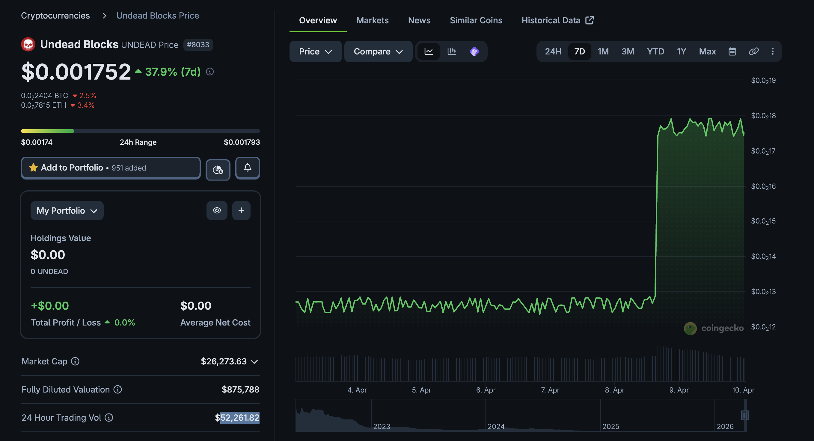

## New Pivots

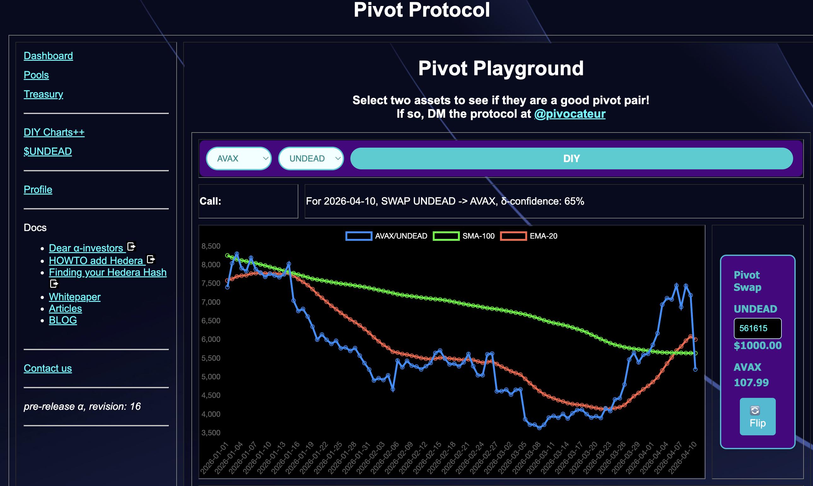
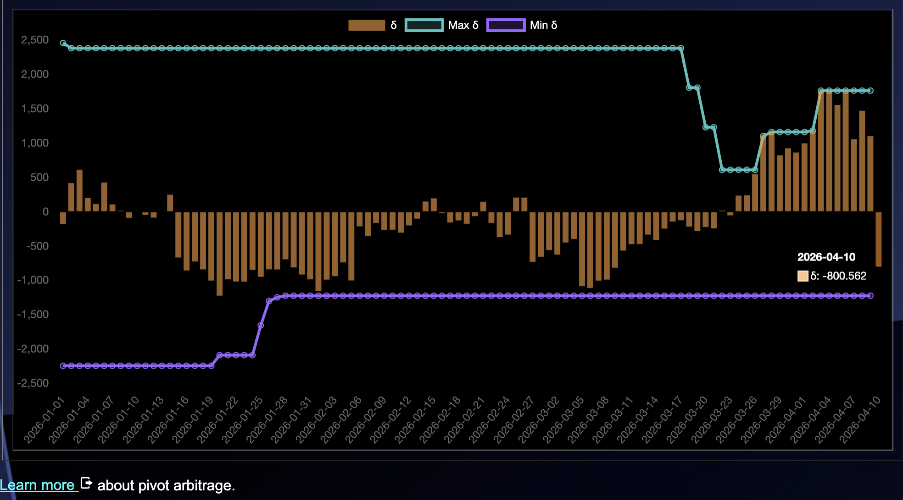

As the delta favors an UNDEAD-on-AVAX pivot, 

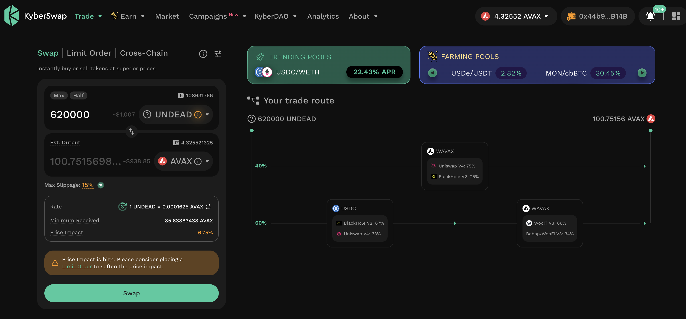
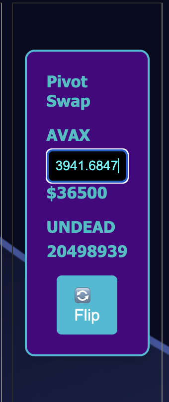

I open new pivot and also an AVAX-on-UNDEAD hedge.

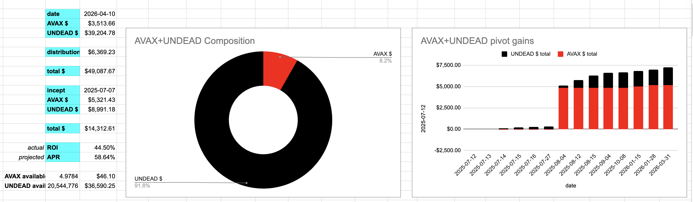
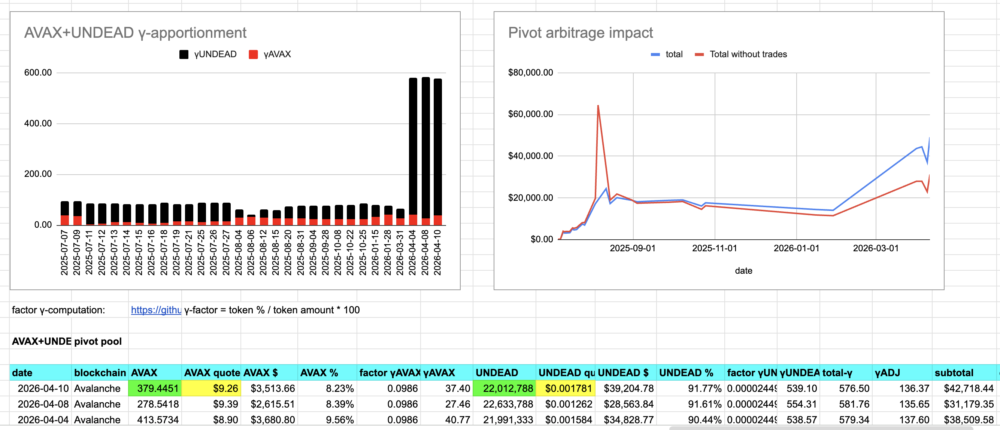

The AVAX+UNDEAD pivot pool composition and apportionment are as charted.
