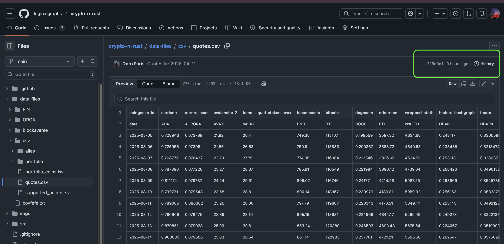
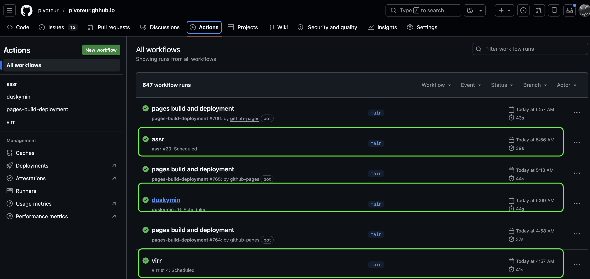
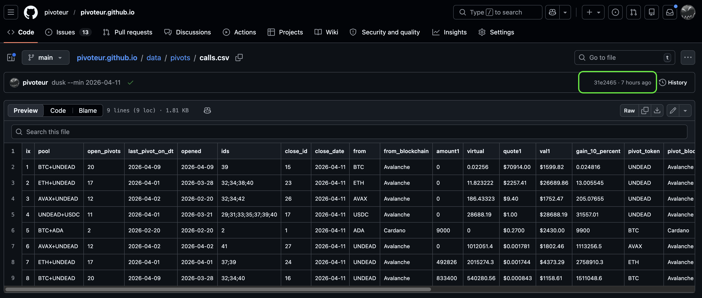

# Automation

G'day, pivoteurs

Today we have 4 automations going, thanks to the research and development by 
@ParisBrand32180.

## `quotes`

First is `quotes`: it fetches the quotes daily and reposes them in github, so 
you can do your own analytics.

You can [use the reposed 
quotes](https://raw.githubusercontent.com/logicalgraphs/crypto-n-rust/refs/heads/main/data-files/csv/quotes.csv).

## Protocol O&M

The next three automations are related to protocol operations and maintenance. 

They are:

* `assets` that compute procotol asset TVLs
* `virtsz` that recomputes all virtual pivots; and,
* `dusk` that makes close pivot calls

Each component is building toward an automated protocol

