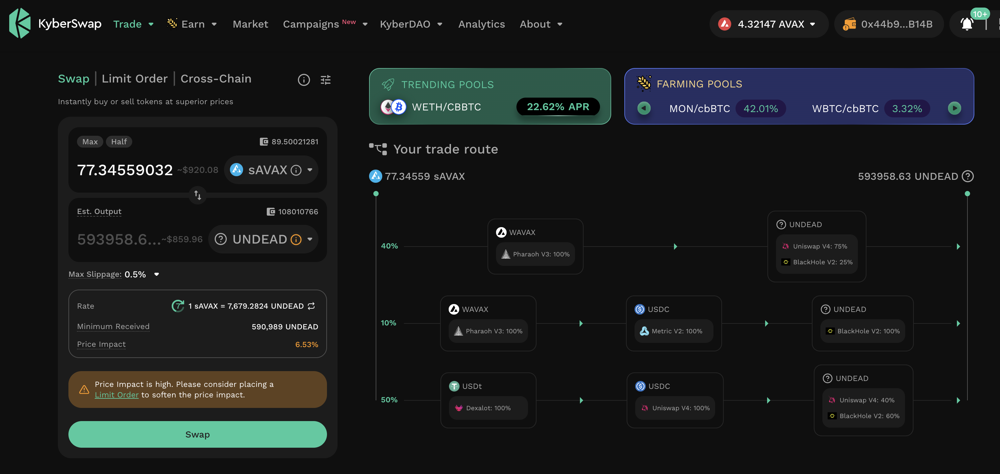
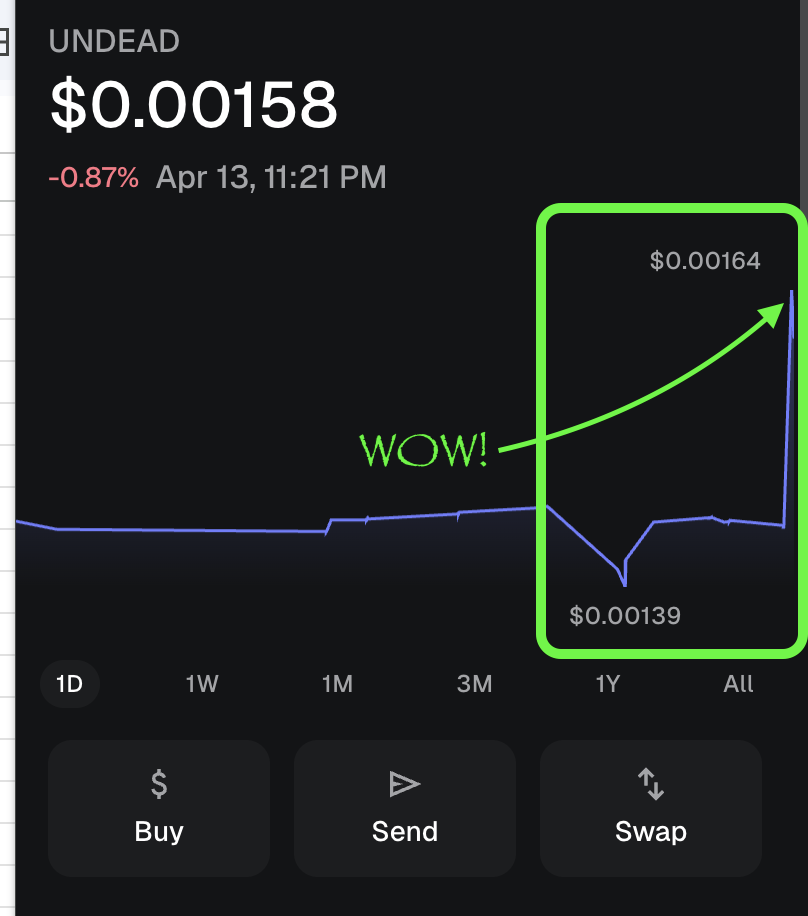
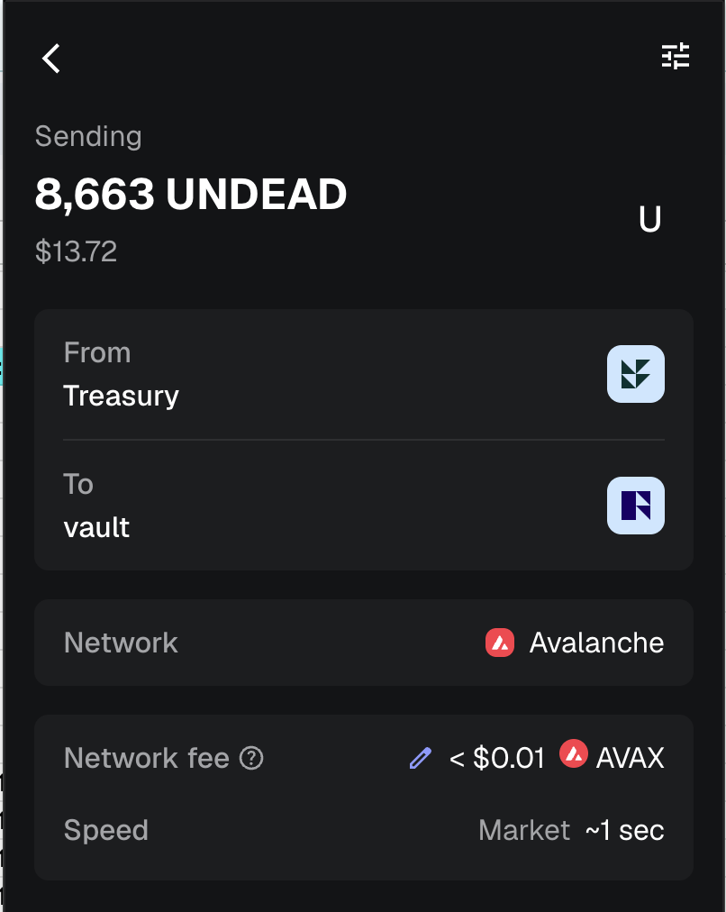
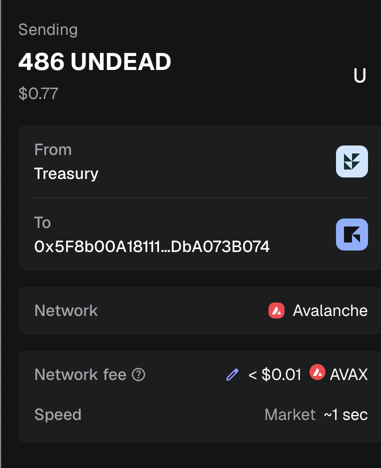
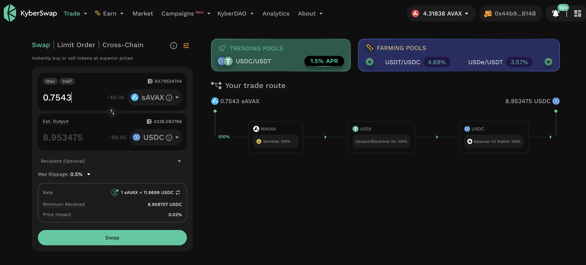
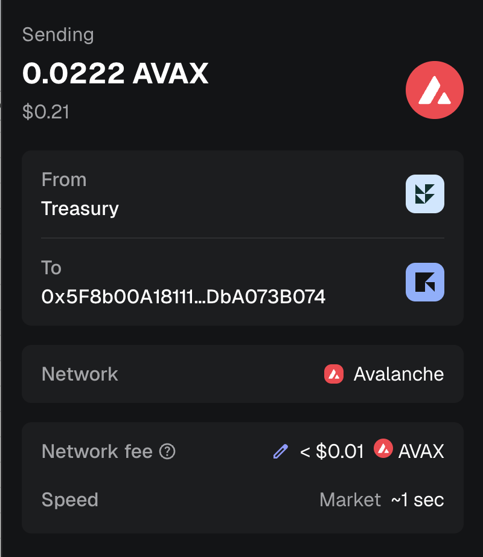

# PIVOTS

G'day, pivoteurs!

Because of the `virtsz`, automated behind the scenes, setting up virtual 
pivots, `dusk`, today, recommends we close $80k-worth of pivots! WOW!

Some are viable; some are not.

Let's see what we can do with these calls, recommended by `dusk`.

## AVAX+UNDEAD

We strike iron, ... or should I say: "We strike $UNDEAD," ... on our first 
close pivot.

### UNDEAD-on-AVAX close pivot

* actual ROI: 17.12% / 568.09% APR projected
* 506026 $UNDEAD -> $AVAX -> 592659 $UNDEAD 💥

## UNDEAD

Of note, this close-pivot caused $UNDEAD's price to appreciate 20% (from 
$0.0014 to $0.0016).

As more and more pivots come online (when we are fully automated), the Pivot 
protocol will continue to impact $UNDEAD's price: that's what pivot arbitrage 
is. 

#### Distribute gains

I move some of the $UNDEAD-gains to the $UNDEAD vault, and I distribute or 
reinvest the pivot-gains. 

### AVAX-on-UNDEAD

Interestingly, the close-pivot the other way (AVAX-on-UNDEAD) works, as well.

* actual ROI: 10.18% / 22.70% APR projected
* 93.2 $AVAX -> $UNDEAD -> 102.7 $AVAX

I swap some of the gains to $USDC for protocol-maintenance and distribution 
and reinvest the rest of the gains. 

