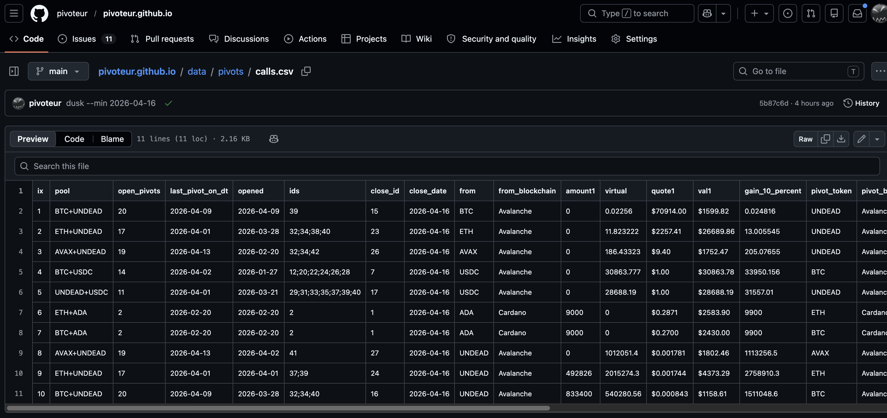
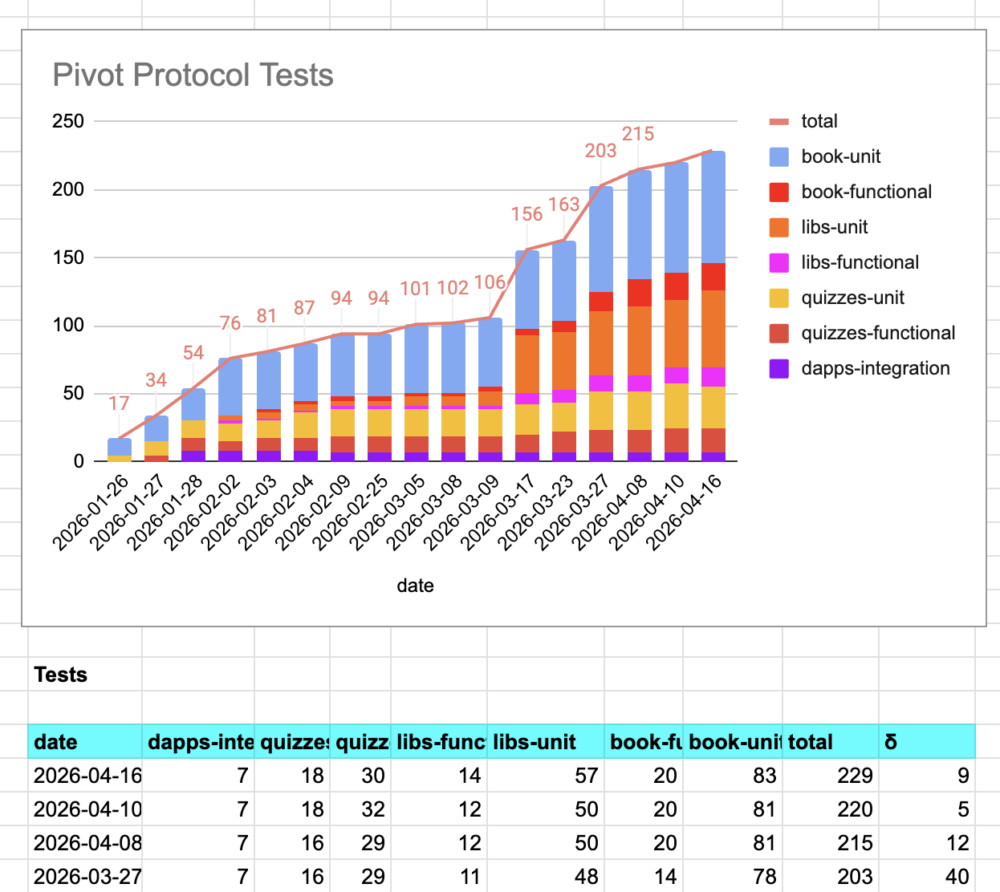
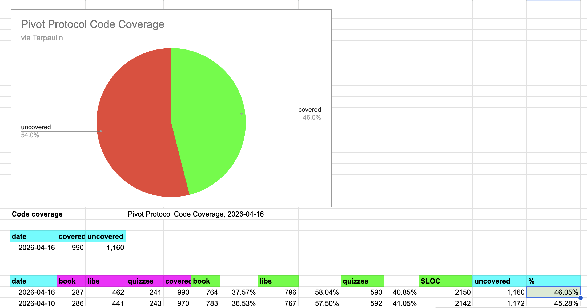
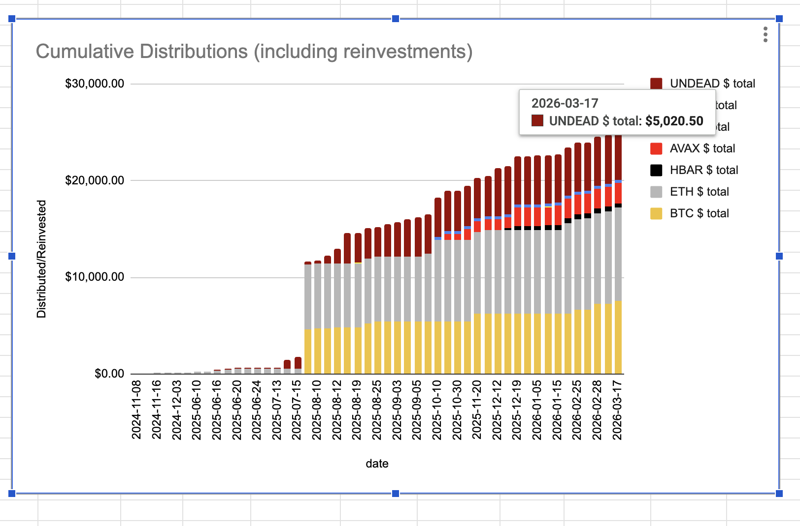

# Automation

G'day, pivoteurs!

I've added functionality to fetch the pivot-calls for the day, programmatically.

I've added unit- and functional-tests around this new functionality. Testing 
and code coverage is expanding: quality assurance is baked into the Pivot 
protocol. 

# Distributions

Here's something for you, dear prospective investor, to consider seriously:

To date, in pre-α release, the Pivot protocol has distributed over $25k in 
yields to its investors, with no loss of principle.

These distributions include:

* $6k $BTC
* $8k $ETH
* $5k $UNDEAD

Dude.

# `dusk`

Do you want to see something amazing, and for me, terrifyingly frustrating?

`
There are $102k in close pivot calls today. At 10% profit that's $10k profit. 
Today.

* $10k to pay investors.
* $10k to pay employees.
* $10k to maintain the protocol.
* $10k that needs full automation to get.

# Automation

The thing is: I don't have full automation to make the $10k a day, and set up 
$100k in pivots to lather, rinse, and repeat the process tomorrow.

Full automation:

* closes the pivots
* distributes gains
* commits free assets into new pivots
* measures and reports everything

