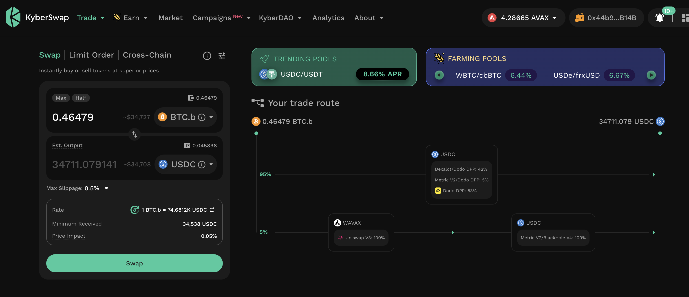
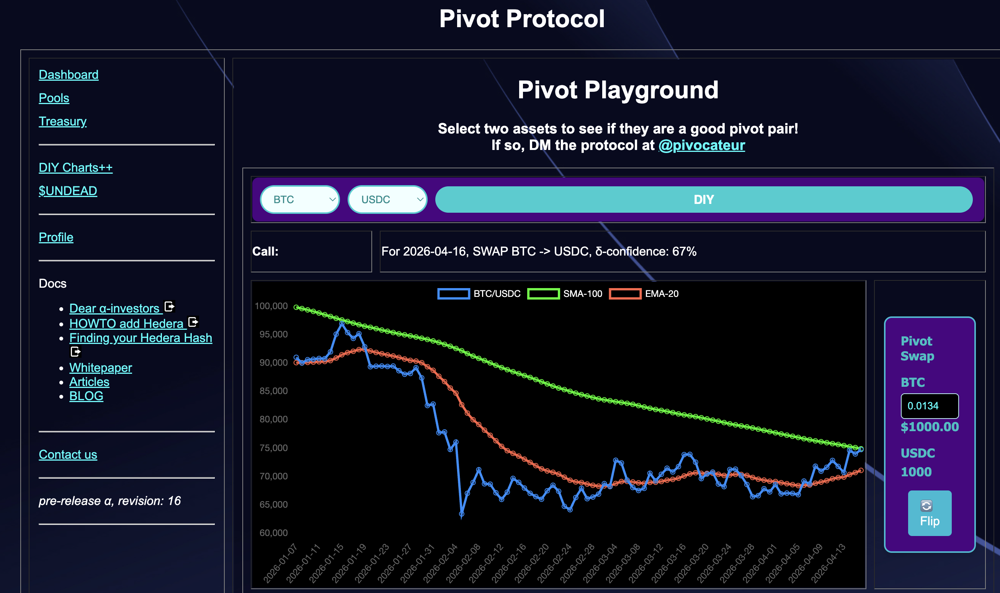
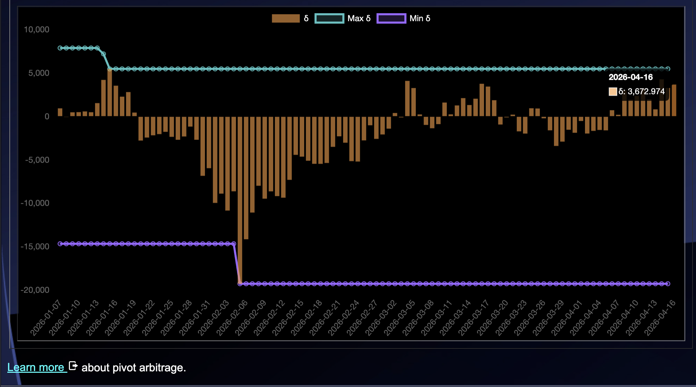
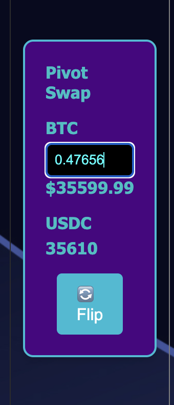
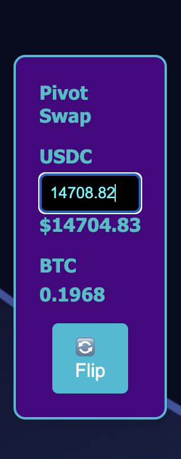
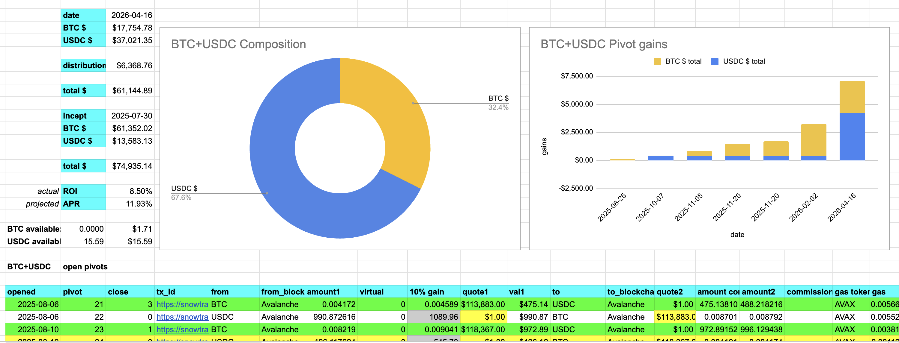
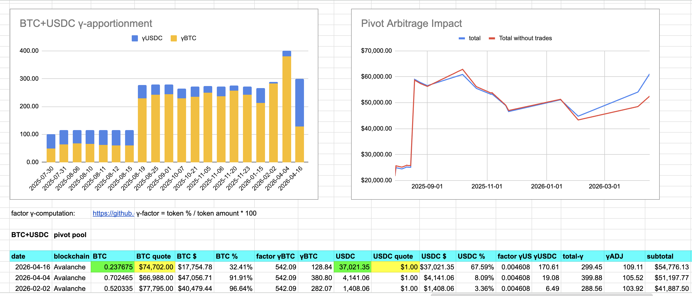

# Automation

G'day, pivoteurs!

I've added functionality to fetch the pivot-calls for the day, programmatically.

I've added unit- and functional-tests around this new functionality. Testing 
and code coverage is expanding: quality assurance is baked into the Pivot 
protocol. 

# Distributions

Here's something for you, dear prospective investor, to consider seriously:

To date, in pre-α release, the Pivot protocol has distributed over $25k in 
yields to its investors, with no loss of principle.

These distributions include:

* $6k $BTC
* $8k $ETH
* $5k $UNDEAD

Dude.

# `dusk`

Do you want to see something amazing, and for me, terrifyingly frustrating?

`
There are $102k in close pivot calls today. At 10% profit that's $10k profit. 
Today.

* $10k to pay investors.
* $10k to pay employees.
* $10k to maintain the protocol.
* $10k that needs full automation to get.

# Automation

The thing is: I don't have full automation to make the $10k a day, and set up 
$100k in pivots to lather, rinse, and repeat the process tomorrow.

Full automation:

* closes the pivots
* distributes gains
* commits free assets into new pivots
* measures and reports everything

## Manual

None of the above processes outlined above are fully automated, ...yet. Some 
are partially automated with Rust programs, spreadsheets, and good ol' spit 
and elbow grease applied by yours, truly.

Let's see how far I get today when I lean into today's pivoting-work. 
#SvängbartWerk

# PIVOTS

## BTC+USDC

I close 6 USDC-on-BTC pivots for gains of:

* actual ROI: 12.43% / 57.96% APR projected
* 30.9k $USDC -> $BTC -> 34.7k $USDC 💥💥💥

All investors in this pool are reinvesting dividends: I update their 
staked-positions in the BTC+USDC pivot pool.

## Open BTC+USDC pivots 

 
 

The positive δ calls to open an BTC-on-USDC pivot, which I do. 

 

I also open an USDC-on-BTC hedge. 

 

All BTC+USDC assets are now committed to pivots. 

The BTC+USDC pivot pool composition and γ-apportionment are as charted. 

 
 

G'nite, fam!
