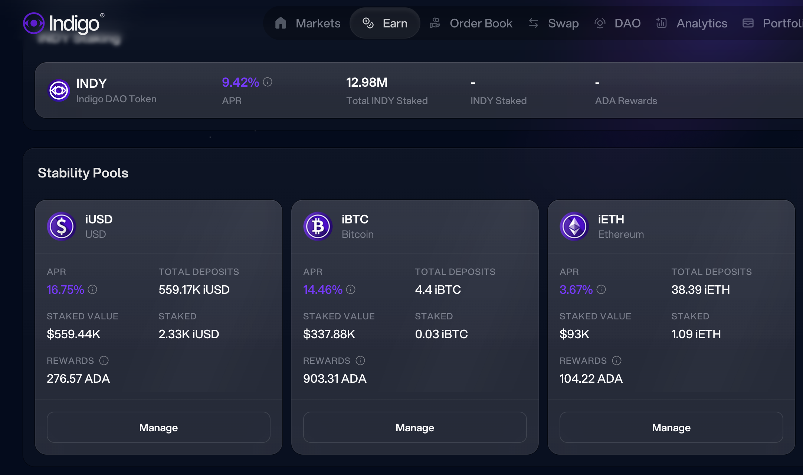
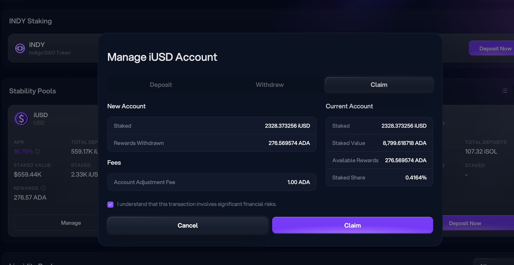
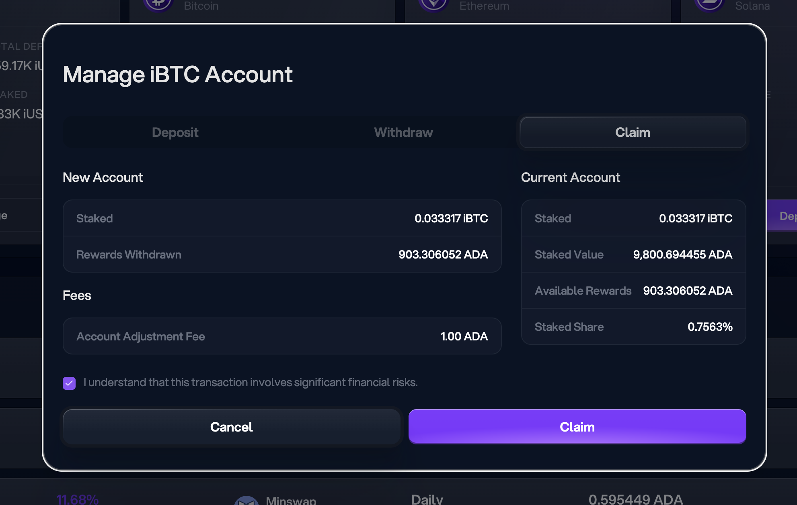
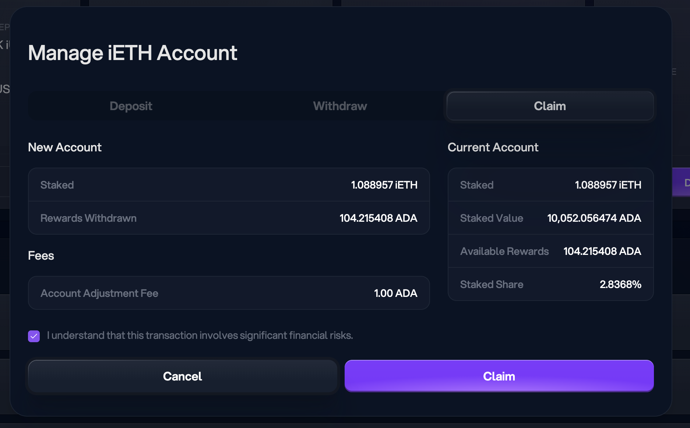
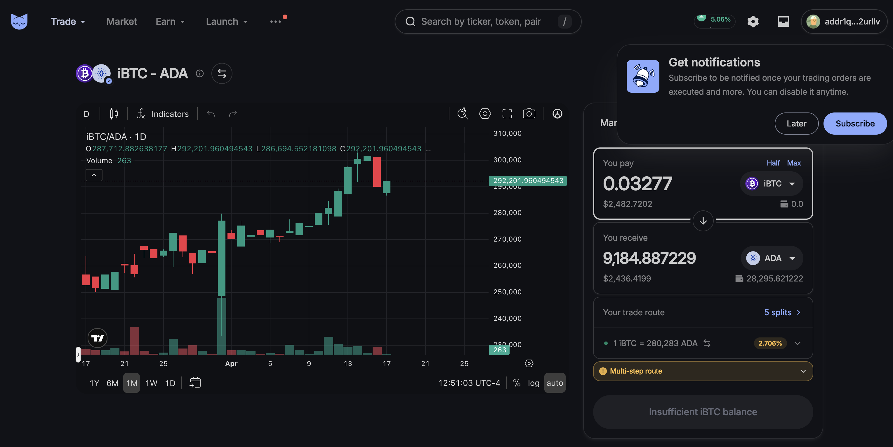
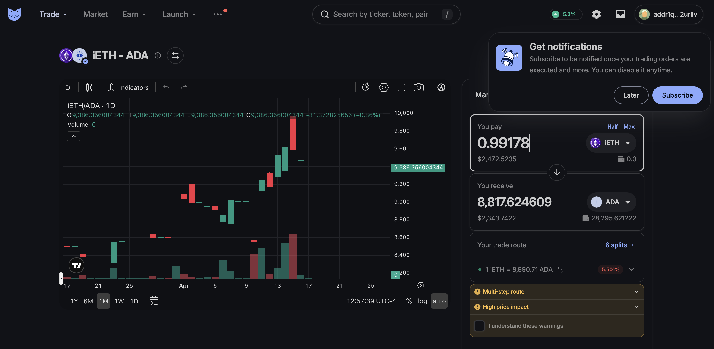
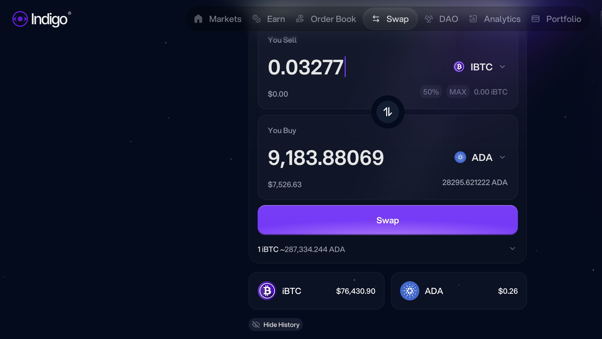
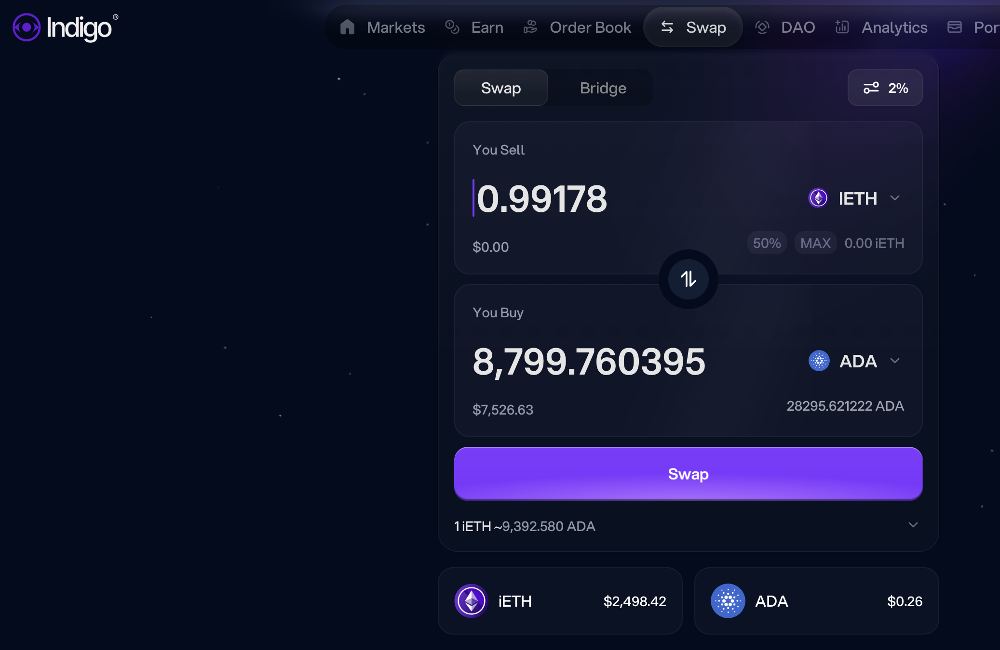
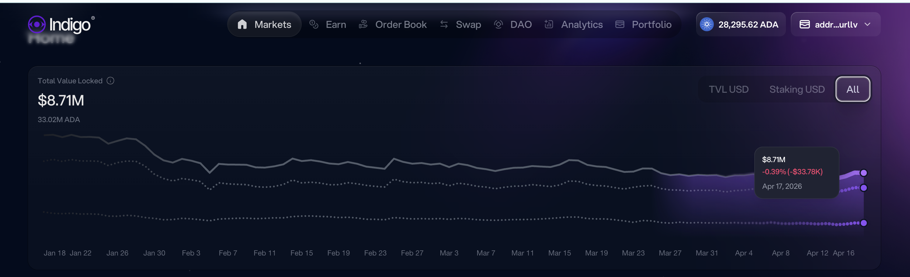

# Synthetics

G'day, pivoteurs!

`dusk` calls for $71k in close pivots.

Meanwhile, on @Cardano, @Indigo_protocol has some activity in synthetics.

I'm going to explore synthetics today. I have $5k in close pivots in the 
synthetics markets, so: here we go!

## Indigo

For the synthetic-staking on @Indigo_protocol, I harvest:

* 276 $ADA for 59 $iUSD ($11 gain)

* 903 $ADA for 0.00277 $iBTC ($24 gain)

* 104 $ADA for 0.01178 $iETH ($1 loss)

Overall, a net $34 gain for $7,500 staked.

So ... 'meh?' is my evaluation so far.

## Synthetic Pivots

Now, for the ADA-pivots, both the 

* ADA-on-BTC and
* ADA-on-ETH

pivots return less than 10% gain (or even A LOSS!?!) because the slippage 
on @MinswapDEX, and it's WORSE on @Indigo_protocol!

If you can't swap $2.5k of $BTC, you have to ask if synthetics are viable on 
Cardano.

### Analysis

That doesn't mean that synthetics are bad. Other protocols have done them, and 
done them well, but it does mean that maybe Cardano isn't a blockchain to 
trade, due to slippage.

Why is lack of liquidity a problem on Cardano? There's $8.7M liquidity 
on @Indigo_protocol! Baffling!

