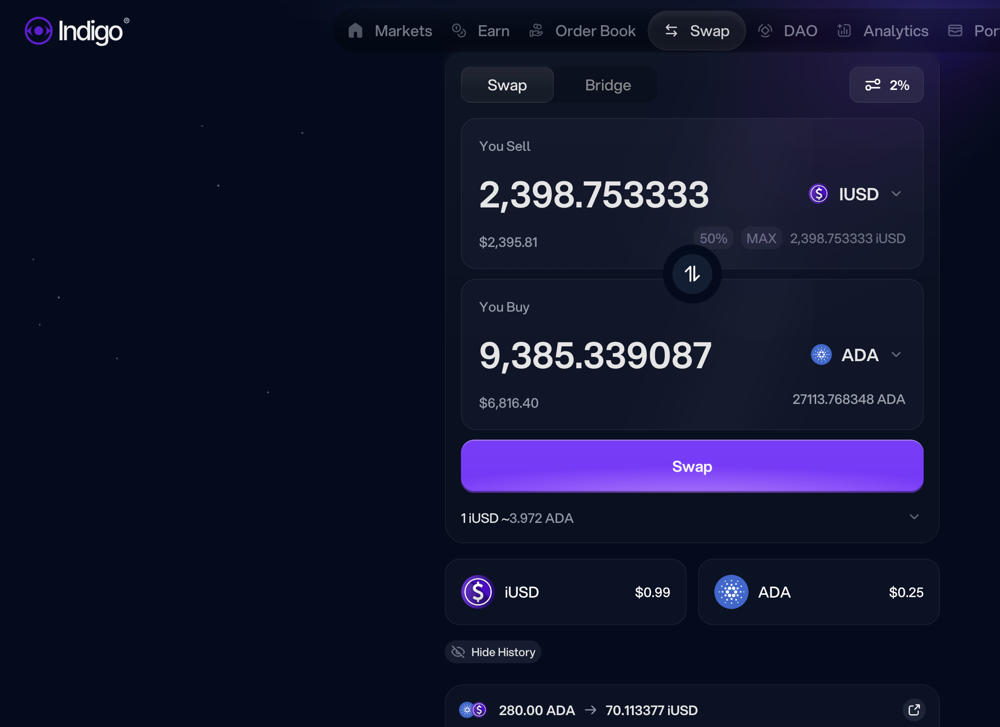
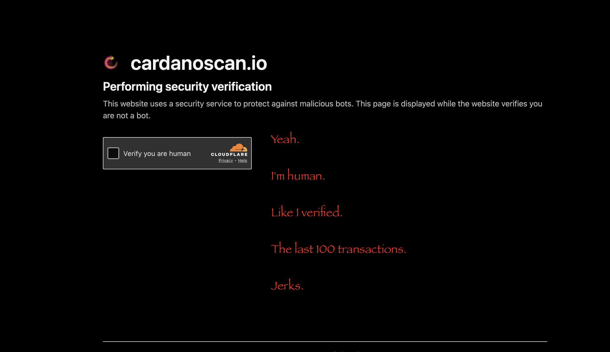
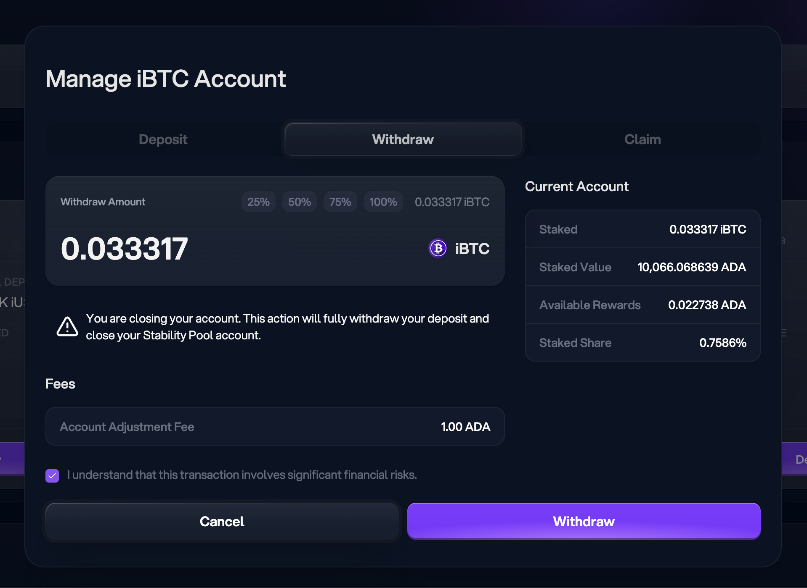
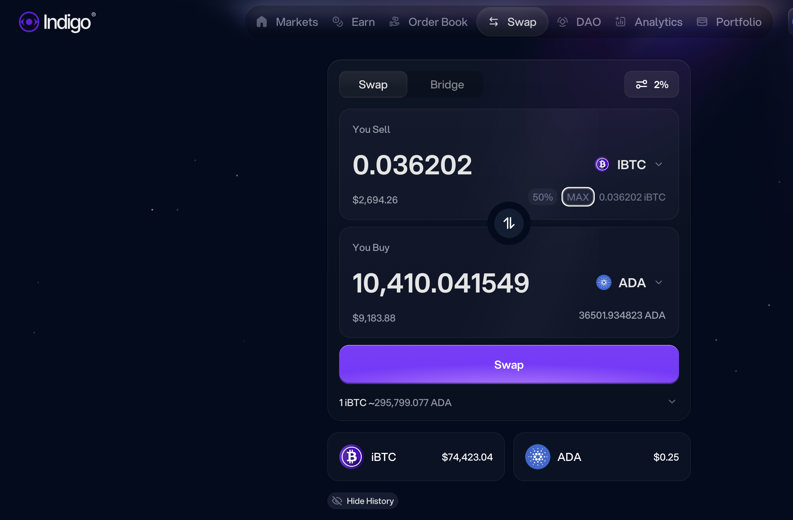
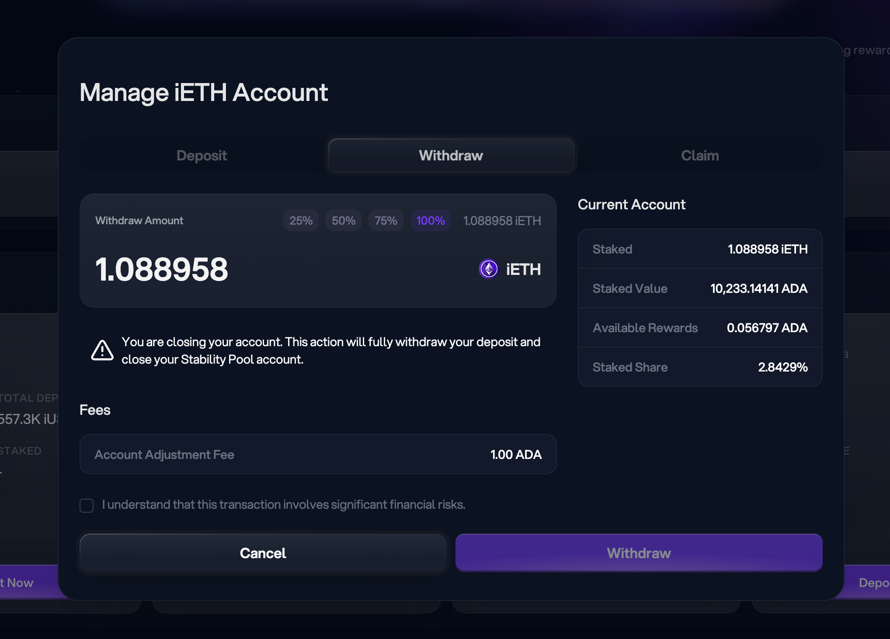
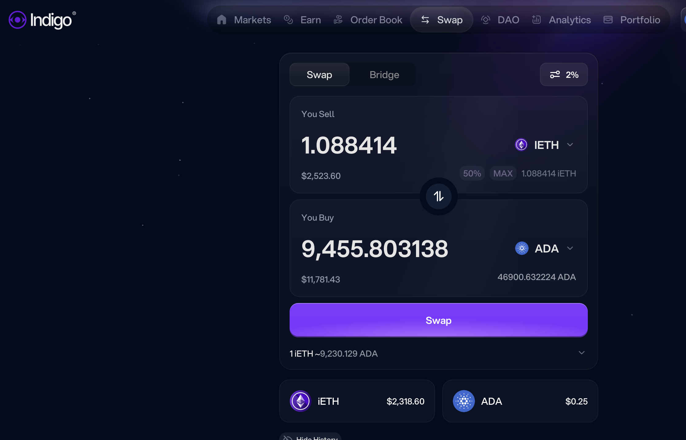

# Closing Cardano positions

G'day, pivoteurs!

I'm closing the Cardano synthetic positions.

The slippage is untenable on Cardano. The price-movement is so sluggish that 
pivot arbitrage is better done elsewhere. Cardano is a blockchain that mades 
trading difficult and expensive.

Lesson learned. Moving on.

Also, why does Cardano team with an explorer that requires 
Cloudflare-verification

> every.
> single.
> transaction.

I'm an arbiteur. Doing this 100s of time each day? Then: talk about subverting 
automation!

Cardano works hard to make trading on its blockchain unbearable. Good job!

## Withdraw Liquidity from Indigo

As I closed my (synthetic) iUSD and swapped to $ADA, I do the same for my iBTC 
and iETH positions, withdrawing all liquidity from @Indigo_protocol.

Launching a protocol is hard enough. I've said from the beginning that 
launching on Cardano was shooting themselves in the foot.

