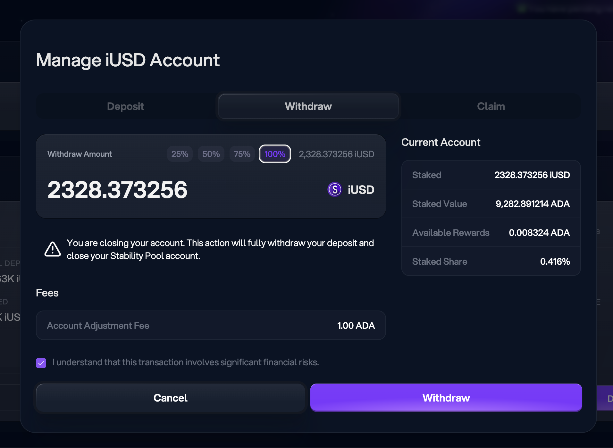

# Closing Cardano positions

G'day, pivoteurs!

I'm closing the Cardano synthetic positions.

The slippage is untenable on Cardano. The price-movement is so sluggish that 
pivot arbitrage is better done elsewhere. Cardano is a blockchain that mades 
trading difficult and expensive.

Lesson learned. Moving on.

