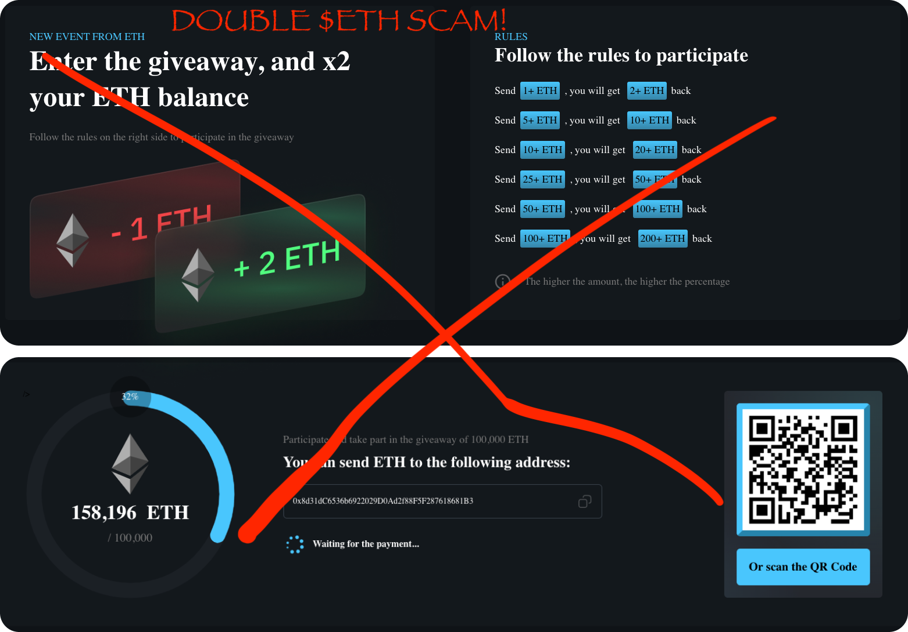

# Security

G'day, pivoteurs

Let's talk security:

* security in cryptocurrency in general and
* security for the Pivot protocol and 
* the security-measures we're taking to safeguard investments

## Cryptocurrency Security in general

There are many ways cryptocurrency can be phished, hacked, spoofed, rugged, stolen, or curfuffled. Of those ways, the vast majority of issues comes two snafus:

1. You give somebody your keys
2. Smart contracts

Let's look.

### You give somebody your keys

"Now," you think, "who would do that? Not me!"

But this is how most people are fooled.

* They leave their laptop open at a cafe
* They give the telegram or discord 'Official Admin' their password to 'check 
their balance'
* They go to 'that' site.

### Double-ETH scam

You'd never give away your keys!

... intentionally.

But this is where most scammers concentrate their efforts, because: why hack 
something? That takes work! Simply steal the liquidity, or, better yet, ask 
you to give it to them.

"Send us x $ETH and we'll send you back DOUBLE!"

