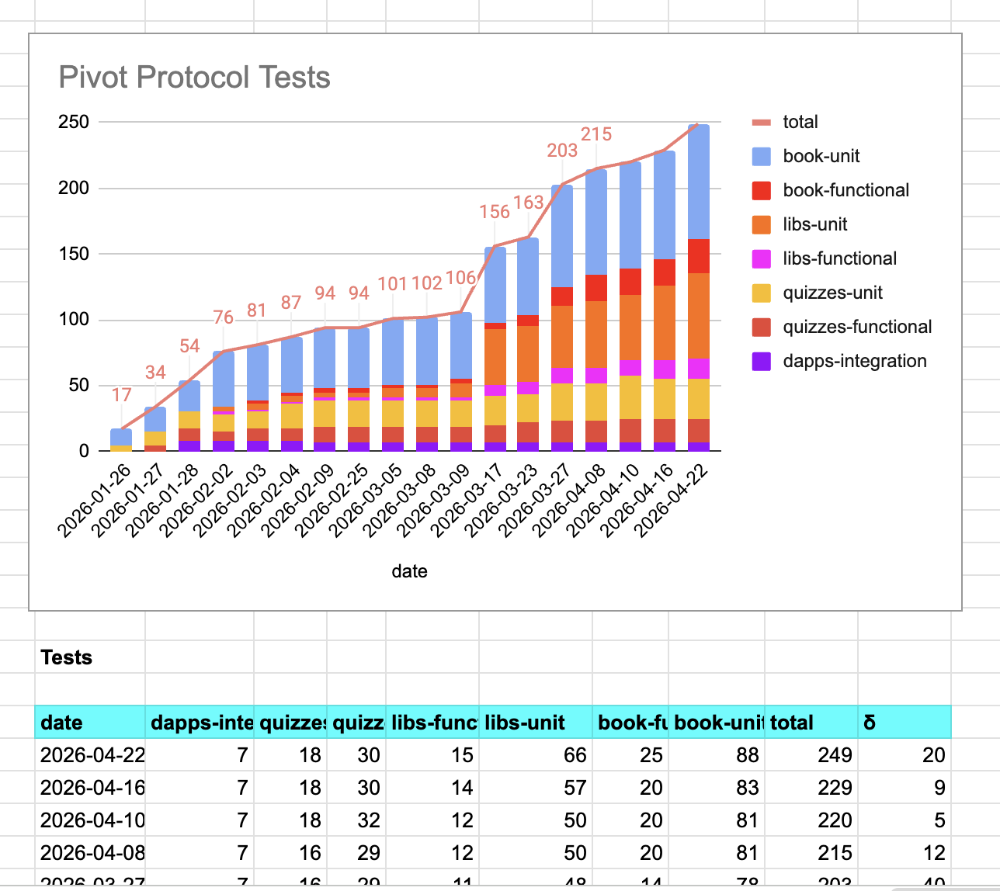
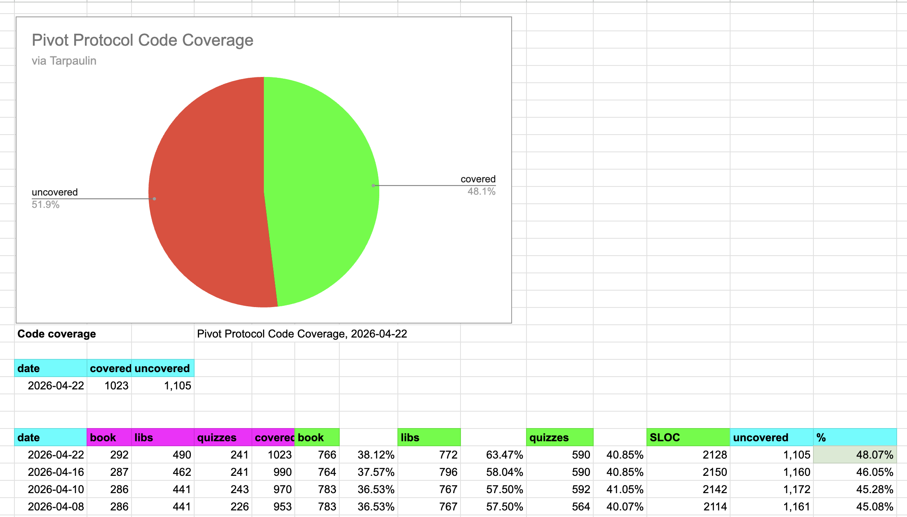

# Security

G'day, pivoteurs

Let's talk security:

* security in cryptocurrency in general and
* security for the Pivot protocol and 
* the security-measures we're taking to safeguard investments

## Cryptocurrency Security in general

There are many ways cryptocurrency can be phished, hacked, spoofed, rugged, stolen, or curfuffled. Of those ways, the vast majority of issues comes two snafus:

1. You give somebody your keys
2. Smart contracts

Let's look.

### You give somebody your keys

"Now," you think, "who would do that? Not me!"

But this is how most people are fooled.

* They leave their laptop open at a cafe
* They give the telegram or discord 'Official Admin' their password to 'check 
their balance'
* They go to 'that' site.

### Double-ETH scam

You'd never give away your keys!

... intentionally.

But this is where most scammers concentrate their efforts, because: why hack 
something? That takes work! Simply steal the liquidity, or, better yet, ask 
you to give it to them.


"Send us x $ETH and we'll send you back DOUBLE!"

## Smart contracts

(Okay, OG Bitcoiners, just chill for a moment)

Many (most) blockchains use smart contracts to facilitate building (meta-)transactions and protocols.

Useful? YES!

...maybe.

Bridge-hacks, the USDC-destabilization, the GMX USDC-sieve: all smart contract hacks.

How much have smart contract hacks cost cryptocurrency investors?

* Terra crash, price-manipulating, the LUNA/UST smart-contract: $50B
* Harmony BTC bridge hack, $100M
* GMX hack: $42M

Those are three hacks off the top of my head.

Billions simply taken from people who had that liquidity because of smart 
contract exploitation.

Sweet.

Bitcoiners, now's your turn to act smug.

* Except for that one guy who gave an ØF girl 2 $BTC, because: 'she asked 
nicely.'

* ...and, then, let's not forget the guy who threw away 1,000s of $BTC into a 
landfill.

"Not your keys, not your crypto" has never taken a more literal turn.

## Thots Bots

So there are plenty of ways to lose crypto, and plenty of people happy to take 
your crypto from you. 

bots/people/bots/people/whatevs: they all start to look the same shade of gray 
to me. Is there even one creative bone shared amongst the lot? Even just one?

That's (lack) of crypto-security for ya, with the two major hacks of:

1. they get your keys
2. they hack smart contracts

# Pivot Protocol Security

What's the Pivot Protocol doing with security?

Taking it seriously.

There are clear partitions between:

1. code and crypto
2. coders and keys

Let's look.

## Code and Crypto

## No Smart Contracts

1. code and crypto

For the Pivot Protocol production release, the Protocol dapp and UX will 
manage user data, staking, destaking, yields, and profiles, but it will not 
touch crypto at all.

Put differently: the Pivot Protocol has no smart contracts.

This decision is deliberate.

Instead of smart contracts, the Pivot protocol runs its own set of dapps that 
facilitate workflow from opening to closing pivots and all the infrastructure 
surrounding that workflow.

Why?

Why reinvent the wheel?

The motivation TO USE smart contracts is that it facilitates building protocols 
to a ludicrous degree: build more, faster.

The motivation NOT to use smart contracts is, well, you lose all your money: 
time, and time again.

So, what's the benefit of self-build-better?

## Software Development

### The traditional approach

I've been studying computer science for decades, specifically proofs-as-types.

Sounds familiar? No, because it's been neglected for:

```Python
for x = 1 to 10:
	print("Hello, world!")
	if x == 3 then c() else d()
```

for decades in academe.

### Proofs as Types

Okay, so we all know Algol, or one of its (much) weaker implementations 
(Pascal, C/++/#, Java, Python, whatever), look like.

What am I doing with the Pivot Protocol?

What if, instead of functions 'doing stuff', they instead carry something 
called 'TruthValues'?

### TruthValues

What do TruthValues buy me?

Instead of coding branches, I simply declare the dapp as a workflow from A → Z.

Should a failure occur along the way, the dapp stops and declares the reason 
why.

If the dapp succeeds, voilà! you have a pivot!

Drink champaign. Celebrate good times!

### Trustless

Another advantage of the Pivot Protocol coding is that it is `trustless`.

The Smart Contract-approach depends upon the proof-of-stake consensus-model. 
This is not `trustless` it is, indeed, `trusting that almost everybody else is 
on the level.`

Ick.

Our code is self-contained.

Instead of trusting that most everybody else is on the up-and-up, our codebase 
trusts no one and no AI. The code is built from First Principles: tested, 
verified, and audited with decades of research and FinTech business experience.

### AI

Sorry, AI.

Nothing personal. We just know you suck, is all.

This isn't bias that's talking. This is experience talking.

### Testing

Back on topic.

Another advantage of Proofs-as-Types or carrying TruthValues is that the code 
becomes trivially amendable to testing.




The tests DON'T write themselves, ...but they almost do. Tests and 
code-coverage strengthen code quality assurance, facilitating external audits.

