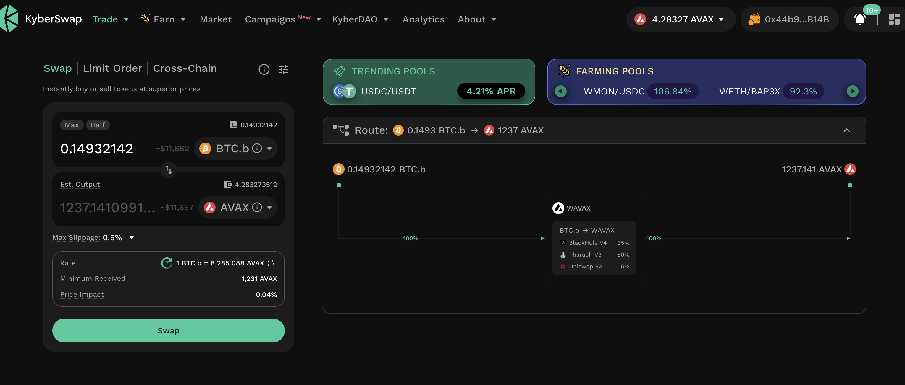
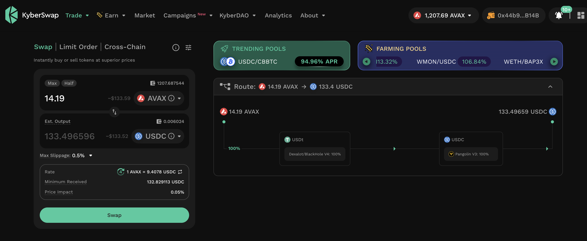
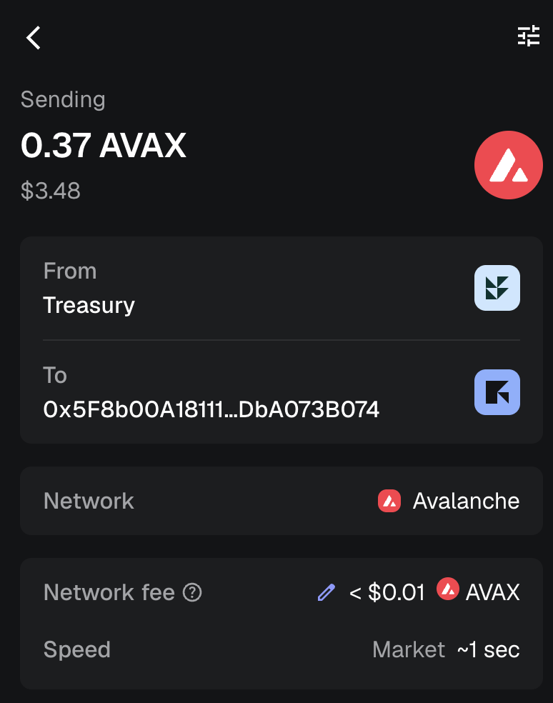

# PIVOTS

## BTC+AVAX

G'day, pivoteurs!

I close an AVAX-on-BTC pivot for gains of:

* actual ROI: 12.97% / 124.53% APR projected
* 1094 AVAX -> BTC -> 1236 AVAX

A gain of $1,330 in one pivot. Sweet! 💥💥

Every single pivot I've done, I've made at least 10% gain, from day one.

I convert 10% of gain to $USDC for operating expenses and distribute and 
reinvest the remaining gains to stakers. 
