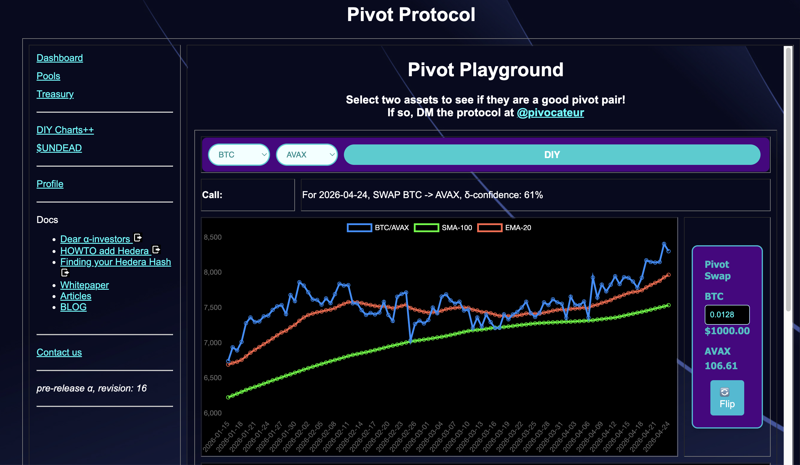
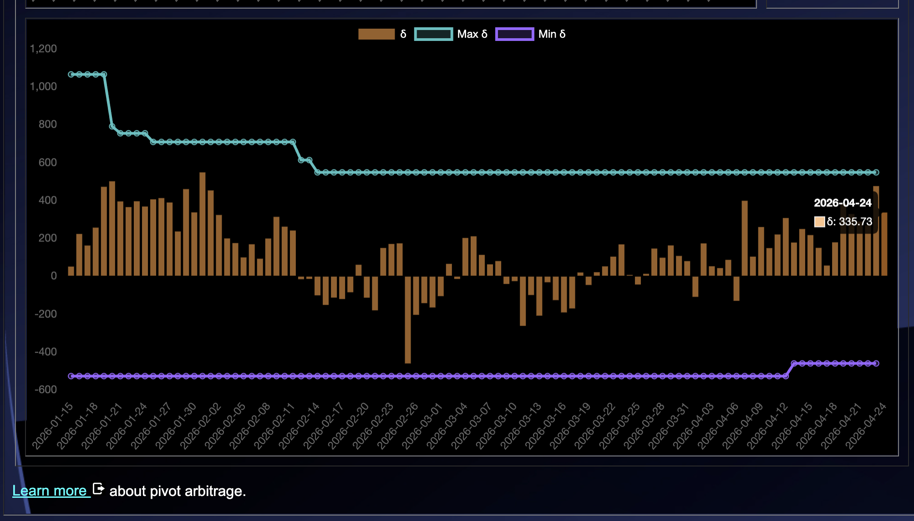
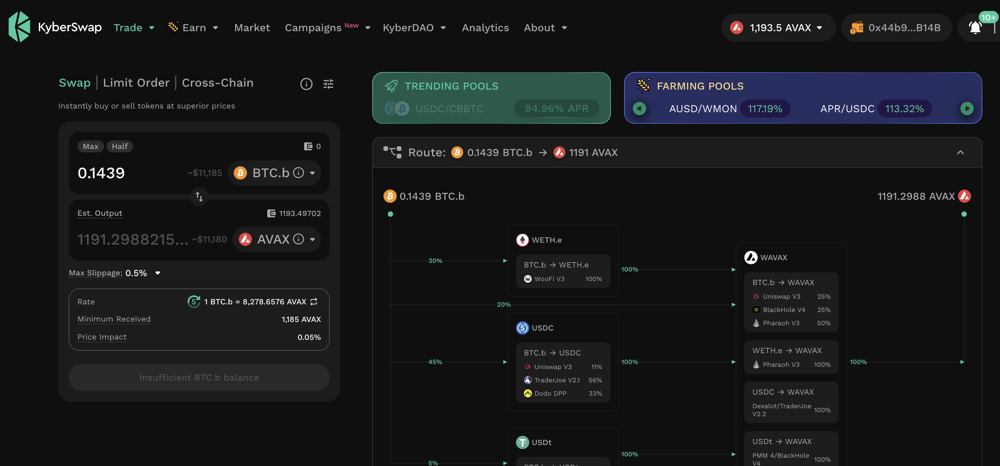
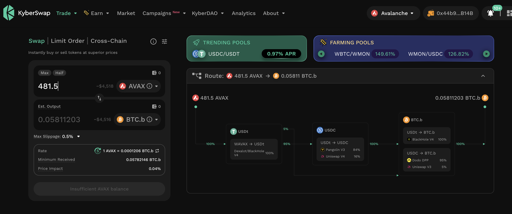
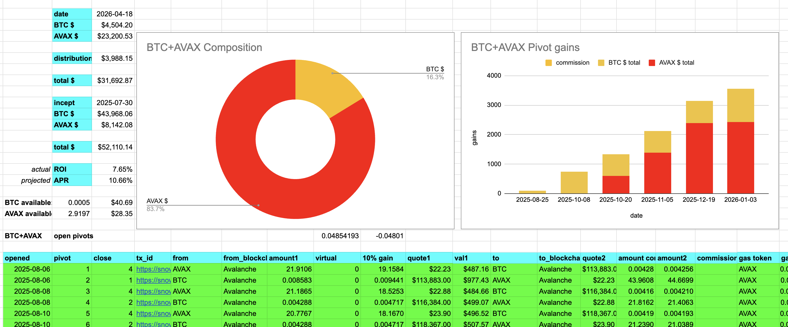
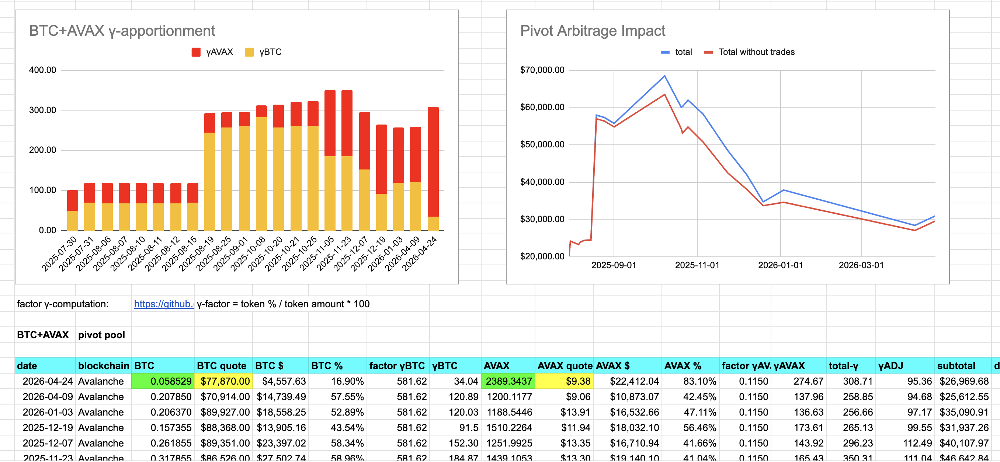

# PIVOTS

## BTC+AVAX

G'day, pivoteurs!

I close an AVAX-on-BTC pivot for gains of:

* actual ROI: 12.97% / 124.53% APR projected
* 1094 AVAX -> BTC -> 1236 AVAX

A gain of $1,330 in one pivot. Sweet! 💥💥

Every single pivot I've done, I've made at least 10% gain, from day one.

I convert 10% of gain to $USDC for operating expenses and distribute and 
reinvest the remaining gains to stakers. 
## Open BTC+AVAX pivots 

 
 

The positive δ calls to open an BTC-on-AVAX pivot, which I do. 

 

I also open an AVAX-on-BTC hedge. 

 

All BTC+AVAX assets are now committed to pivots. 

The BTC+AVAX pivot pool composition and γ-apportionment are as charted. 

 
 

# Milestone

With the distributions and reinvestments from the above close-pivot, the Pivot 
Protocol has just surpassed $30,000 in distributions to its stakers. 

