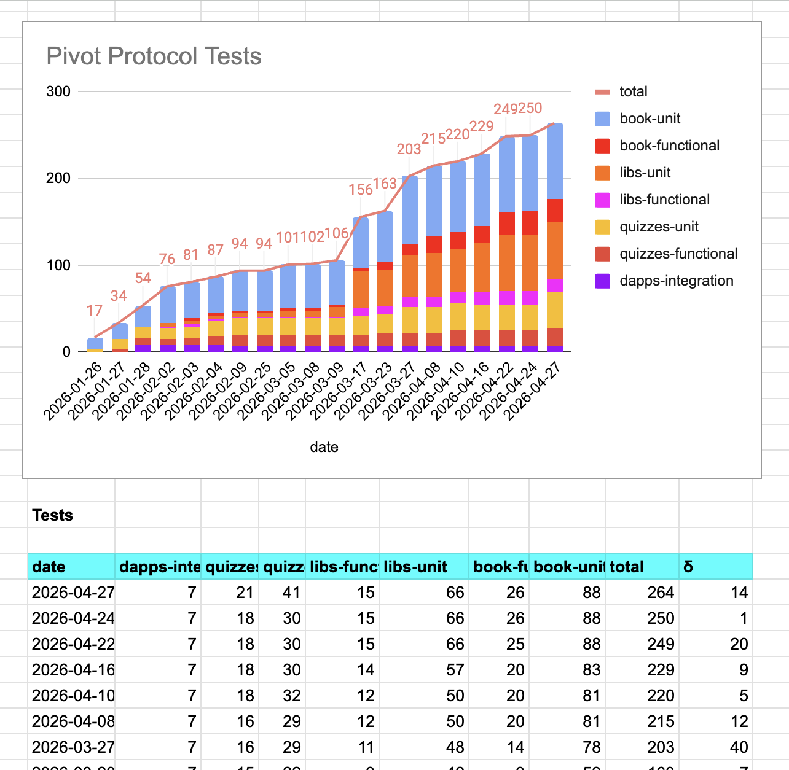
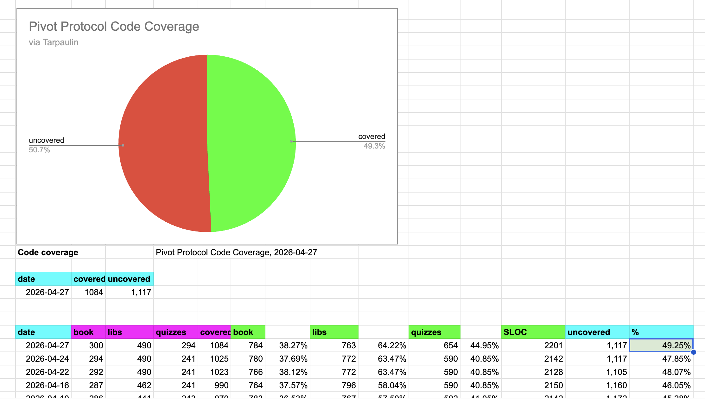

# Automation and Testing

G'day, pivoteurs!

We're preparing a new automation to close a pivot on the protocol from a 
transaction from a swap (from the pivot asset to the principal asset).

That means: more testing!

We're getting close to 50% code-coverage, increasing our quality assurance as 
we BUIDL!

