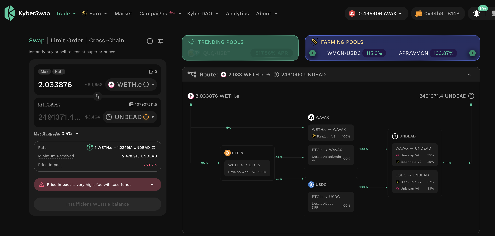
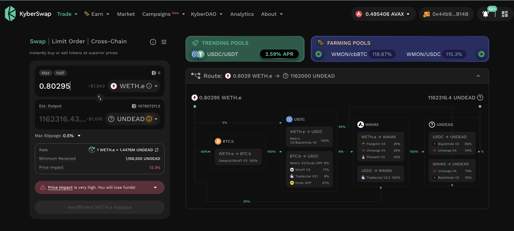
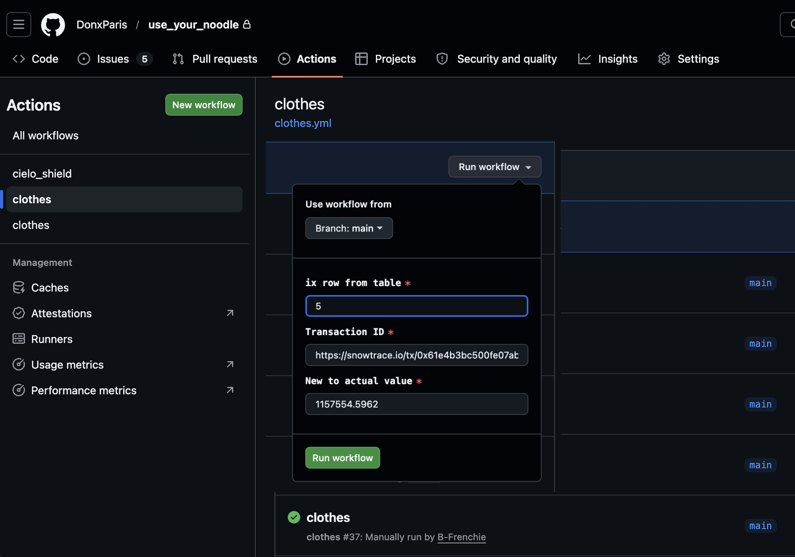
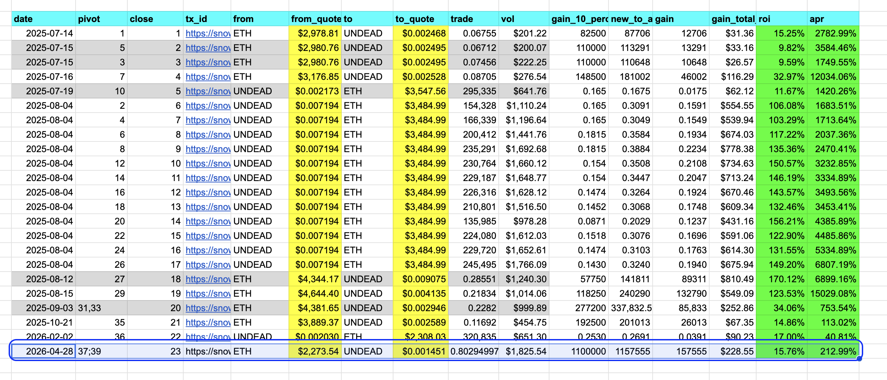

# Slippage

G'day, pivoteurs!

A bit of a quandary.

`dusk` recommends close pivots with $UNDEAD, ...

...however when I go to close those 
pivots, the slippage is so bad that I can't even do a profitable trade 
at 1/100th of the recommendation.

The LPs are at $6k and $7k, so there should be a trade.

There are work-arounds.

* We could add liquidity to the LPs to reduce slippage. I've done this before. 
We still have slippage.
* We could create our own DEX. I'm working on this.
* ...or: both.

When the protocol goes live, there will be more liquidity, reducing this 
slippage.

## ETH+UNDEAD

ETH+UNDEAD

Still on $UNDEAD. There's a close-pivot available the other way. It doesn't 
work for a full trade, but a partial trade (aiming for 1.1M $UNDEAD in the 
close) is viable. Let's do that. 

I close this pivot, using the automation @ParisBrand32180 implemented, for 
gains of:

* 1M $UNDEAD -> $ETH -> 1157555 $UNDEAD 
* actual ROI: 15.76% / 212.99% APR projected
* 157.5K $UNDEAD / $228.55 gain. 

