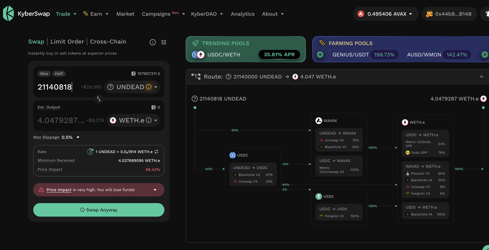
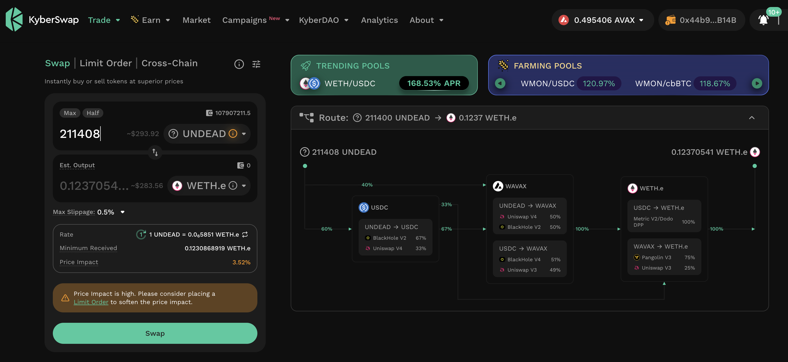
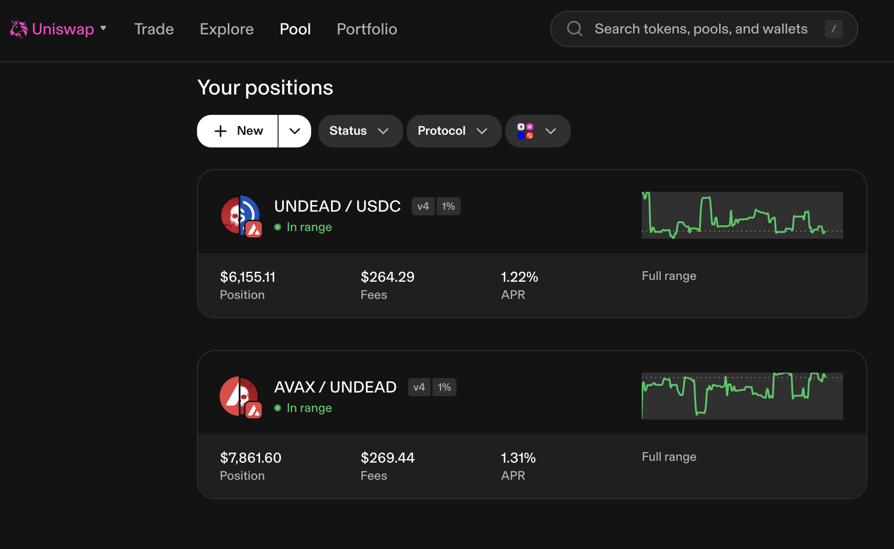

# Slippage

G'day, pivoteurs!

A bit of a quandary.

`dusk` recommends close pivots with $UNDEAD, ...

...however when I go to close those 
pivots, the slippage is so bad that I can't even do a profitable trade 
at 1/100th of the recommendation.

The LPs are at $6k and $7k, so there should be a trade.

