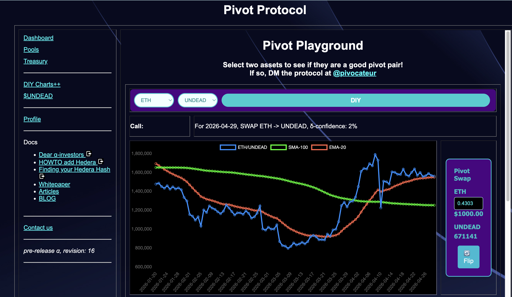
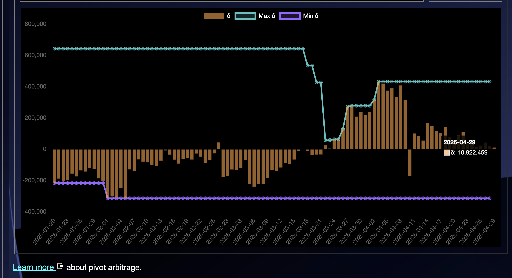
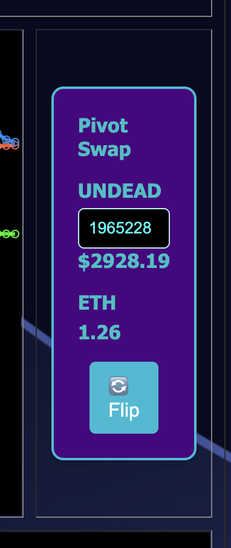
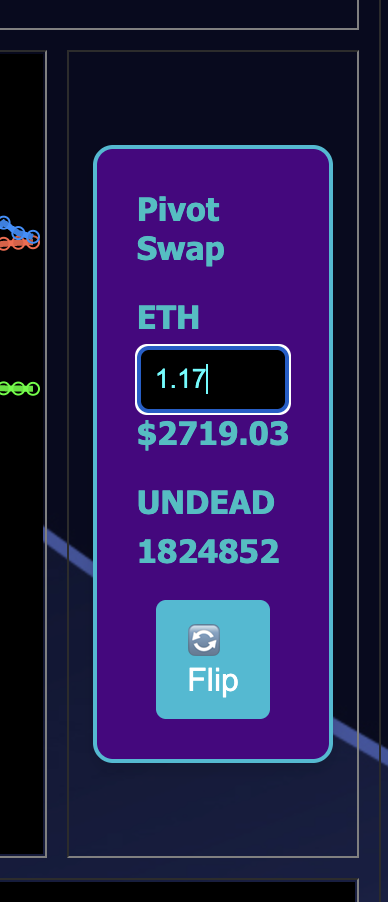
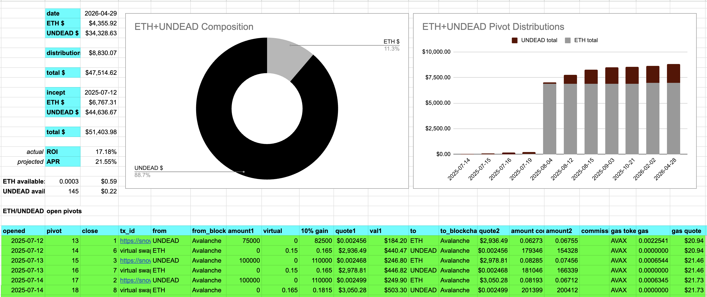
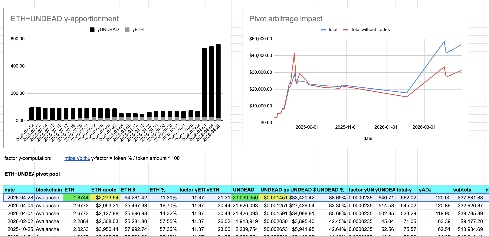
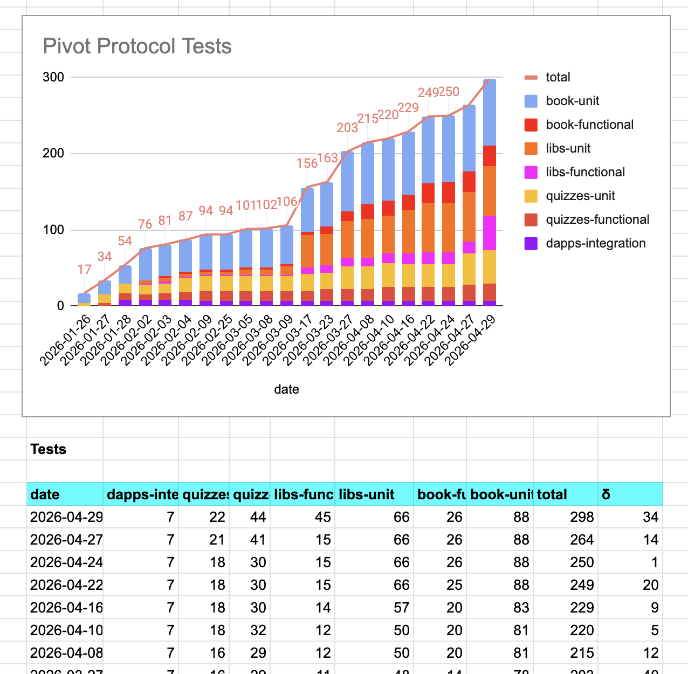
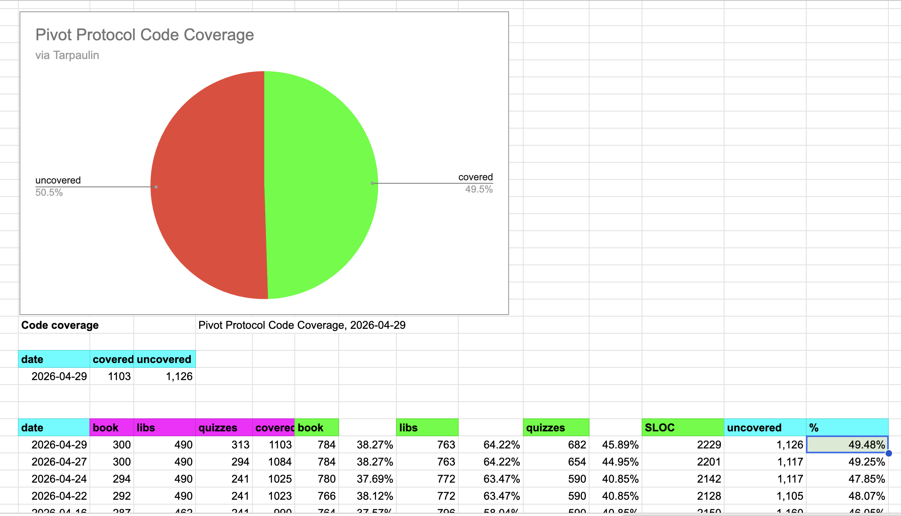

# PIVOTS

## ETH+UNDEAD

G'day, pivoteurs.

From the close UNDEAD-on-ETH pivot yesterday, I distribute and reinvest gains 
and I reserve some of the gains into the $UNDEAD vault. 

### Distributions

To date, the Pivot Protocol has distributed/reinvested more than $30k to its 
stakers, including:

* $9k of $ETH 
* $7k of $BTC 
* $4k of $USDC 
* $3k of $AVAX and
* $6k of $UNDEAD 

Wow. Just one guy (moiself) with backing and help did this over the past year. 
Come join the fun!
## Open ETH+UNDEAD pivots 

 
 

The meh δ makes no call, but I open an UNDEAD-on-ETH pivot, anyway. 

 

I also open an ETH-on-UNDEAD pivot. 

 

All UNDEAD+ETH assets are now committed to pivots. 

The ETH+UNDEAD pivot pool composition and γ-apportionment are as charted. 

 
 

# Taxes

Pivoteurs!

Do you know

* it takes $100ks to set up and run a business?
* crypto is not a security? It's not money!

The IRS demands a tax return by April 30.

The IRS is about to be shocked at how much they owe me.

Me? I'm filing taxes in [my 
safe-space](https://www.youtube.com/watch?v=0wobXPBDA7k).

# `pools`

## 💥💥💥ANNOUNCING💥💥💥

A new release of `pools` that calculates active pivot pools of the protocol.

The previous release was 'trusted' using a token to access data. [This 
version](https://github.com/pivoteur/protocol/tree/main/dapps/pools)
is 'trustless', being allowed read-only access to protocol data. 

The aim for this revised dapp is to inline it into the automation suite.

The aim, eventually, is to have an entirely automated protocol, pivoting 
assets and distributing gains on a daily cadence.

Testing and code-coverage continues to improve as work progresses. 

