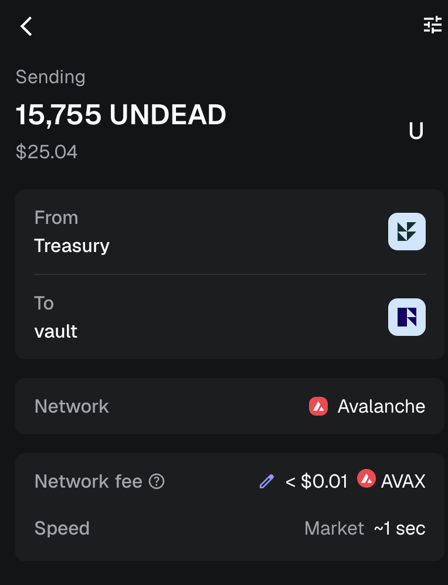
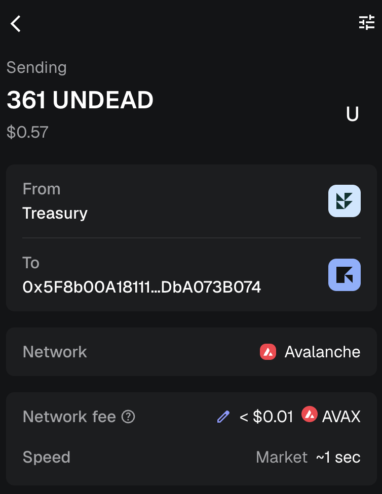
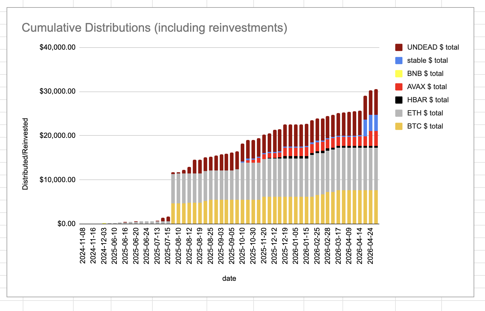

# PIVOTS

## ETH+UNDEAD

G'day, pivoteurs.

From the close UNDEAD-on-ETH pivot yesterday, I distribute and reinvest gains 
and I reserve some of the gains into the $UNDEAD vault. 

### Distributions

To date, the Pivot Protocol has distributed/reinvested more than $30k to its 
stakers, including:

* $9k of $ETH 
* $7k of $BTC 
* $4k of $USDC 
* $3k of $AVAX and
* $6k of $UNDEAD 

Wow. Just one guy (moiself) with backing and help did this over the past year. 
Come join the fun!
