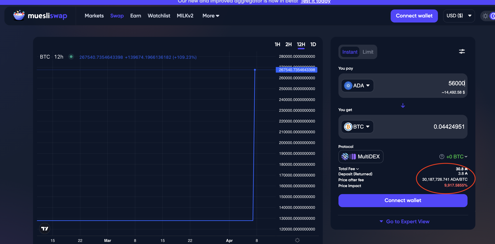
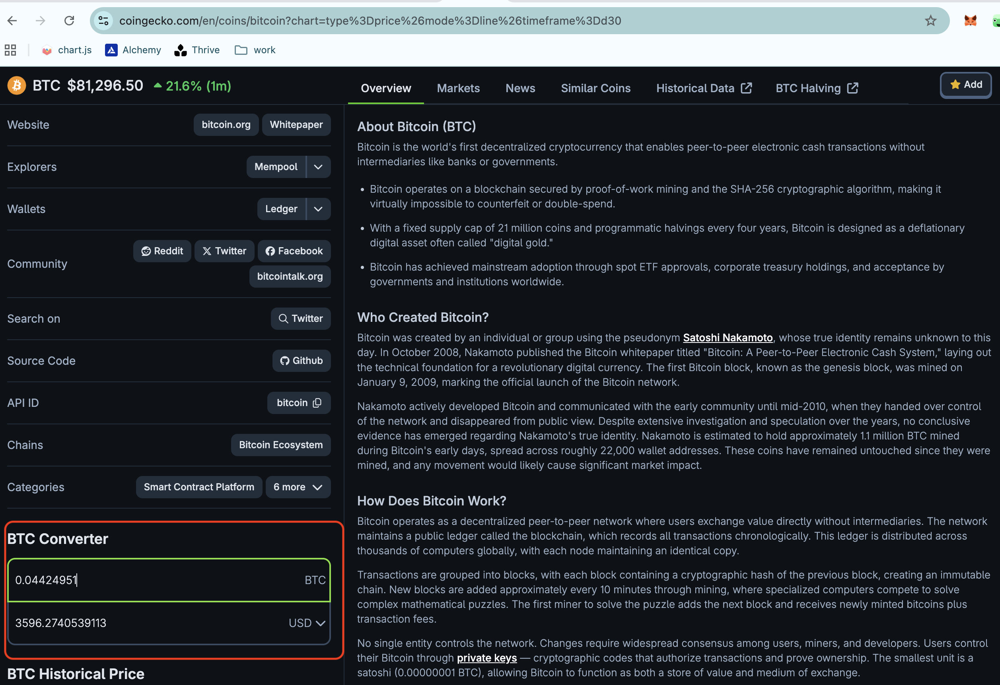

# Cardano slippage

This is slippage on @Cardano 

I go to trade 56k $ADA ($15k) for $BTC on @MuesliSwapTeam: it offers 
0.04 $BTC, which is $3.5k at current trading value.

That's 9,900% slippage. 

Cardano, being 15th largest blockchain, needs to address this 
liquidity-scarcity issue to be viable.

