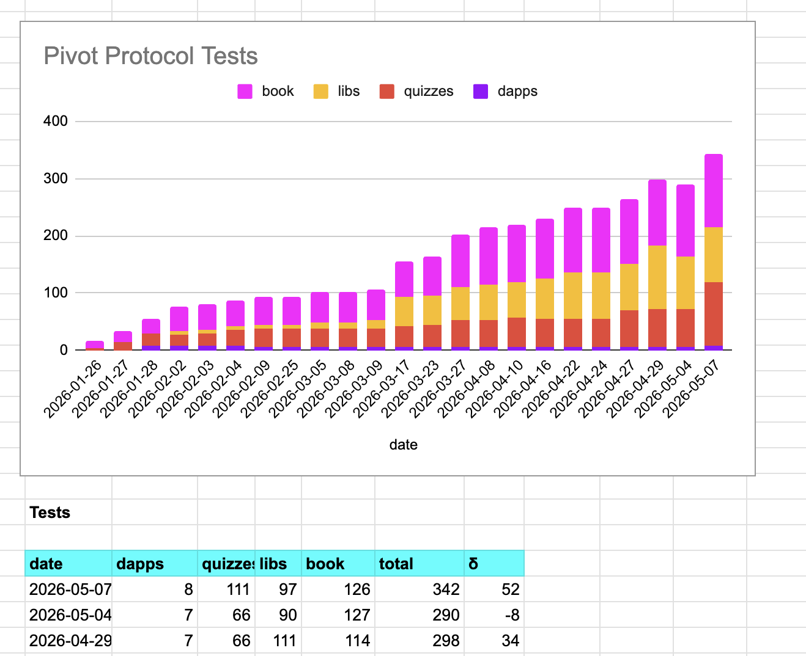
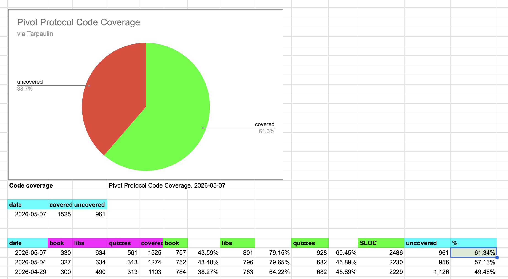

# Testing

G'day, pivoteurs!

The Pivot protocol team, in a combined effort, has developed a new, integrated, 
[functional test 
framework](https://github.com/logicalgraphs/crypto-n-rust/blob/main/src/libs/book/lib.rs#L31-L87)]: 
tests cover more code, faster.

The impact is vivid: code-coverage leapfrogged over 50% to, now, above 60% 
code coverage. 🎉🎉🎉

