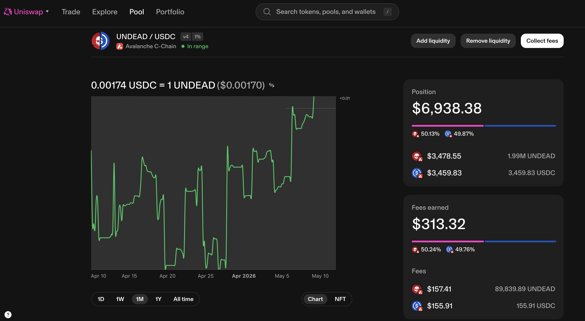
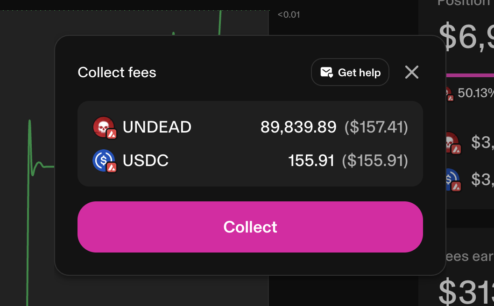
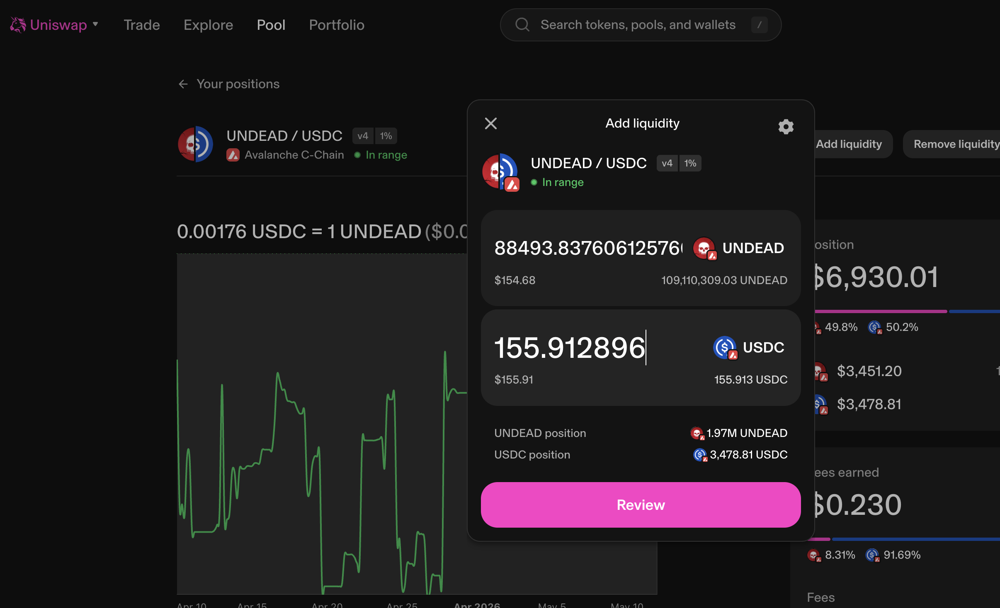
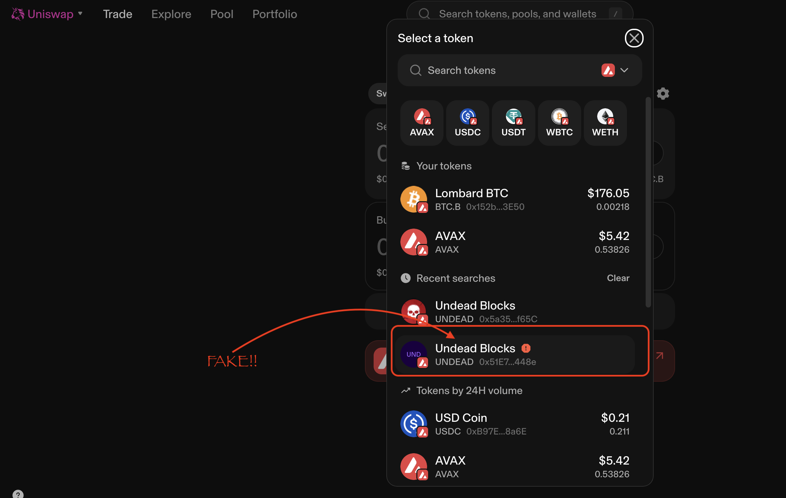
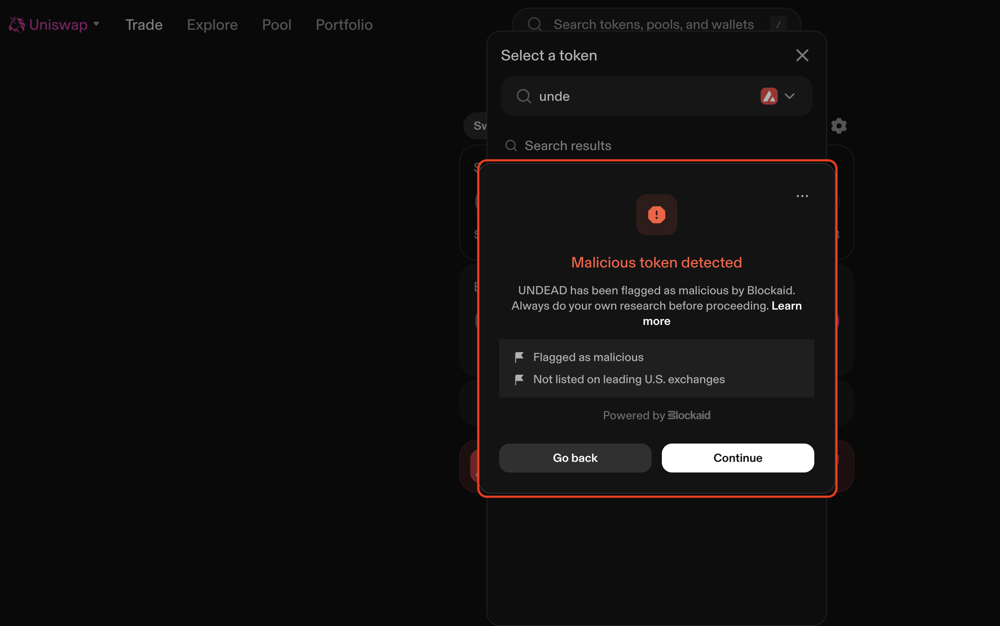
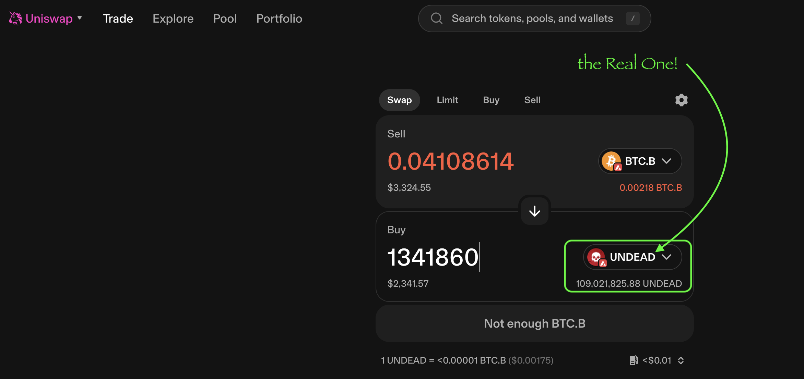
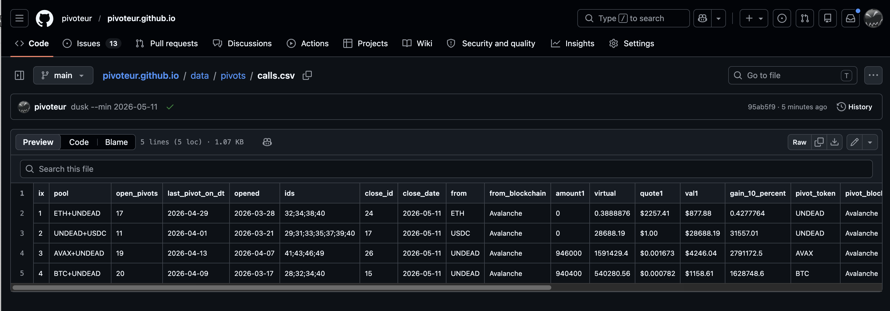

# Liquidity pools

G'day, pivoteurs!

Some of you have reached out to me and said you are stockpiling $UNDEAD for 
when the Pivot Protocol goes live.

Maybe that's why there's trading fees to collect on @Uniswap?

I collect these fees, then reinvest them into the $UNDEAD LP to reduce slippage.

# Fake UNDEAD on Avalanche

G'day, pivoteurs!

@Uniswap has flagged a bad-actor out there. There's a fake $UNDEAD token on 
@avax.

Always know what you're buying and what you're selling.

The contract for $UNDEAD on @avax is 0x5a3534720A4f29FA0dc53cE474Db88973A95f65C. 

# PIVOTS 

## ETH+UNDEAD 

 
 

Automation calls to close 3 ETH-on-UNDEAD pivots (which I manually confirm) for gains of: 

* actual ROI: 11.42% / 94.77% APR projected 
* or: 0.3889 $ETH -> $UNDEAD -> 0.4333 $ETH 
* or: $877.88 gain on 3 pivots totalling $1,007.58 

# `wyrd`

I use `wyrd` – a tool developed and deployed by @ParisBrand32180 – to close the 
pivot from `dusk` and a transaction. This saves me an hour of work per close pivot.

Distributing the gains takes another ~ 4 hours, so that's an area of 
development in our automation pipeline.

