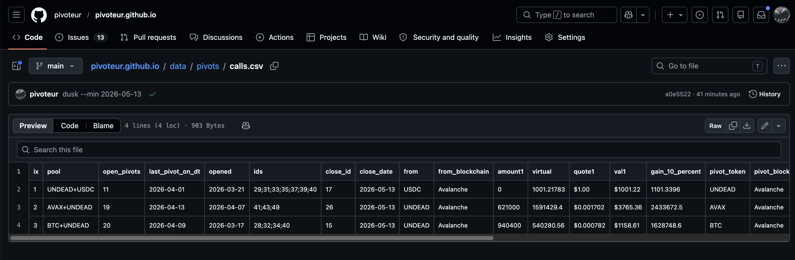
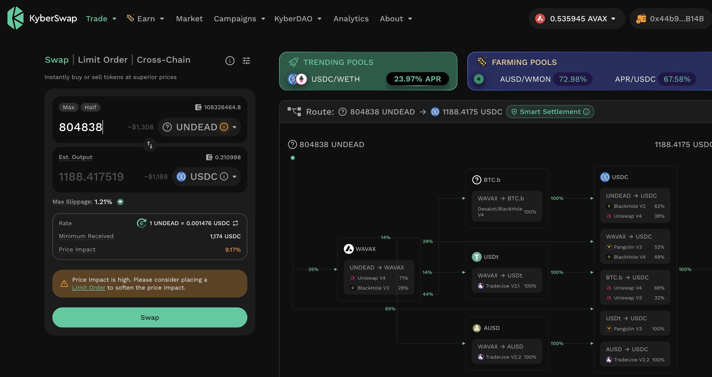
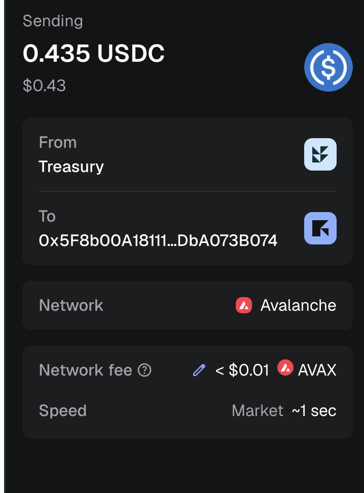
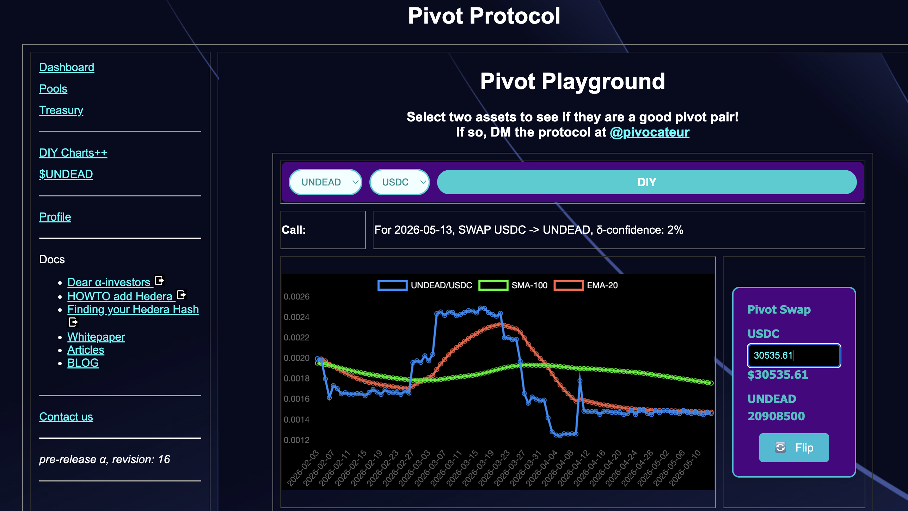
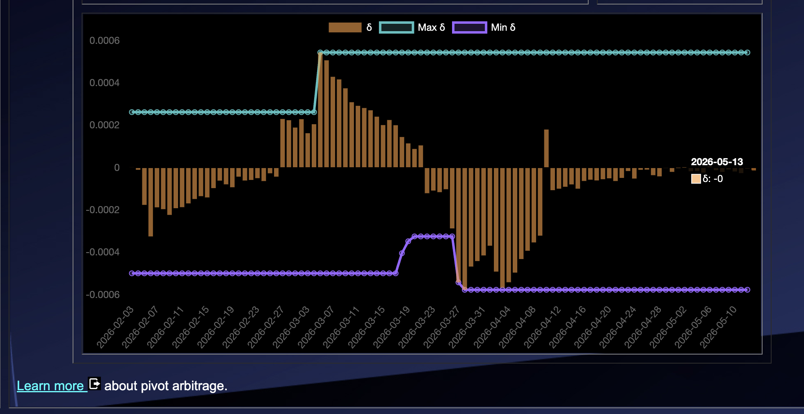
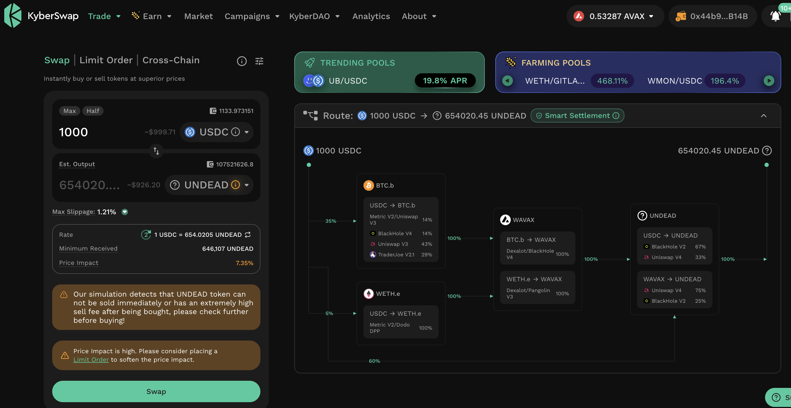
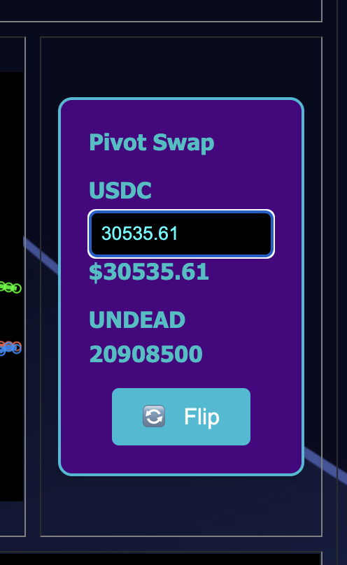

# PIVOTS 

## UNDEAD+USDC 

 
 

Automation calls to close 3 USDC-on-UNDEAD pivots (which I manually confirm) 
for gains of: 

* actual ROI: 18.67% / 128.56% APR projected 
* or: 1001.2178 $USDC -> $UNDEAD -> 1188.1186 $USDC 

## `wyrd`

We generate the close-pivot line, `wyrd` – developed and deployed by
@ParisBrand32180 – to update the close-pivot table. 

## Distribute Gains

I distribute and reinvest the pivot gains for the investors. 

## Open UNDEAD+USDC pivots 

 
 

The meh δ makes no call, but I open an USDC-on-UNDEAD pivot, anyway. 

 

I also open an UNDEAD-on-USDC pivot. 

 

