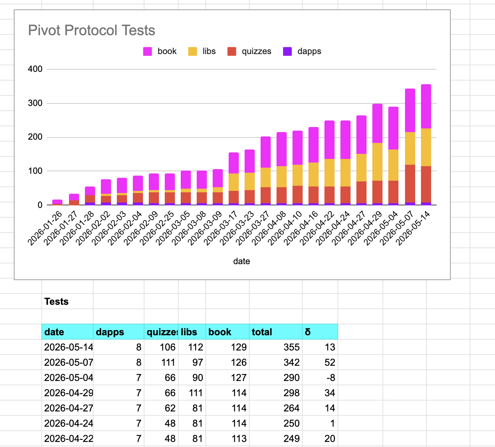
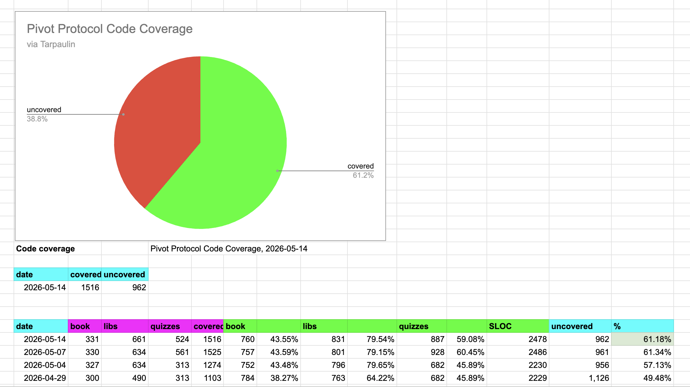
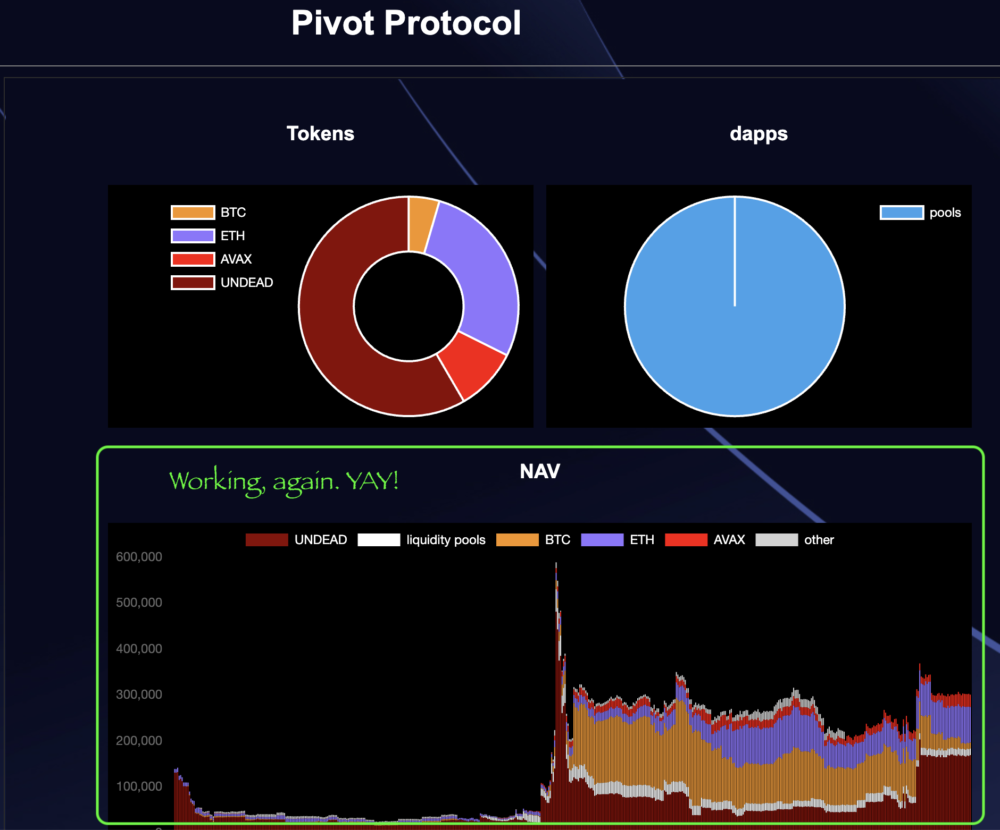

# Testing and Code coverage

G'day, pivoteurs!

A good day yesterday, and an all-nighter for moiself! (<<- that is French, 
that is!)

Automation development proceeds apace. Along with development, we're adding 
testing and code coverage to the Pivot Protocol. 

# UX

For those sharp-eyed pivoteurs that saw that our dashboard was down this 
morning, this was due to a change in data-formats.

I diagnosed the issue and put in a code-fix.

The [Pivot Protocol dashboard](https://pivoteur.github.io/#) is back up and 
running! YAY! 

