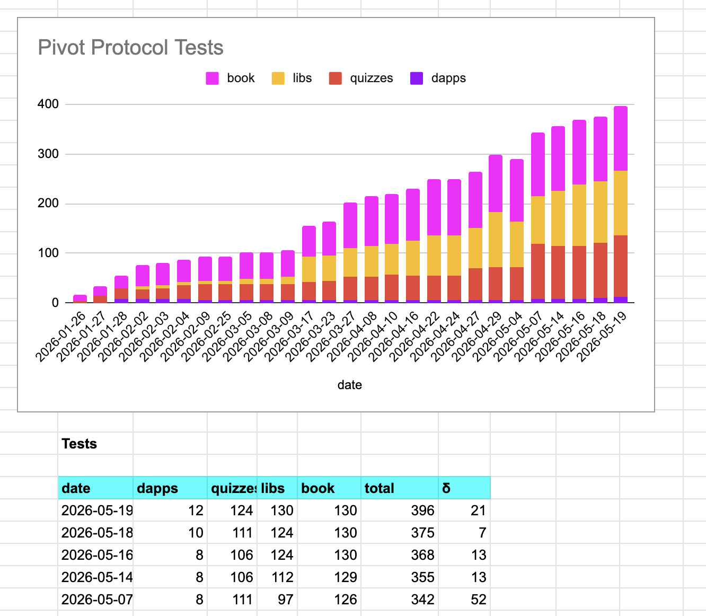
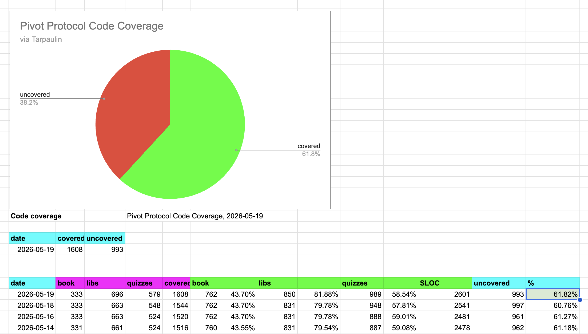
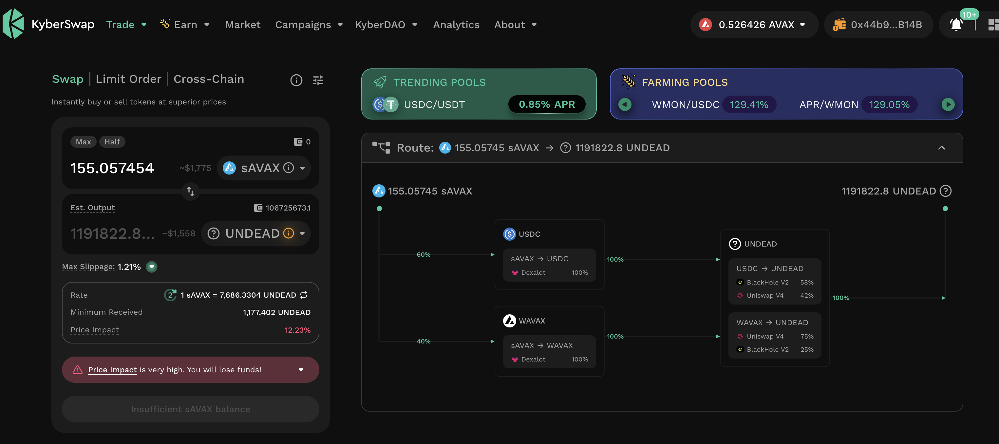
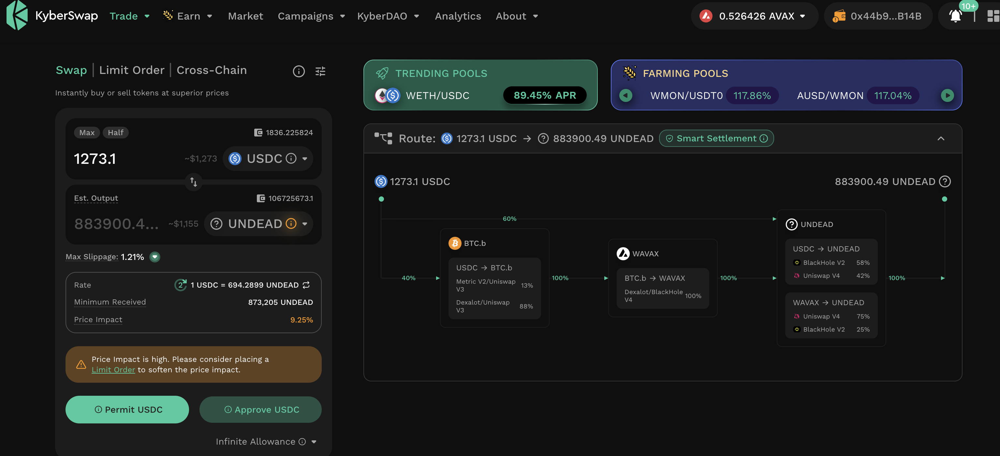
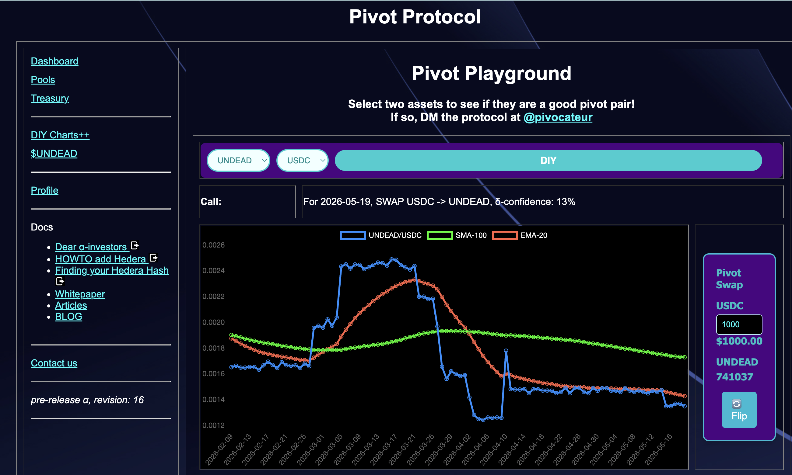
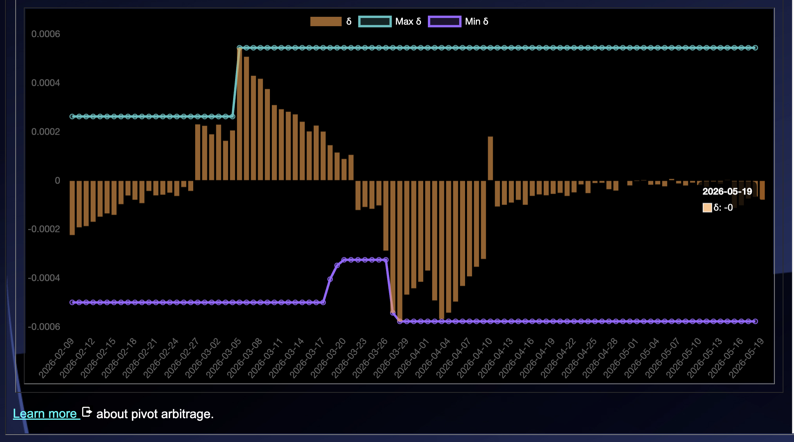
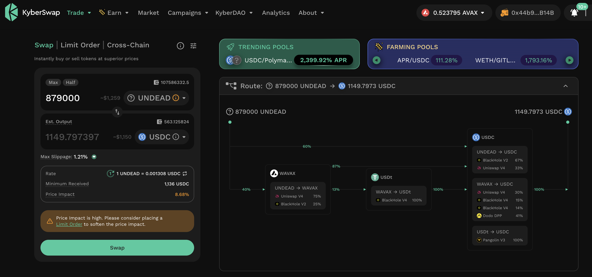
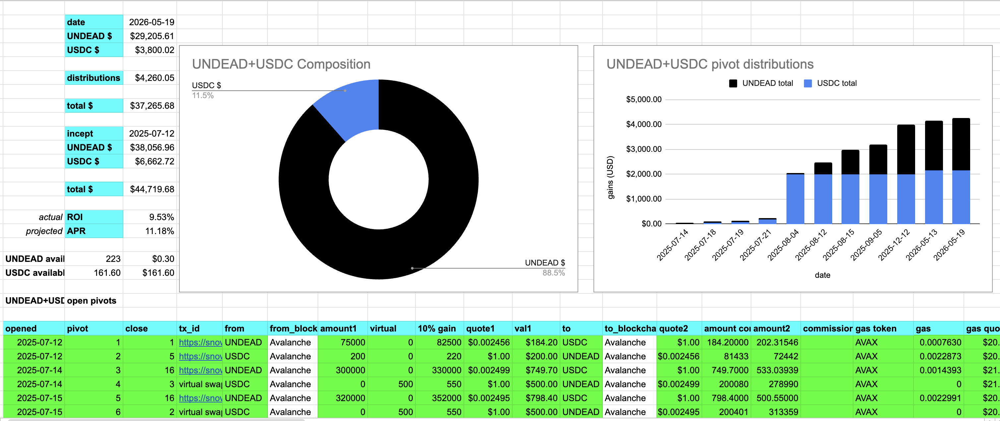
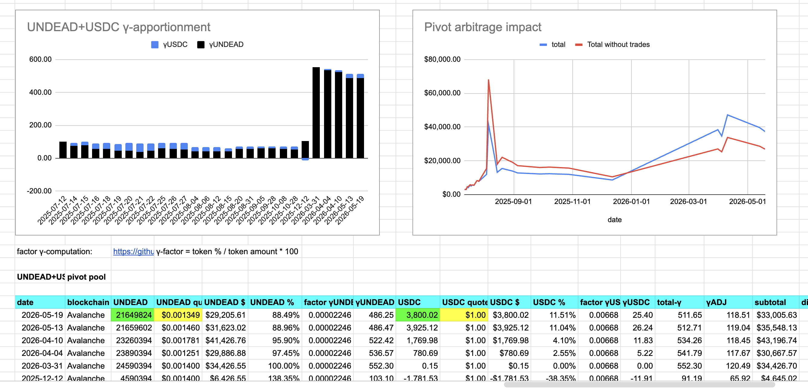

# Testing and Code Coverage

Hwæt, pivoteurs!

Automation work proceeding apace. We're increasing our testing and 
code-coverage as we develop automation. 

# PIVOTS

`dusk` calls for 4 close pivots. Let's examine some of them (the ones we can 
get to), starting with the largest volume pivots first. 

## UNDEAD-on-AVAX

Pivot #1, from 195 $AVAX to $UNDEAD doesn't meet the 10% gain-cut, so we move 
onto the next pivot.

Maybe slippage or maybe price-movement invalidated this pivot. I don't know. 

## UNDEAD+USDC

The next pivot (ix 3) the swap does surpass the 10% gain requirement, so I 
close this pivot.

I enter the data into `wyrd` to close the pivot, but it does not process 
numbers with commas.

This is a work in progress. 

### `wyrd` hot-fix

A hot-fix in just before 8 pm ET (that is: UTC midnight), allows `wyrd` to 
process the transaction correctly.

I enter this row into the UNDEAD+USDC close pivot table. 

*whew!*

## Open UNDEAD+USDC pivots 

 
 

The meh δ makes no call, but I open an UNDEAD-on-USDC pivot, anyway. 

 

All UNDEAD+USDC assets are now committed to pivots. 

The UNDEAD+USDC pivot pool composition and γ-apportionment are as charted. 

 
 

