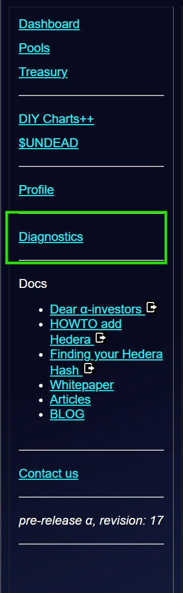
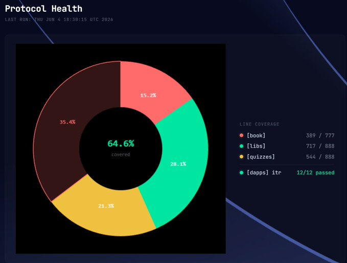

# Protocol Health

Hwæt, pivoteurs!

How do we measure the health of the Pivot Protocol?

Many ways. One way is via quality assurance of code.

Thanks to the work of @ParisBrand32180, we now have comprehensive and 
automated testing, at the unit-, functional-, and integration-level, 
displayed live!

