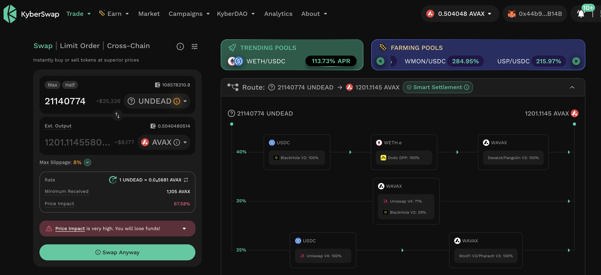
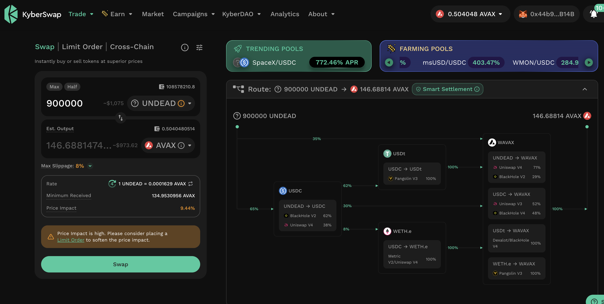
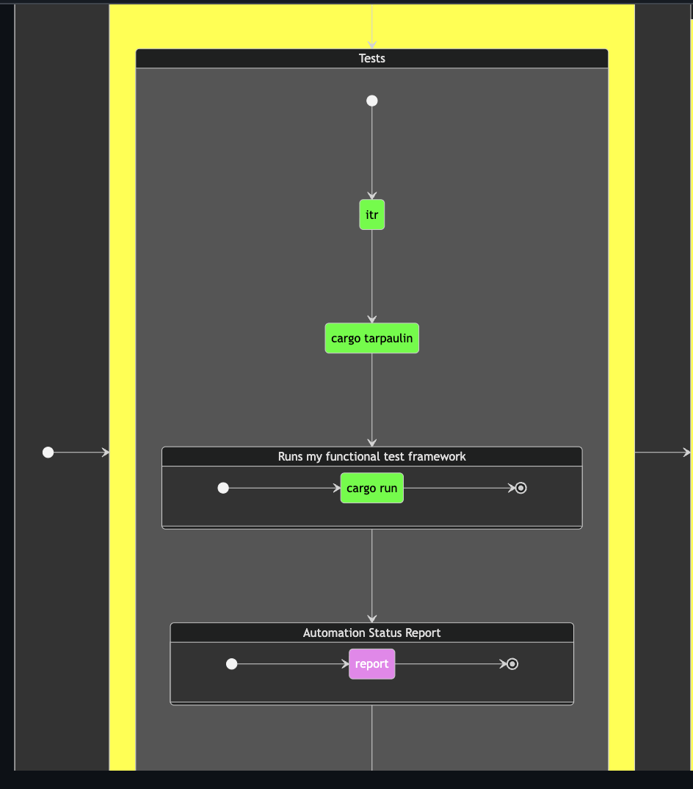
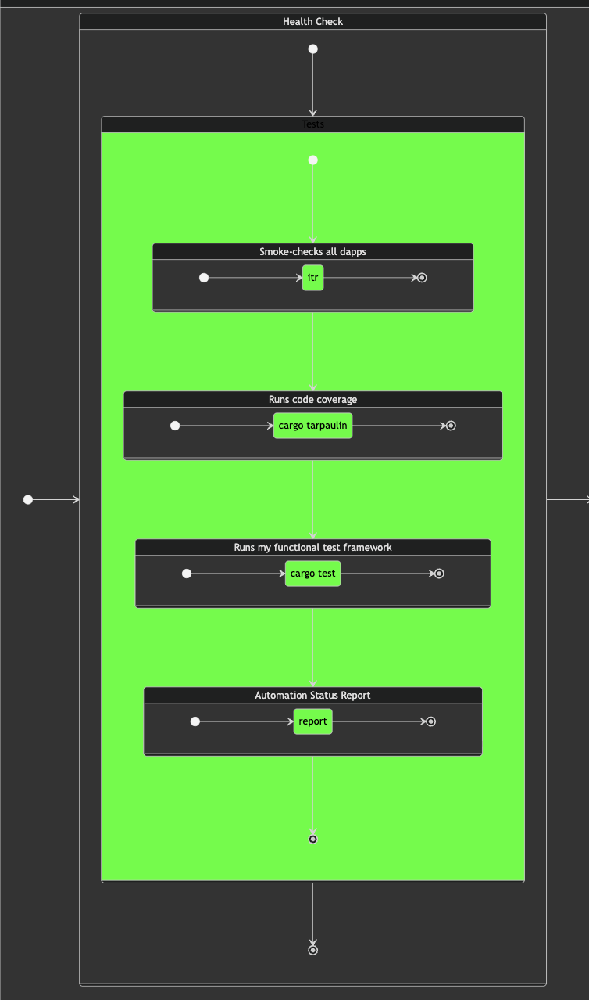

# `dusk` report

HWÆT, my belovèð pivoteurs!

`dusk` has recommendations for all the pivot pools, ...

...but trading is an issue with limited liquidity, so we need a new program to 
counterpropose trades that are feasible, given current market conditions.

`Ġegncwide`/`counter`? That name is available.

# Pivots

So, let's take a working example.

The second close-pivot call says swap back 21M $UNDEAD for $AVAX. That's not 
feasible right now, but is 1M $UNDEAD a net-positive trade?

Let's work through the mechanics of figuring out this ġegncwide.

## Clarifications

Before we go changing anything, I need to clarify two points:

1. what does it mean that the current market cannot bear the recommended trade?
2. Given 1. ... what does the new proposed trade actually look like?

### Current Market

1. is easy: if I were to trade 21M $UNDEAD now, as called for, that would be 
67% slippage, returning only 1,200 $AVAX of the 3,200 $AVAX that opened the 
pivot, or a loss, again of 67%.

This is what we call 'no bueno' or: 'the current market cannot bear the 
recommended trade.' 😅

### `offrian`

2. is easy ... NICHT! eheh.

So, if the full trade has too much slippage and isn't viable, is there a trade 
that is?

We need a system to propose a trade, run it against the data, and determine if 
the counteroffer (ġegncwide) is viable. For that, I propose `offrian` 
('propose'). 

### Scenario

`dusk` recommends trading $26k or 21M $UNDEAD (not viable), so, counteroffer 
(gegncwide): how about $1k or 900k $UNDEAD for 146.38 $AVAX?

Is that a good trade for call #2 from `dusk`?

Let's invent `offrian` as we find out ourselves.

# Health Check Automation

But first a health check/documentation break:

Thanks to the UX and automation work put in by @ParisBrand32180, our test 
suite is now fully automated.

I've updated [the 
documentation](https://github.com/pivoteur/protocol/tree/main/dapps) to 
reflect the fully-automated testing for the Pivot Protocol.
