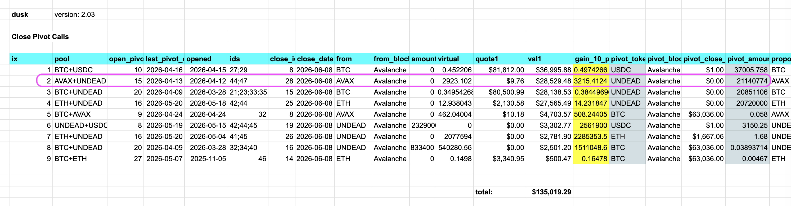

# `dusk` report

HWÆT, my belovèð pivoteurs!

`dusk` has recommendations for all the pivot pools, ...

...but trading is an issue with limited liquidity, so we need a new program to 
counterpropose trades that are feasible, given current market conditions.

`Ġegncwide`/`counter`? That name is available.

# Pivots

So, let's take a working example.

The second close-pivot call says swap back 21M $UNDEAD for $AVAX. That's not 
feasible right now, but is 1M $UNDEAD a net-positive trade?

Let's work through the mechanics of figuring out this ġegncwide.
