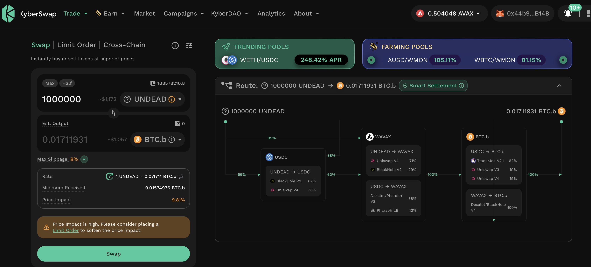
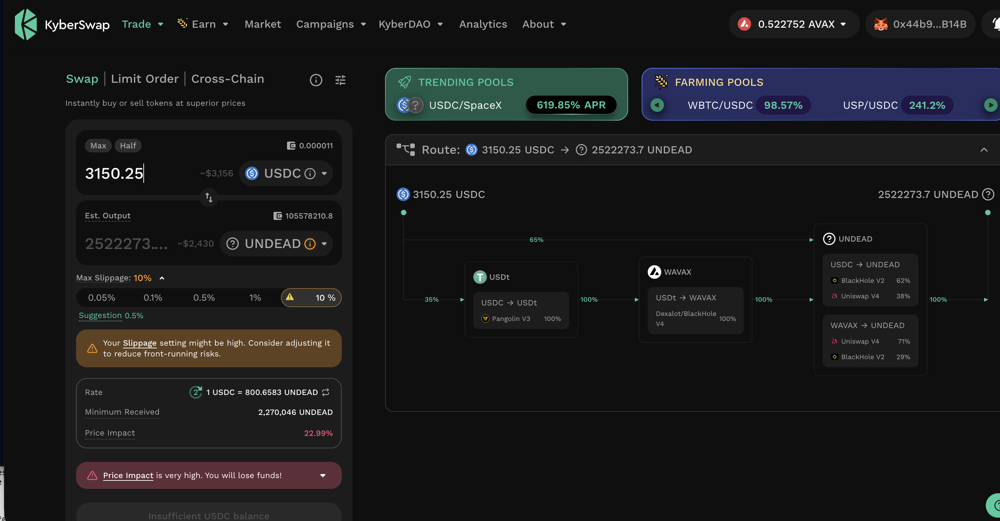
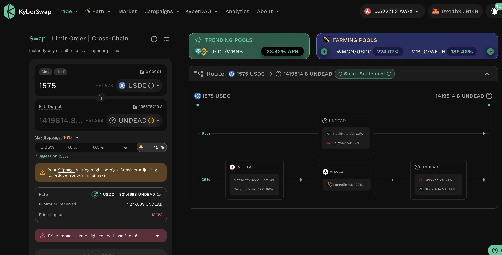

# Javascript, or ... SATAN!

HWÆT, Pivoteurs!

Does this feel familiar to you UX Designers out there?

<right click>-<inspect>-<console>

"Oh, so that's the error, huh!"

^-- this translates to: "I hate Javascript."

I really do.

# Pivots

In alignment with our daily goals:

I open an 1M UNDEAD-on-BTC pivot. 

# Trading Viably

Continuing our conversation from yesterday around building systems that 
execute viable trades, let's take a look at the `dusk`-report.

It says to trade 3150 $USDC, but the slippage for that is too high. But what 
if we trade half that amount? 

