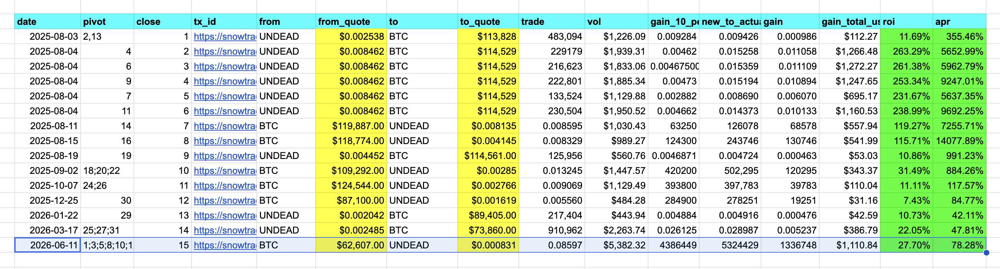
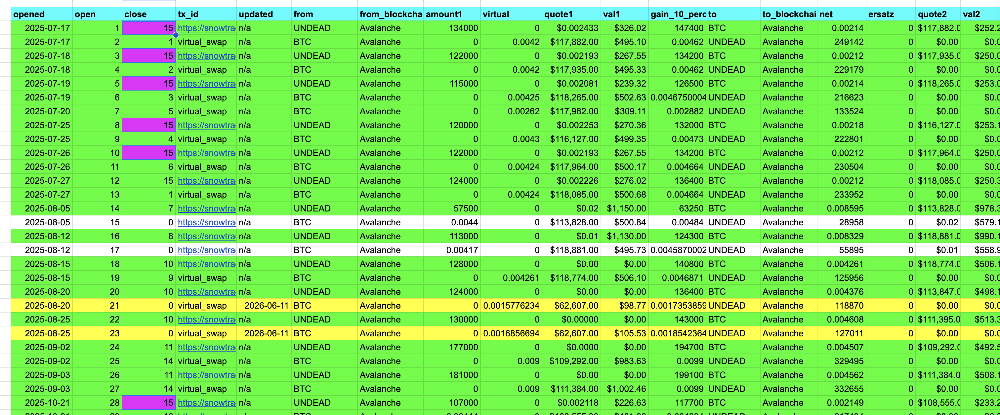
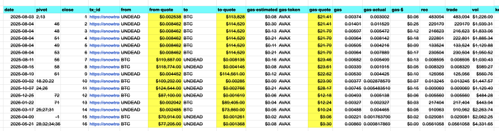
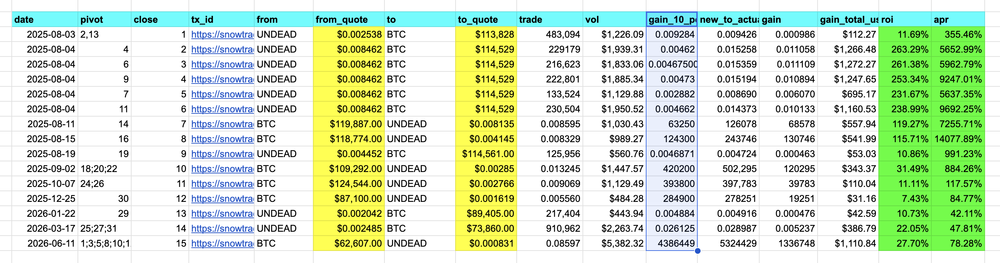
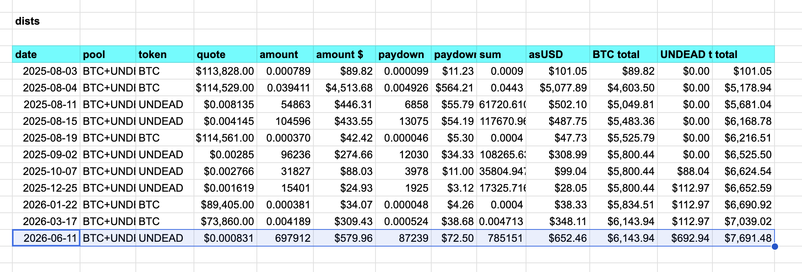
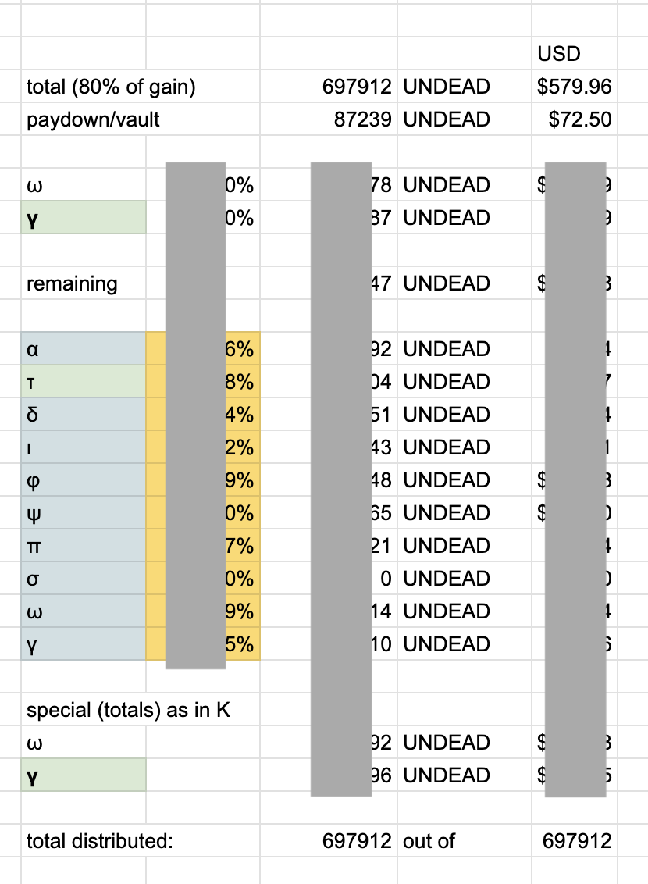

# Dividends and Reinvestments

Hwæt, pivoteurs.

Today @ParisBrand32180 and I were going to close an $UNDEAD pivot, but first 
I have to pay or reinvest yields to the investors for the previous two close 
pivots. I'll be working on that today.

Also, as I'm going about this process of paying and reinvesting yields, I'll 
be looking at automation here to make this process seemless.

## Workflow

Let's look at each close pivot in turn.

### `wyrd`

Firstly, for the UNDEAD-on-BTC close pivot on 2026-06-11, we have a program 
that makes an entry into the close pivot table. That's called 
[`wyrd`](https://github.com/pivoteur/protocol/tree/main/dapps/wyrd), which 
works with 
[`appender`](https://github.com/pivoteur/protocol/tree/main/dapps/appender).

## TODOs

### Partial closes

`wyrd` works perfectly for closing a pivot completely, but sometimes market 
conditions require I break up a pivot into multiple trades to make the pivot 
profitable.

Automation to do the latter will be realized as 
[`offrian`]( and 
[`gegncwide`](https://github.com/pivoteur/protocol/issues/190).
These are issues captured on github.

### Close open pivots

Next I need to update the open pivot table, providing the close pivot id on 
those pivots I closed.

Currently I do this manually. I've opened an [issue on 
github](https://github.com/pivoteur/protocol/issues/61) to automate this 
process. 

### `convcls`

Before I even get started – I just reminded myself – I had to update the old 
close pivot table format to the new format, which now includes the "gain 10%" 
go/no-go metric. 

The program and automation that does this is 
[`convcls`](https://github.com/pivoteur/protocol/tree/main/dapps/convcls).

### `distr`

Next I add an entry to the distribution-table. 

Currently I do this manually. 
I have an [issue on 
github](https://github.com/pivoteur/protocol/issues/200) to automate this 
process.

### `distillr`

From the entry on the pivot's distribution table, and from the amount staked 
by the investors, I compute the distributions and reinvestments of gains. I do 
this manually now. I have an [issue open on 
github](https://github.com/pivoteur/protocol/issues/62) to automate this 
process.

