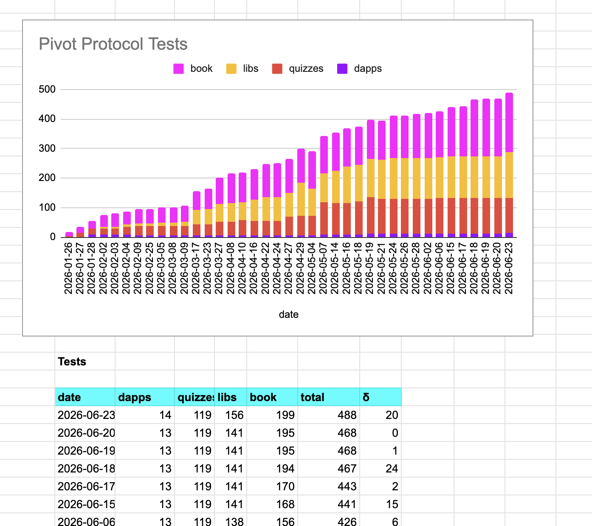
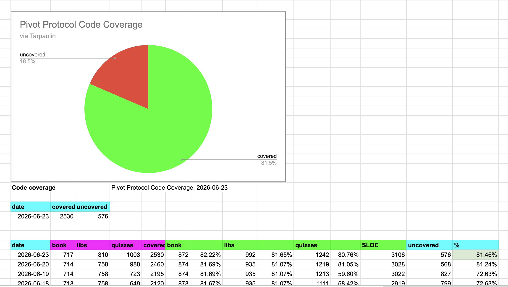

# `quotes`

Hwaet, Pivoteurs!

Introducing 
[`quotes`](https://github.com/pivoteur/protocol/tree/main/dapps/quotes) that 
scans the quotes-data and updates the daily quotes for use by the Pivot 
Protocol UX. 

# Testing

We've achieved a major milestone in our testing and code coverage:

We now have over 80% code-coverage, across the board. This contributes 
strongly to the Pivot Protocol's quality assurance. 

