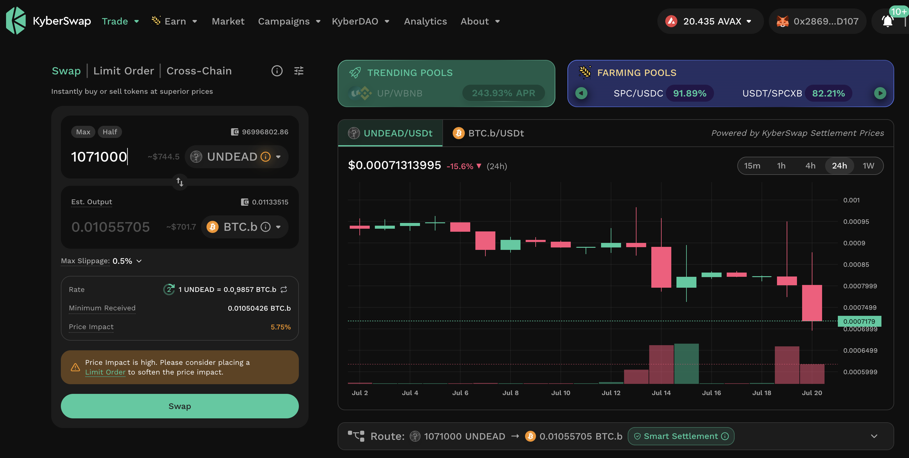
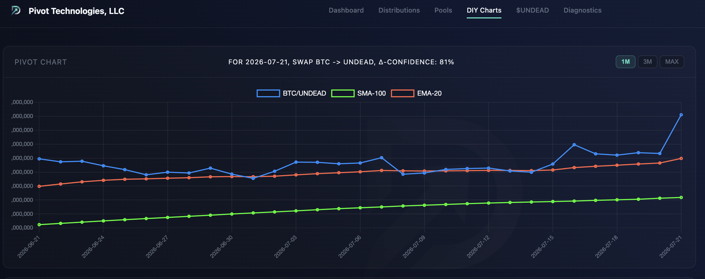
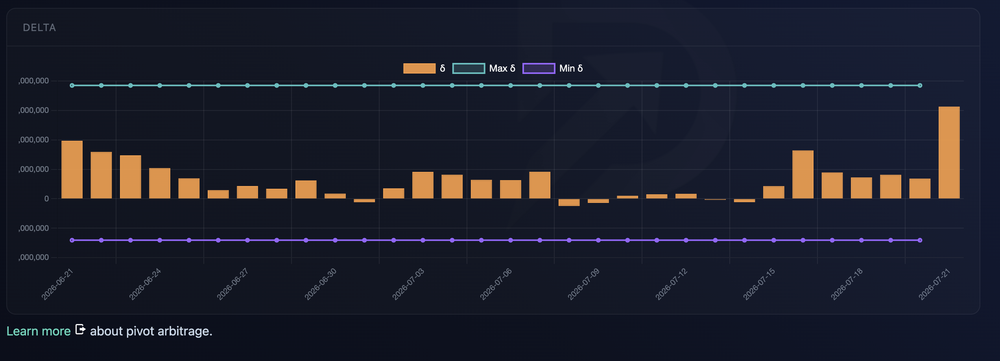
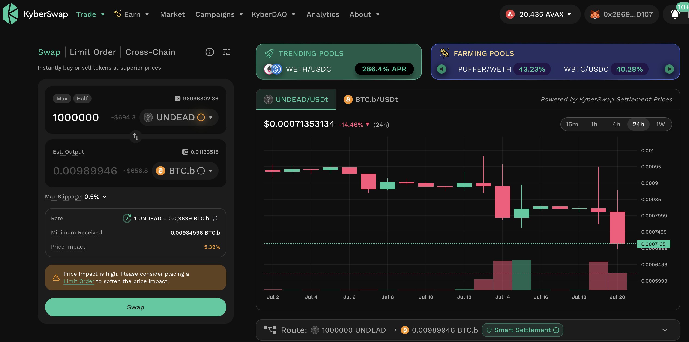

# BUIDL

HWÆT, pivoteurs!

Today is a good day? Why? Because I say so!

We've been [building and building](https://github.com/pivoteur), but there 
comes a time when one must stop building and start producing.

Today is that day.

Today is a good day!

# PIVOTS

## BTC+UNDEAD

I close a BTC-on-UNDEAD pivot for gains of:

* actual ROI: 14.83% / 5413.50% APR projected

(that's not a typo: this pivot happened in 1 day)

The δ calls to open a BTC-on-UNDEAD pivot, which I do, ...

and I also open an UNDEAD-on-BTC hedge, because ...

it's FUN MAKIN' MONAY! 
