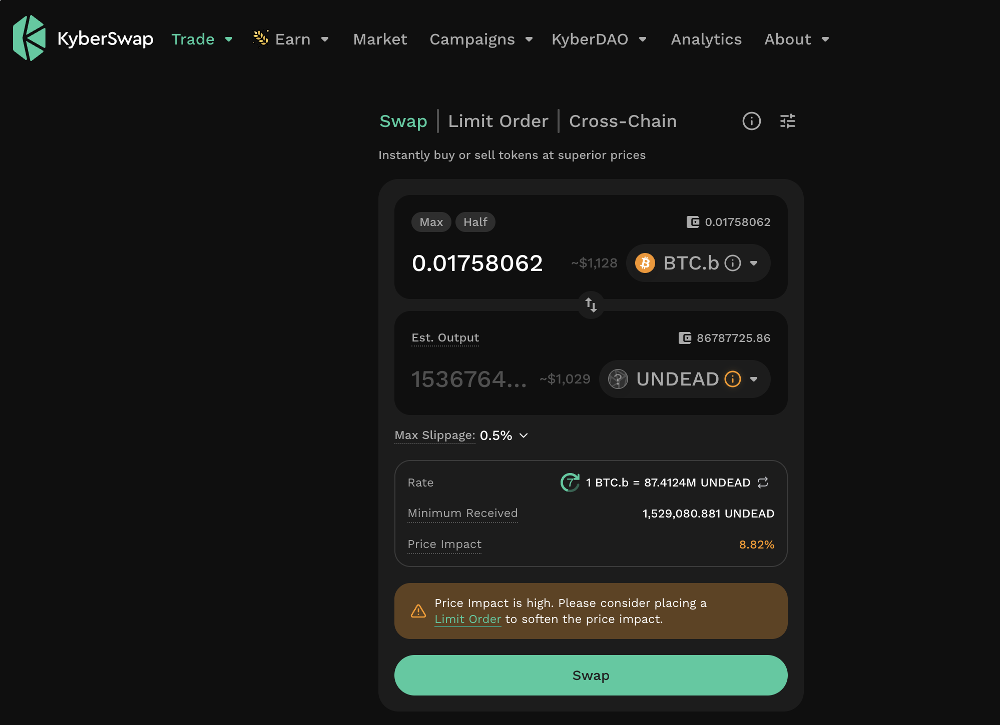
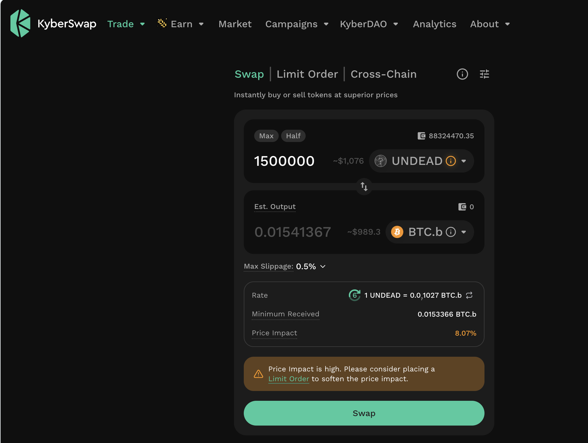

# PIVOTS

## UNDEAD-on-BTC close pivot

HWÆT, pivoteurs!

We begin closing a UNDEAD-on-BTC pivot-set: I'm going to be breaking this into 
6 trades to close the pivot.

As $UNDEAD has such price-volatility, I'll do one trade, then trade-back to 
open a different pivot.

The first trade-back is a BTC-on-UNDEAD pivot. 

