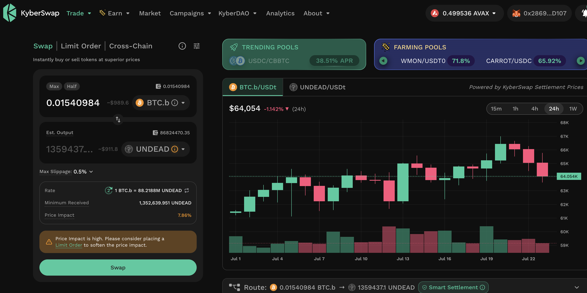
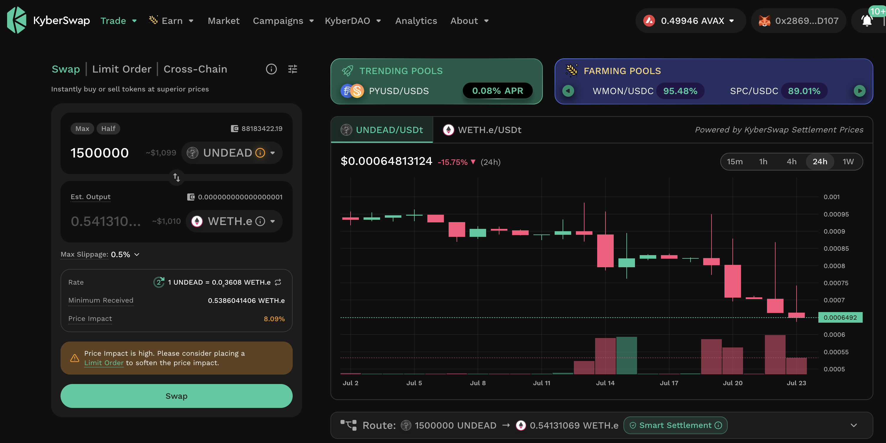

# PIVOTS

## UNDEAD-on-BTC close pivot

HWÆT, pivoteurs!

### trade 1

We begin closing a UNDEAD-on-BTC pivot-set: I'm going to be breaking this into 
6 trades to close the pivot.

As $UNDEAD has such price-volatility, I'll do one trade, then trade-back to 
open a different pivot.

The first trade-back is a UNDEAD-on-BTC pivot. 

### trade 2

The second part of closing the UNDEAD-on-BTC pivot is followed by opening an 
UNDEAD-on-ETH pivot.

Close, then open, UNDEAD pivots keep the $UNDEAD price stable. 

