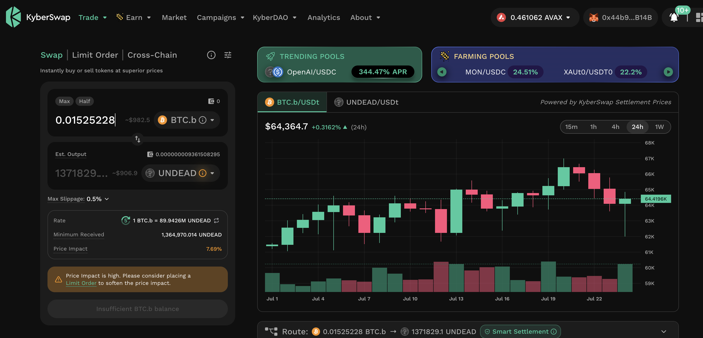
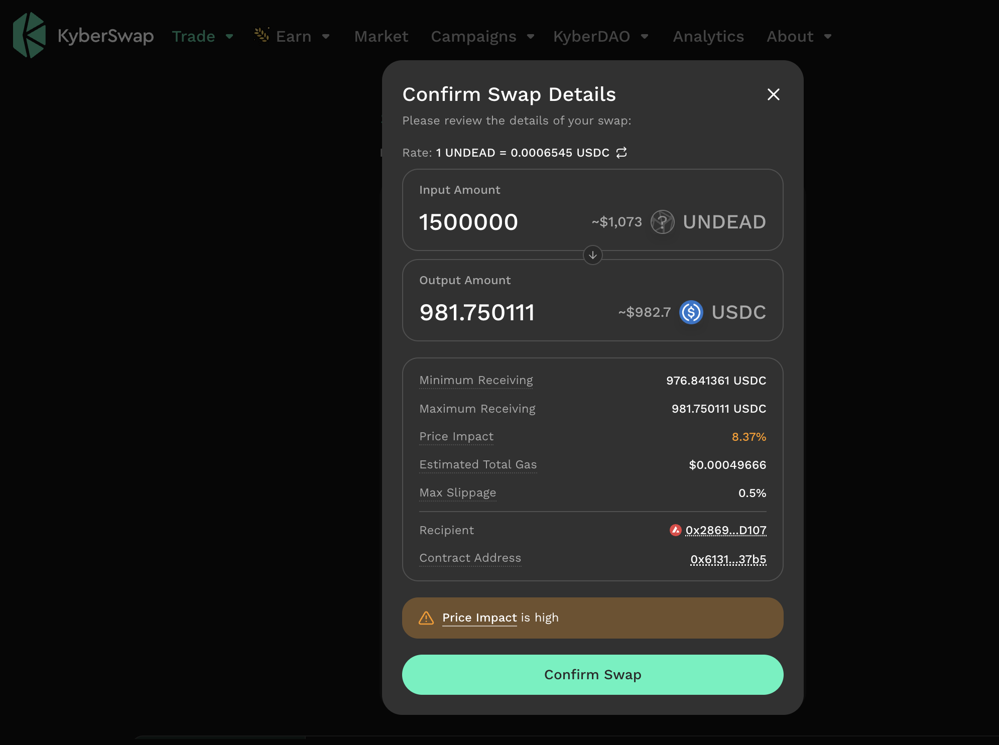
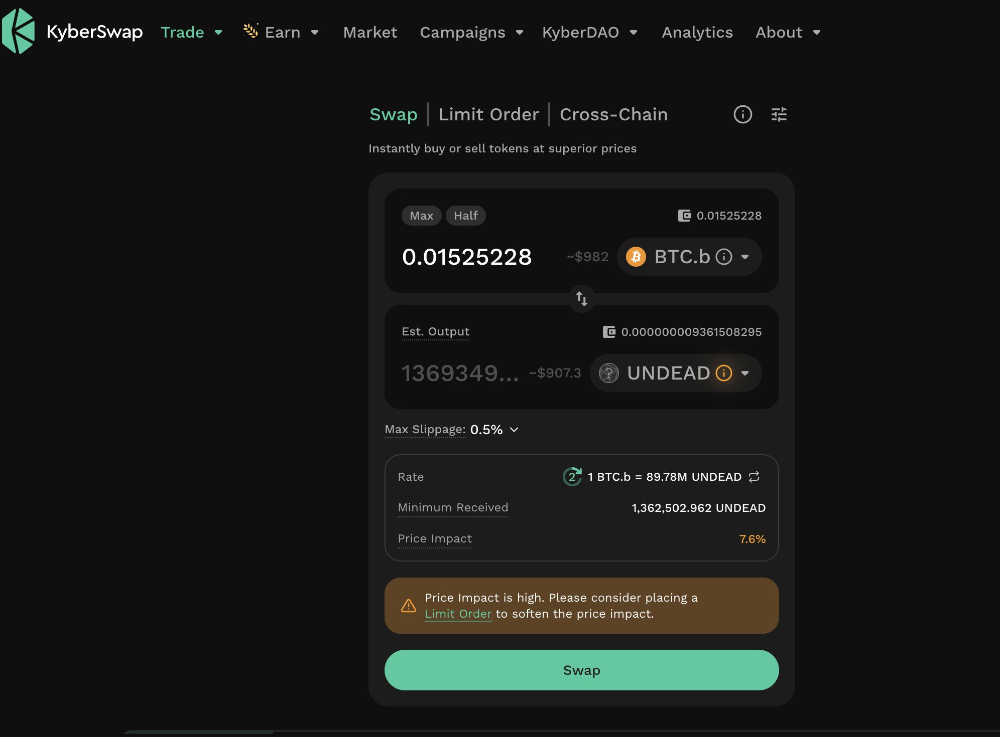
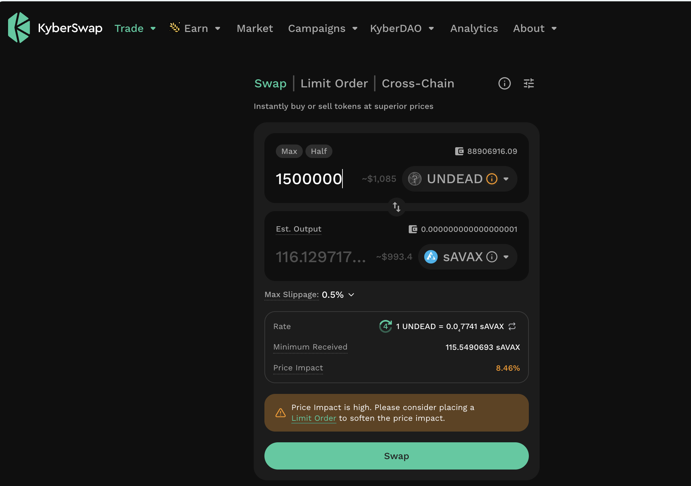

# PIVOTS

## BTC+UNDEAD, continued

### part 3

HWÆT, pivoteurs,

[Continuing on from yesterday](../24), the UNDEAD-on-BTC close pivot is still 
valid and ongoing.

I close the next part of the UNDEAD-on-BTC pivot, then turn right around and 
open a new UNDEAD-on-USDC pivot, keeping the $UNDEAD price balanced. 

### part 4

Next part of closing the UNDEAD-on-BTC pivot, then I open an UNDEAD-on-AVAX 
pivot.

