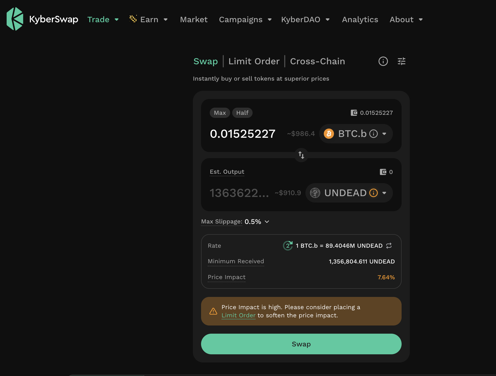
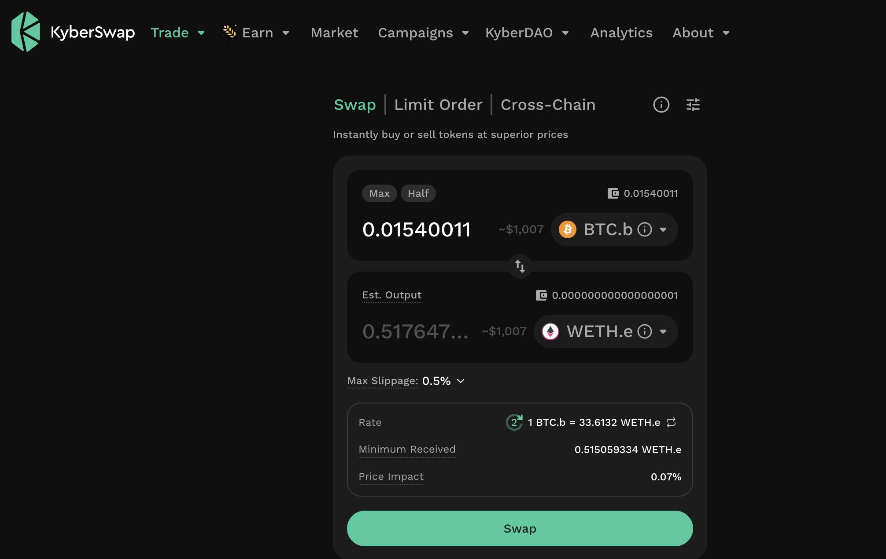

# PIVOTS

## BTC+UNDEAD

### Part 5

HWÆT, Pivoteurs!

[Continuing on from continuing-on](../25), I close the next part of the 
UNDEAD-on-BTC pivot, then open a new UNDEAD-on-ETH pivot (via BTC: I went to 
BTC first, but ETH has available UNDEAD; BTC's UNDEAD is all committed to 
pivots now). 

