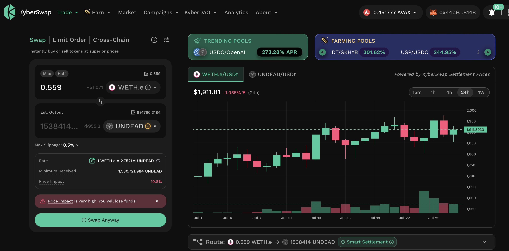
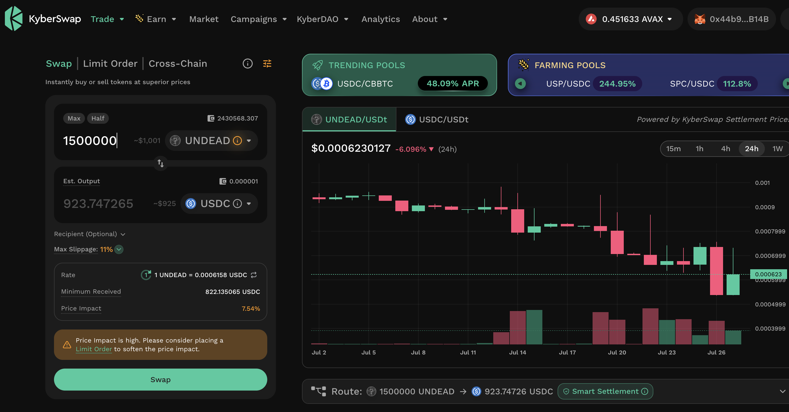
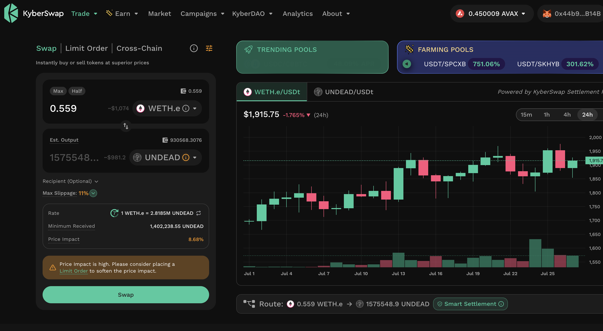

# PIVOTS

HWÆT, Pivoteurs!

## ETH+UNDEAD

Today we'll close 7 pivots on the ETH+UNDEAD pivot pool.

### part 1/6

We partition this close into 6 swaps, to lessen the impact this large close on 
the $UNDEAD liquidity pool.

1/6 UNDEAD-on-ETH close pivot which I follow by opening an UNDEAD-on-BTC pivot. 

### part 2/6

Close 2/6 UNDEAD-on-ETH pivot;
open UNDEAD-on-USDC pivot 

### part 3/6

Close 3rd UNDEAD-on-ETH pivot-part;
open UNDEAD-on-AVAX pivot 
