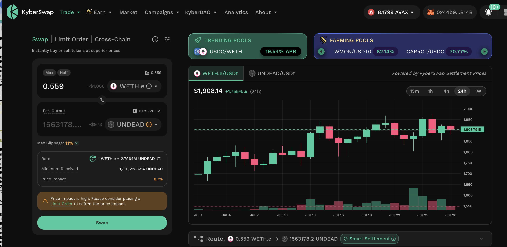
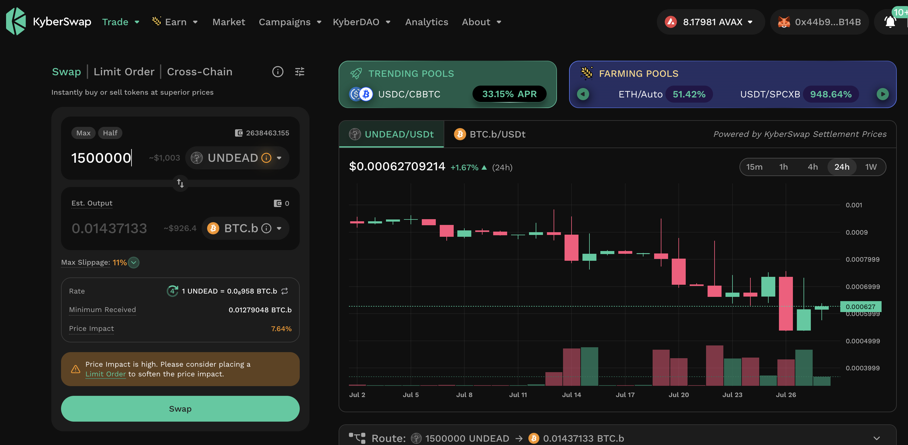
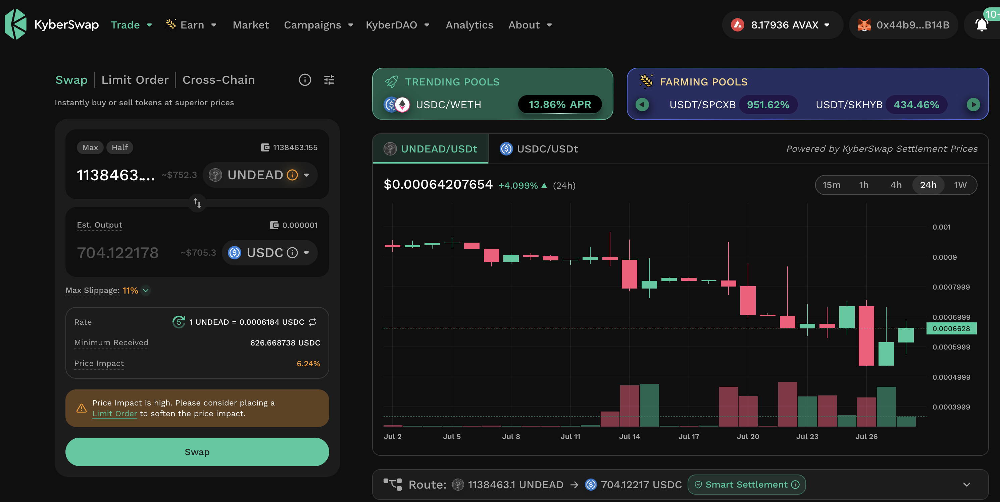
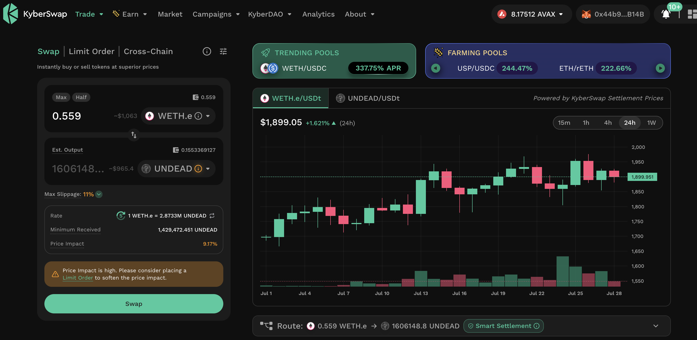
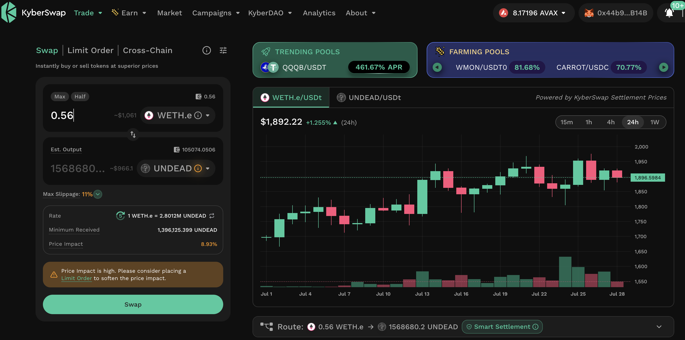
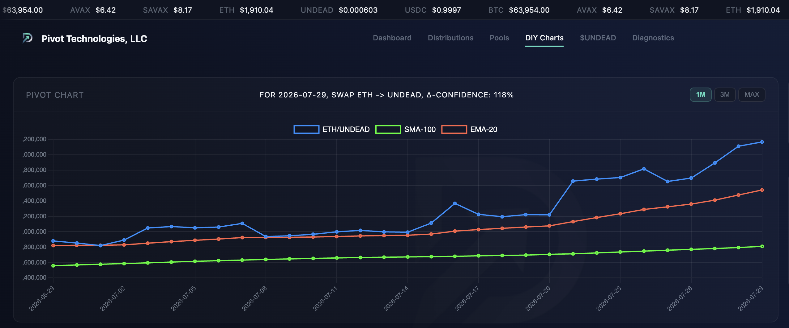
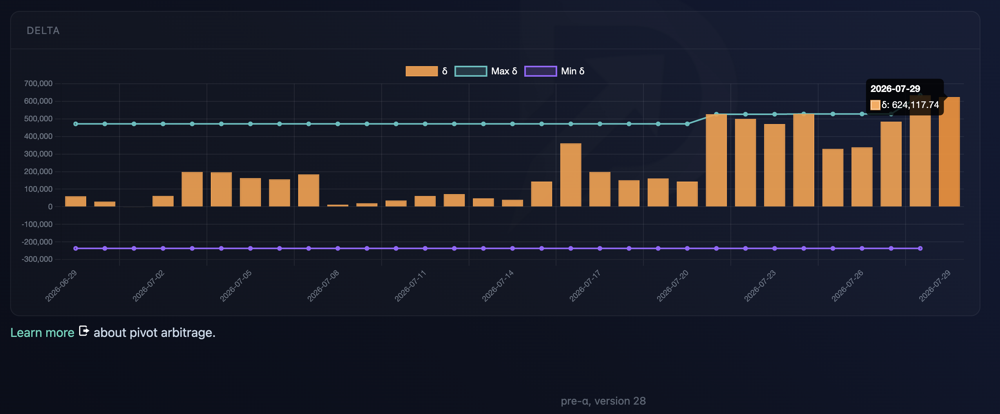
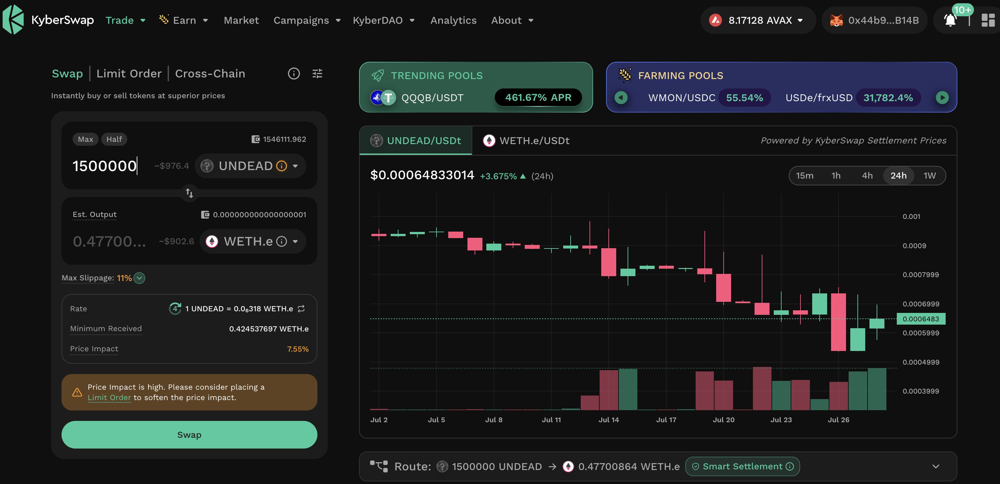
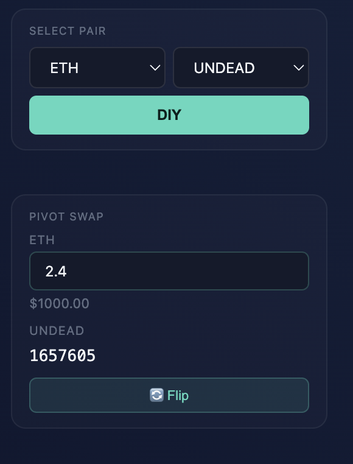

# PIVOTS

## ETH+UNDEAD

### part 4/6

HWÆT, pivoteurs,

Continuing the [UNDEAD-on-ETH close pivot from yesterday](../28), ...

* close UNDEAD-on-ETH pivot, 4/6

* open a new UNDEAD-on-BTC pivot

### part 5/6

* open UNDEAD-on-USDC pivot

* close UNDEAD-on-ETH pivot

### part 6/6

Completing the UNDEAD-on-ETH close pivot, I do the final swap and also open an 
UNDEAD-on-AVAX pivot.

close pivot gains:

* actual ROI: 14.97% / 321.39% APR projected

Which is stellar! 💥

Of note: I close pivots ranging from last week to MORE THAN A YEAR AGO!

Pivots work.

### Open new pivots

I distribute and reinvest the gains to all investors.

The ETH/UNDEAD δ calls to open an ETH-on-UNDEAD pivot, which I do virtually, 
and I also open an UNDEAD-on-ETH hedge, protecting the pool from any market 
change-in-direction.

