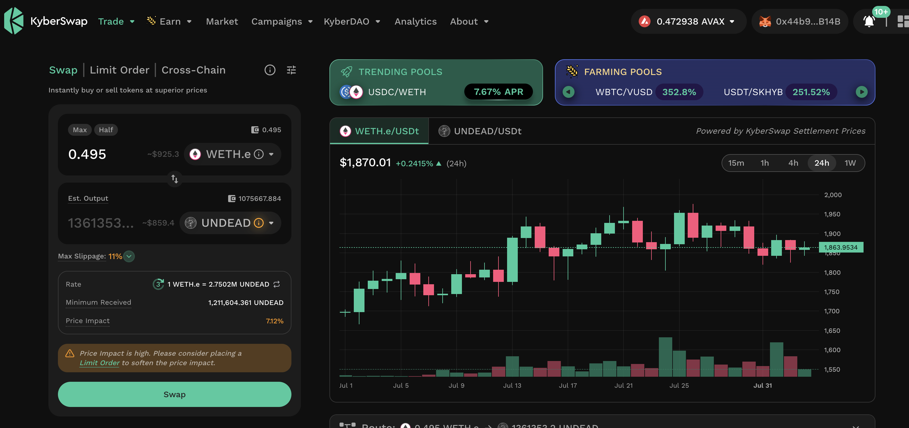

# PIVOTS and Automation

HWAET, Pivoteurs!

We continue to develop automation and pivot.

To wit: I open an ETH-on-UNDEAD pivot. 

Why am I showing you me opening a pivot manually when I'm talking about 
automation?

Because we're working on trade-automation.

This is the 'before pic.' 😎

