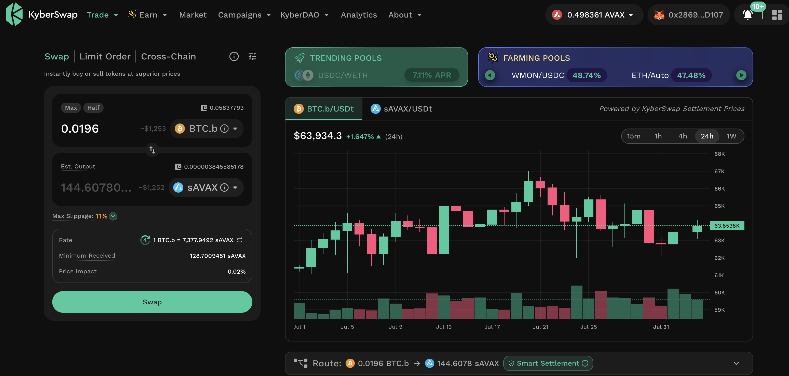
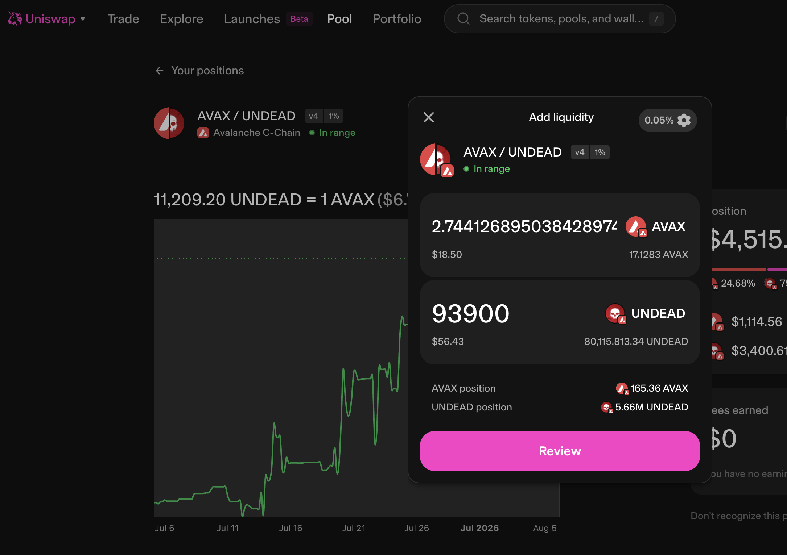

# PIVOTS

HWÆT, Pivoteurs,

Let's start the day by opening a BTC-on-AVAX hedge. Why? Because I opened an 
AVAX-on-BTC pivot a tad earlier today.

We rock'n-'n-roll'n with the pivot'n on the Pivot Protocol. 

# Liqudity

Slippage for $UNDEAD swaps is still very high for trades over $300, so I fund 
a little bit (back) to the AVAX/UNDEAD LP on @Uniswap from the fees collected 
on pivot arbitrage trades.

The protocol's aim is to have $1M of AVAX/UNDEAD liquidity in the LP.

We have a ways to go.
