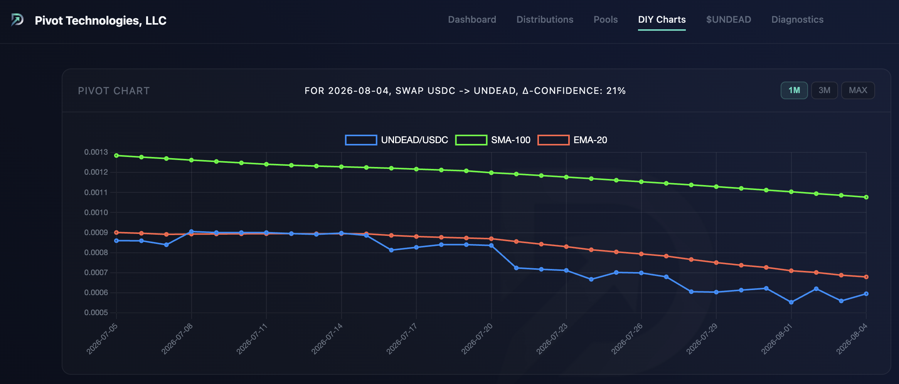
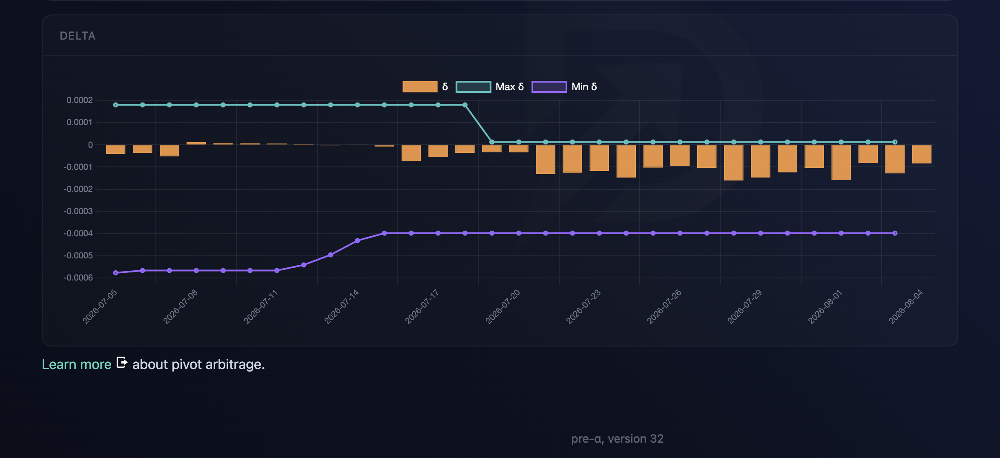
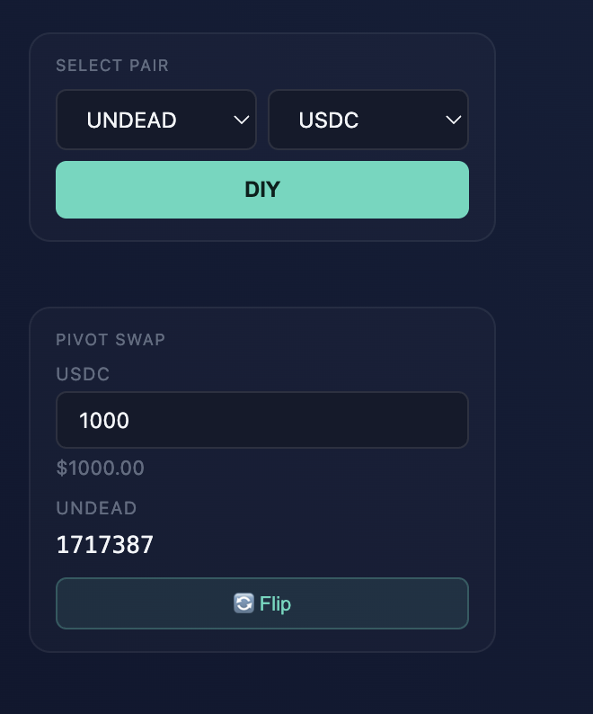
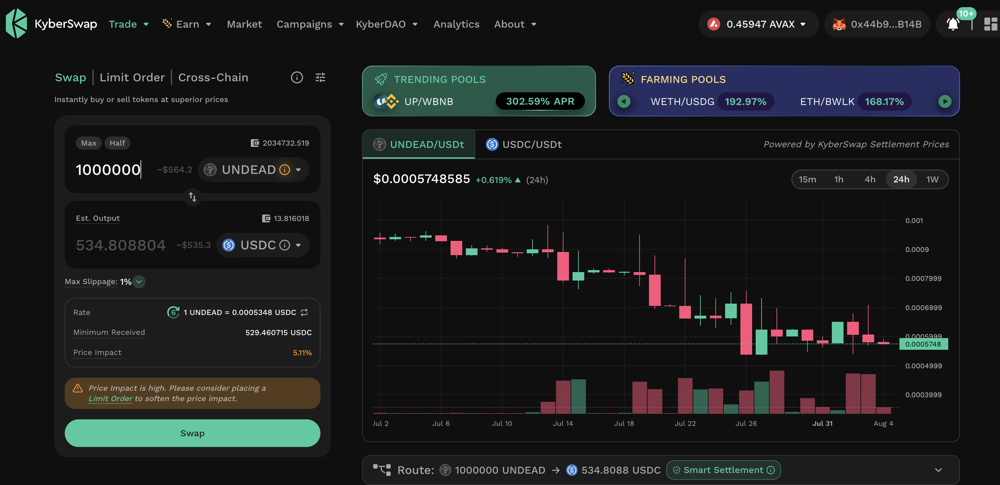
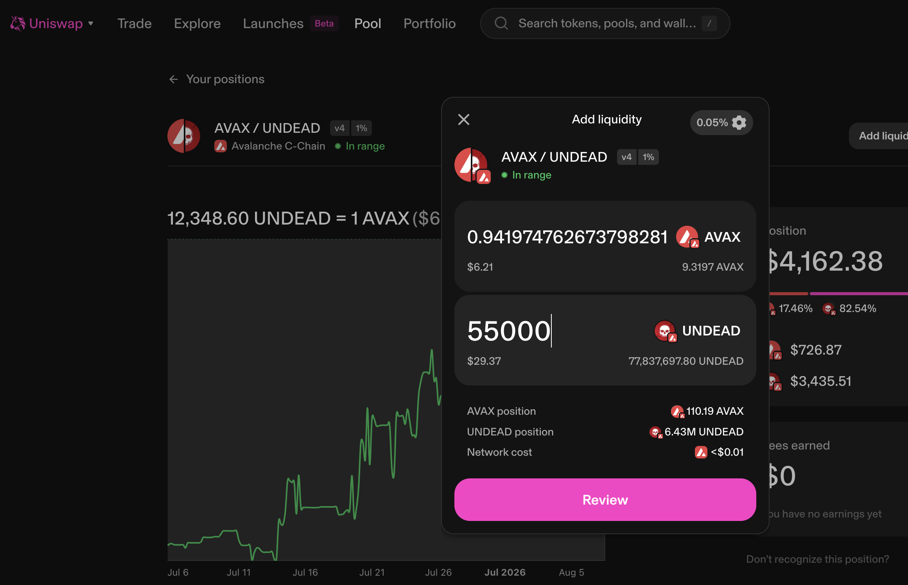

# PIVOTS

HWÆT, pivoteurs!

## UNDEAD+USDC

We start our day by opening an USDC-on-UNDEAD pivot and, contrapositively, 
an UNDEAD-on-USDC hedge, as per the 
[DIY+-page](https://pivoteur.github.io/diy.html?t1=UNDEAD&t2=USDC)
recommendation. 

# Liquidity pool

I fund the @Uniswap $UNDEAD liquidity pool. 
