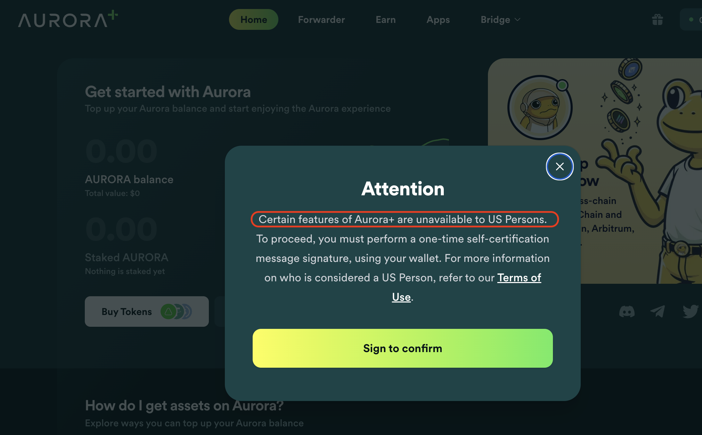
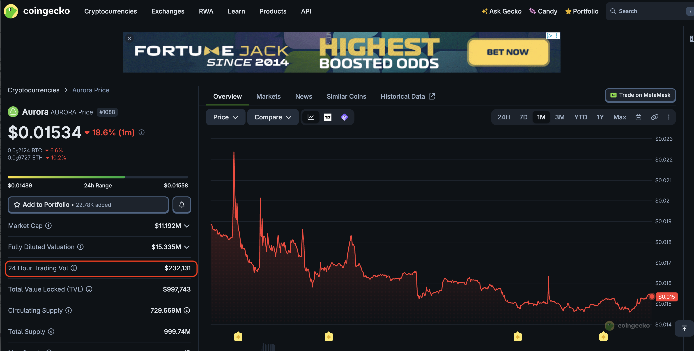
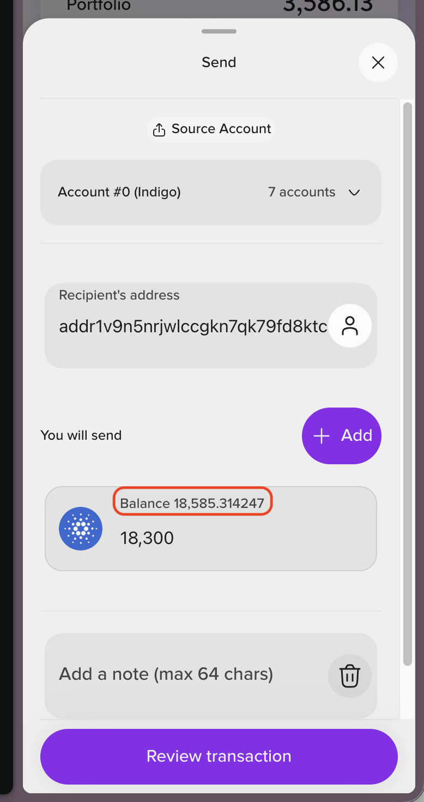
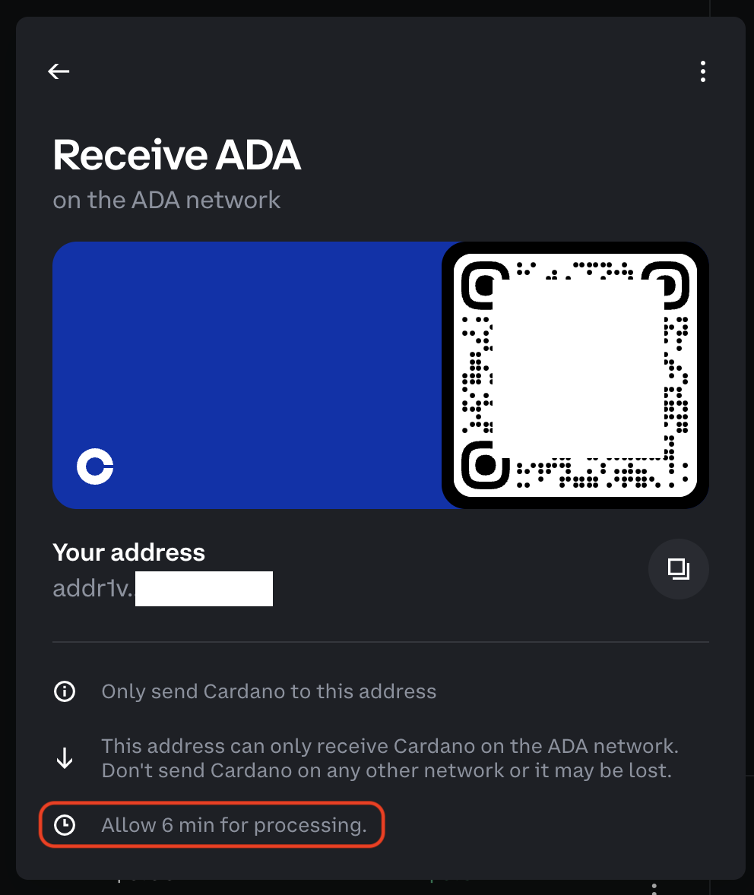
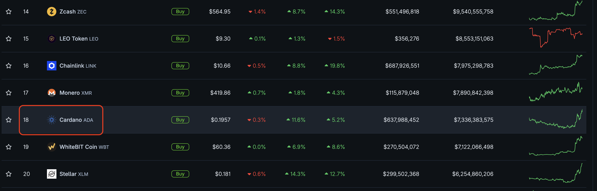
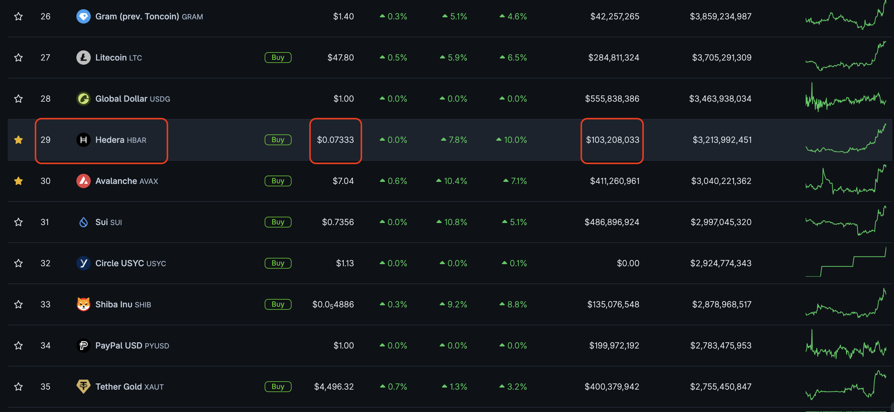

# Experiments

## Aurora Blockchain

HWÆT, pivoteurs!

Last year, we looked into Aurora protocol $AURORA.

That didn't work. I'm not one to tell others how to run their business, but 
excluding US Persons exclude a large potential market, perhaps the largest 
in the world, and $AURORA's daily volume shows this lack.

## Cardano

We looked at Cardano, but there are problems with the blockchain that make it 
irreconcilable with pivot arbitrage:

* high transaction fees ($4.00 sometimes)
* very high slippage on @Indigo_protocol and other DEX
* transactions take up to 6 minutes???
* confirmation transactions

A Cardano-maxxie bragged that "in all the years that Cardano has existed, it 
has never fell below 15th blockchain in the world!"

It immediately fell to 18th, dipping 80% in price.

Sure, be a maxxie, but when making a pronouncement, back it up by BUIDL'n a 
fast, efficient chain!

## Hedera

We explored Hedera HashGraph, but we came to that graph just as major protocols abandoned that chain, but it is unsuitable for pivot arbitrage:

* 30%+ slippage on BTC/ETH swaps
* 70% price-drop for $HBAR 
* slow transactions

A graph is a great idea, but low volume on the chain?

