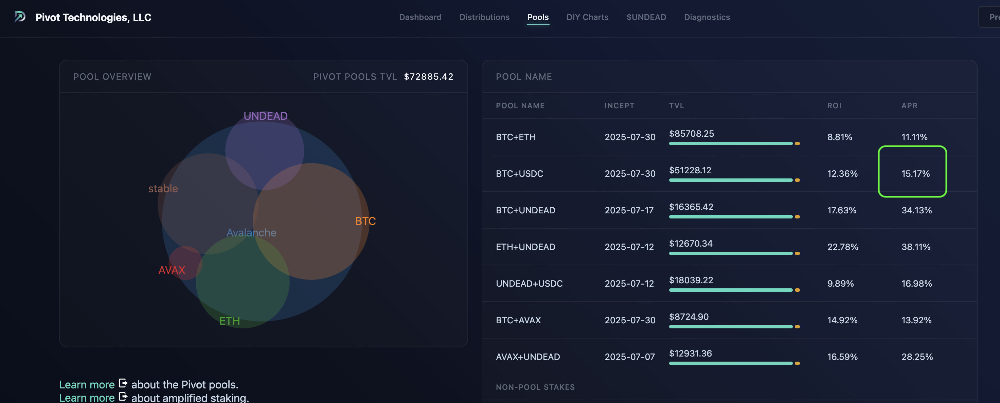

# Pivot Pools vs Liquidity Pools

HWÆT, pivoteurs!

* Liquidity pools have "impermanent loss" (IL)

* Pivot pools are the exact opposite: they have "permanent gains" (PG)

* BTC/USDt on @KyberNetwork is making 9% on @binance with the risk of IL.

* BTC+USDC pivot pool is making 15% on https://pivoteur.github.io/pools.html 
with PG. 

