# Pivot Pools vs Liquidity Pools

HWÆT, pivoteurs!

* Liquidity pools have "impermanent loss" (IL)

* Pivot pools are the exact opposite: they have "permanent gains" (PG)

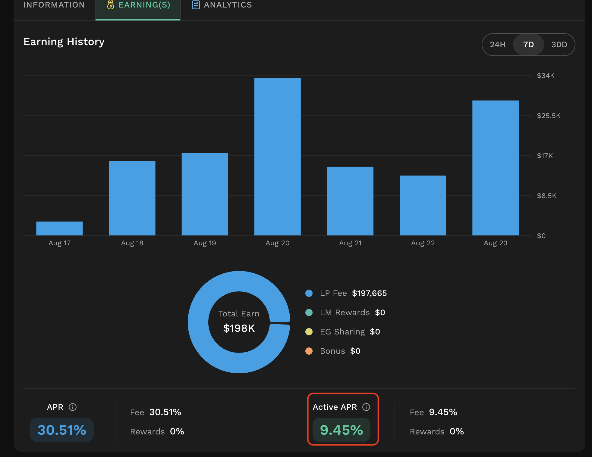

* BTC/USDt on @KyberNetwork is making 9% on @binance with the risk of IL.

* BTC+USDC pivot pool is making 15% on https://pivoteur.github.io/pools.html 
with PG. 

# Pivots

## BTC+USDC

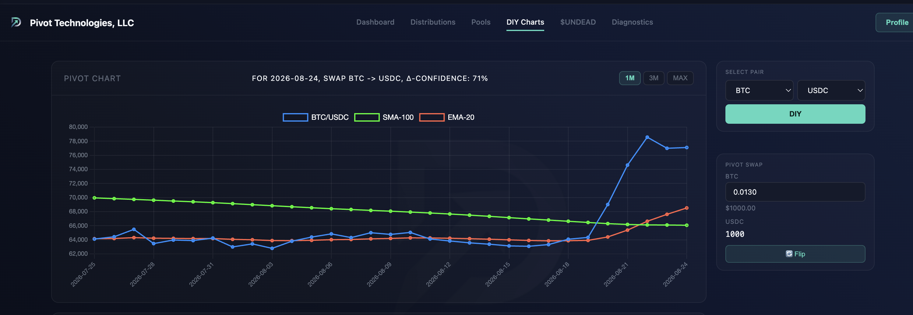
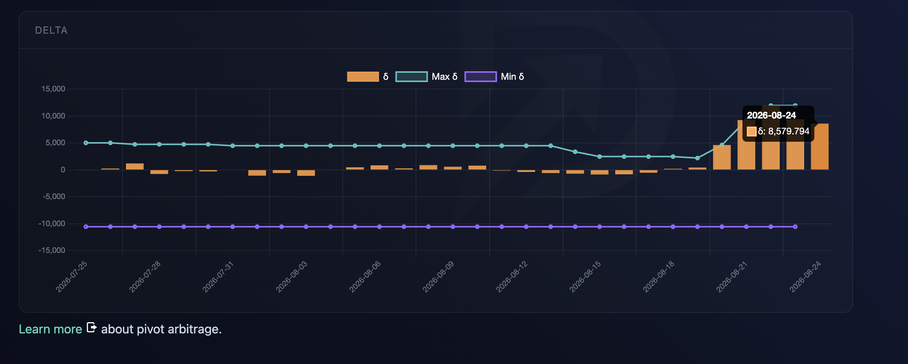
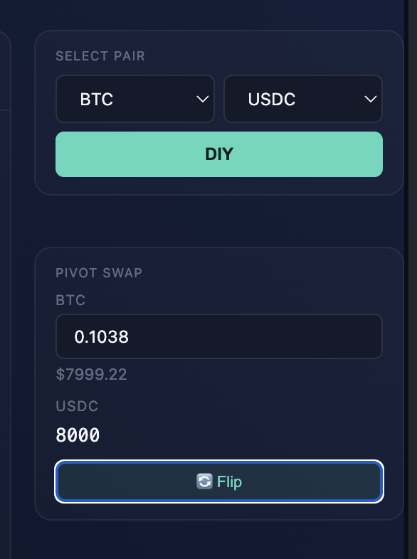
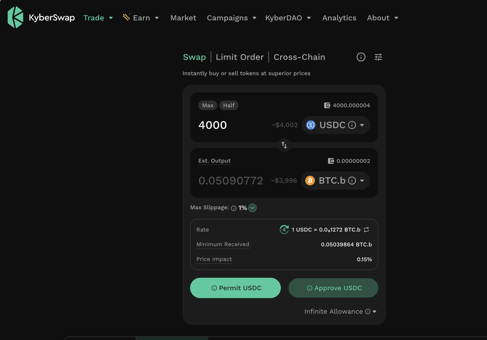

The protocol opens a BTC-on-USDC pivot and, at the same time, a USDC-on-BTC 
hedge upon reviewing the BTC/USDC ratio and δs. 

## ETH+UNDEAD

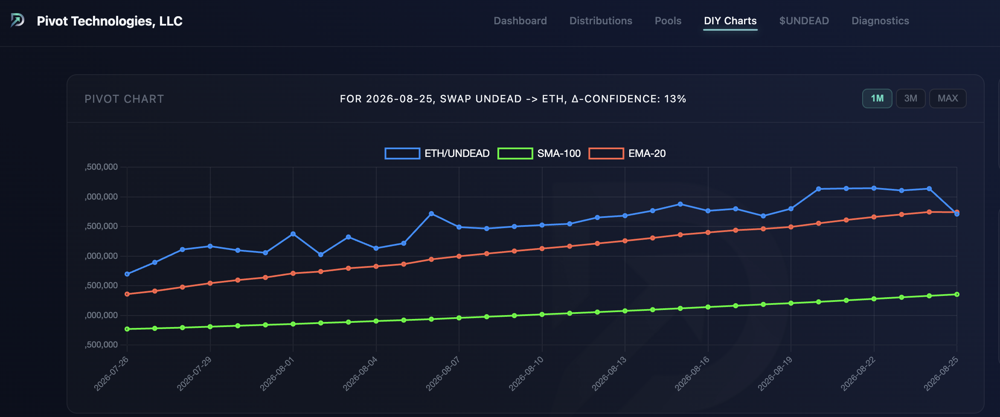
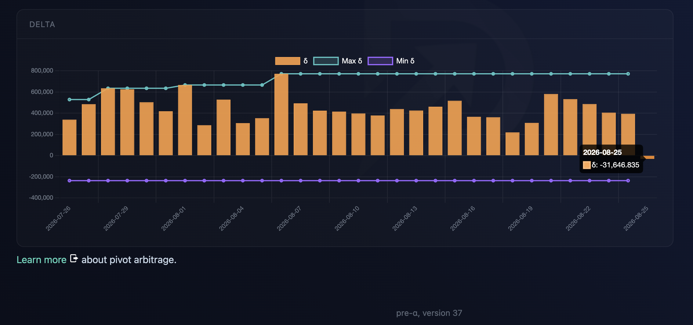
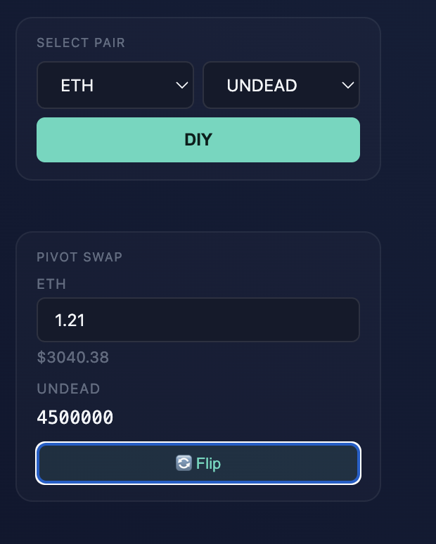
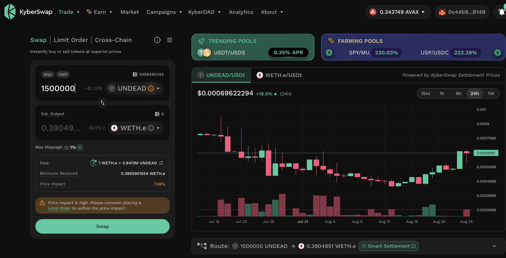

I also open an ETH-on-UNDEAD pivot and an UNDEAD-on-ETH pivot as the 
indicators make no call either way. 

## BTC+UNDEAD

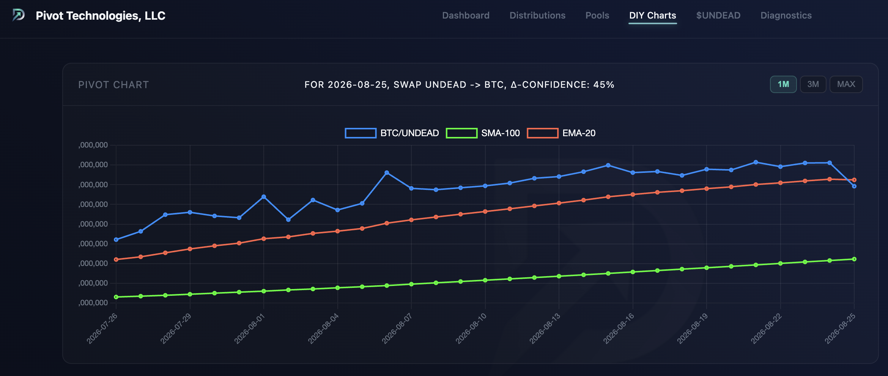
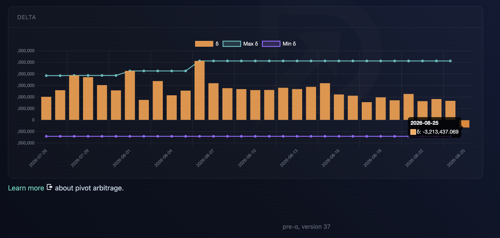
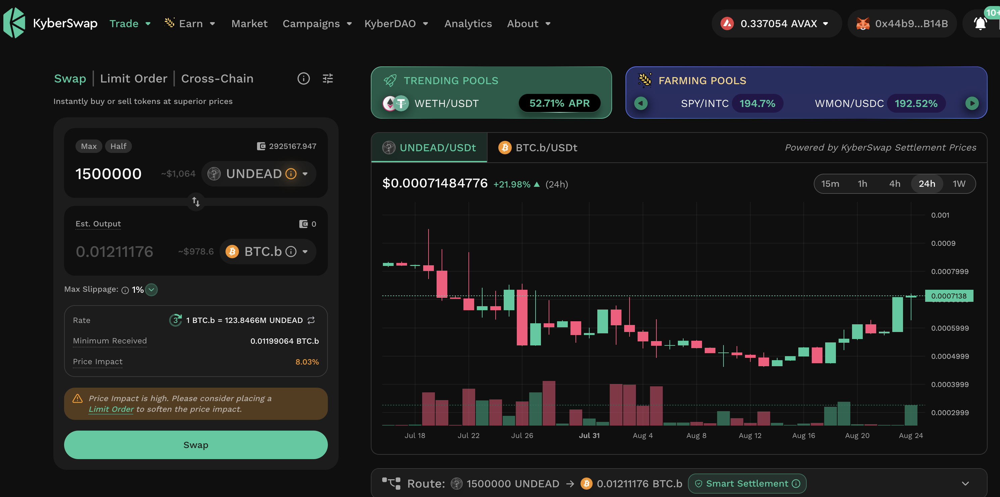

I open an UNDEAD-on-BTC pivot. 

## UNDEAD+USDC

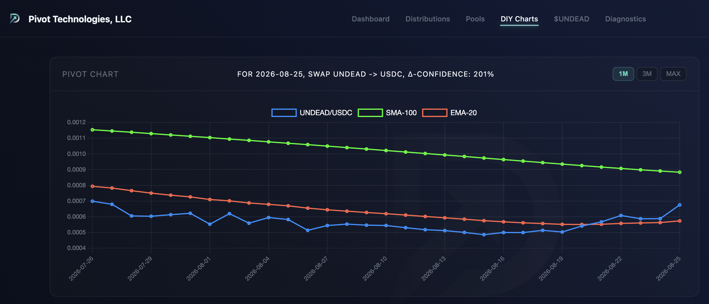
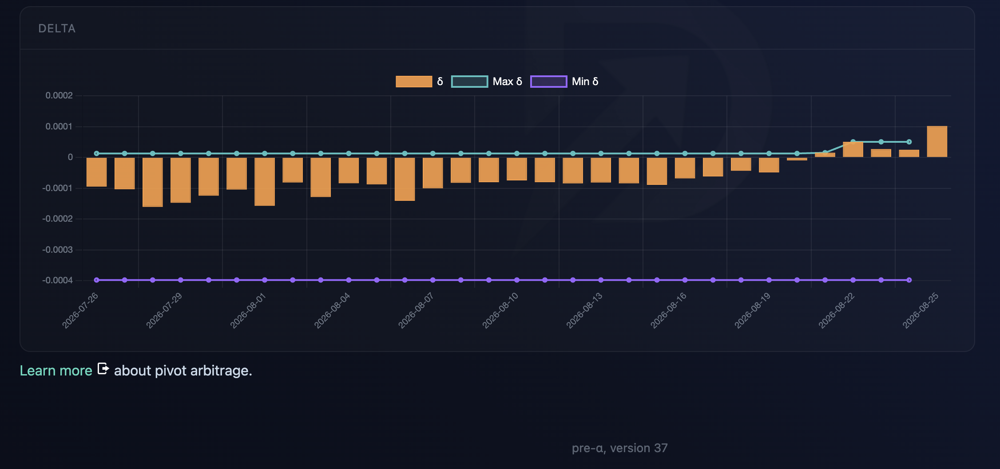
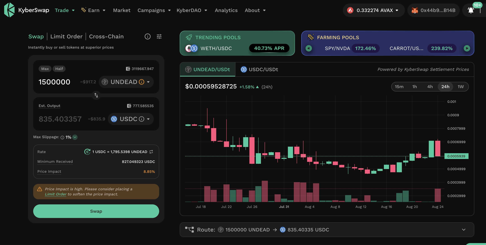
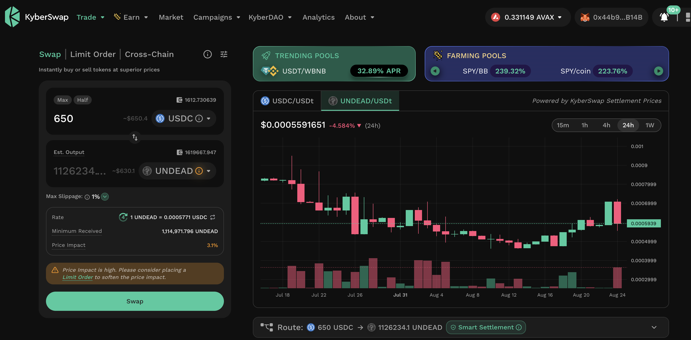

I open both an UNDEAD-on-USDC and a USDC-on-UNDEAD pivots. 

