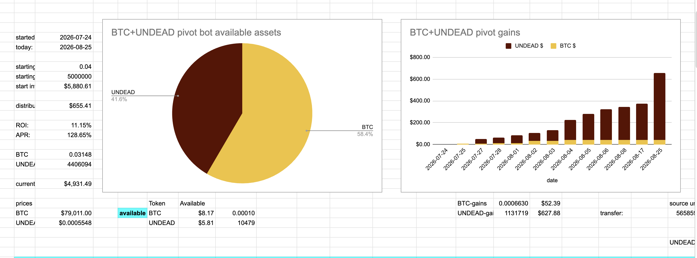
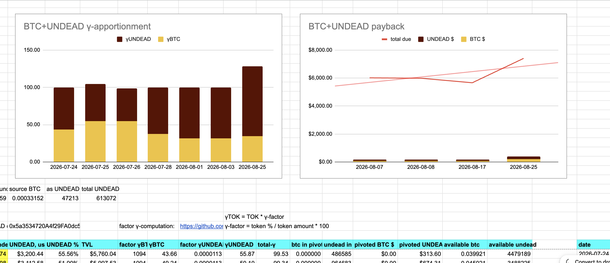
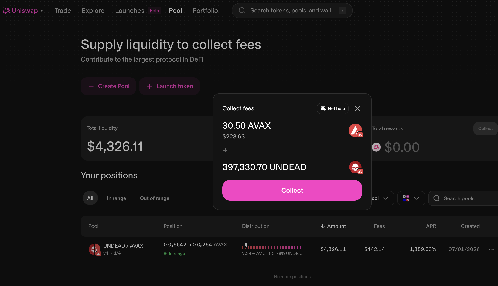
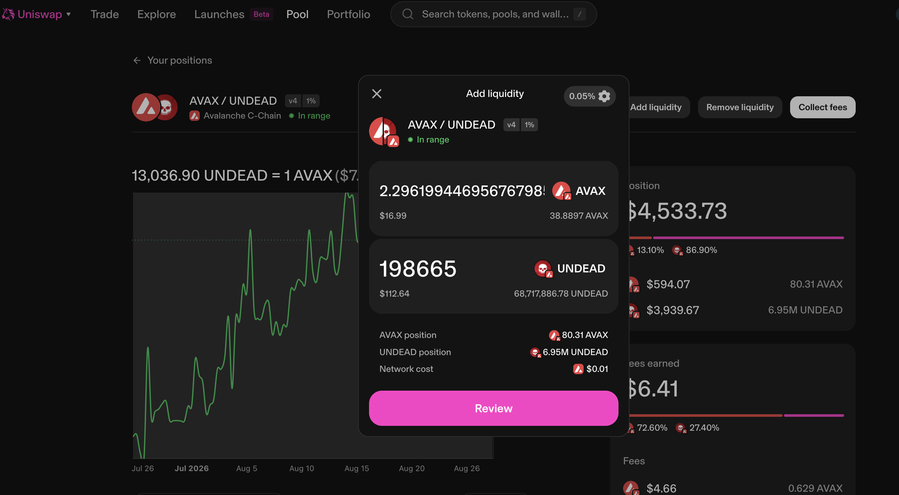

# BTC+UNDEAD automation experiment

## progress report

HWÆT, pivoteurs!

Yesterday I mentioned the protocol is [running an experiment with an automated 
BTC+UNDEAD pivot pool](https://x.com/pivocateur/status/2092177407813824666)

How's it going?

We're making good progress. On a $6,000 pool we've gained ~$700 in pivots in 
the past month.

It will pay for itself.

# $UNDEAD LP

We've been collecting fees on the @Uniswap $UNDEAD LP, thanks, in part, to the 
BTC+UNDEAD automation experiment.

I claim the fees collected and reinvest half to the LP.

The aim is (eventually) to have $1M in the $UNDEAD LP.
