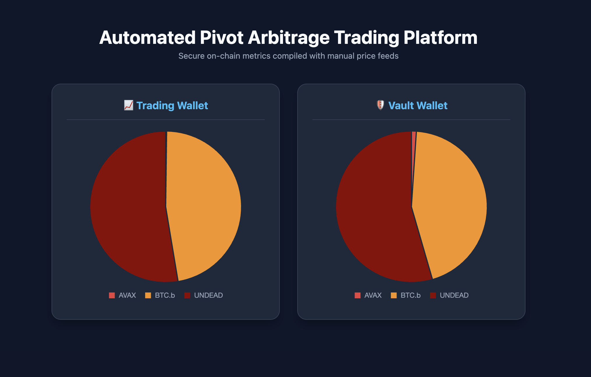
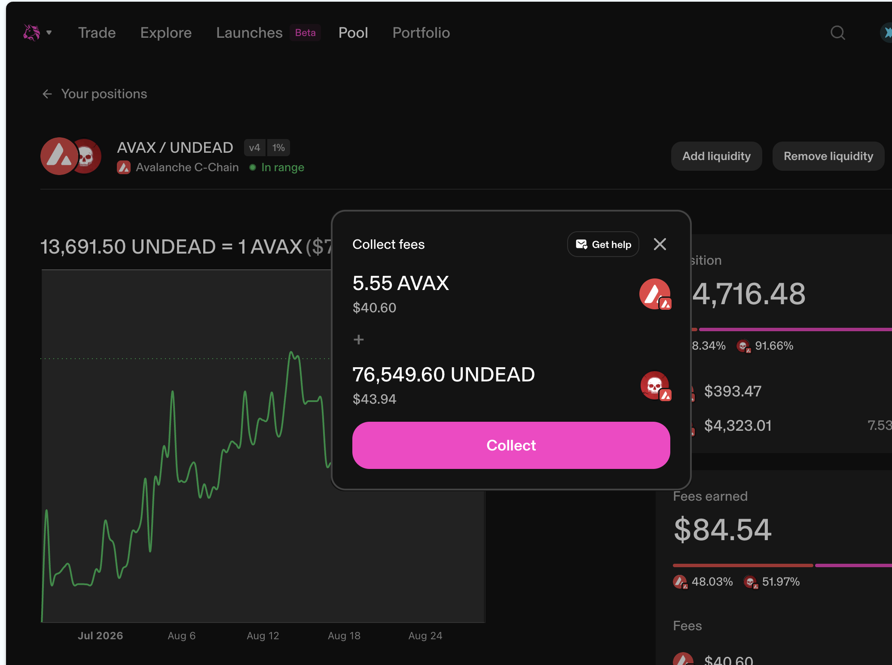
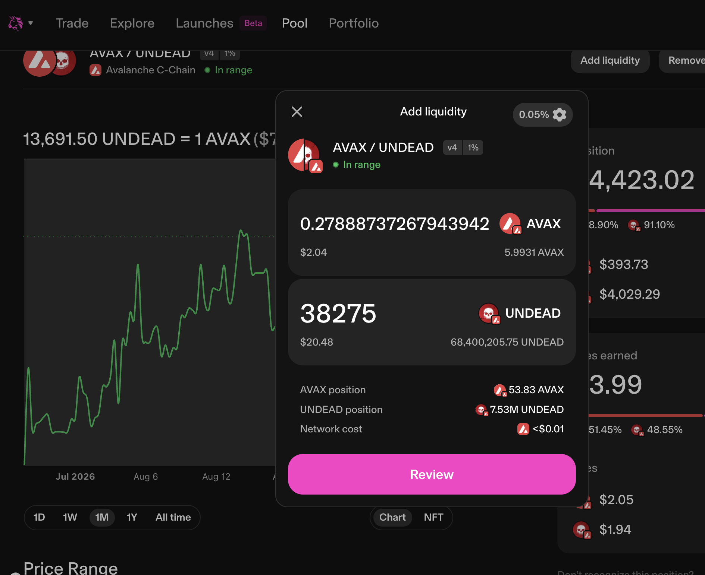

# Automation

HWÆT, pivoteurs!

💥💥 β ANNOUNCEMENT!💥💥

Thanks to the work by @ParisBrand32180, we now have in β-testing a small, 
fully-automated BTC+UNDEAD pivot pool:

* trading, every hour,
* distributing gains, every hour, and
* me, updating spreadsheets... not once.

We are SO close!

# Liquidity Pool

Thanks to automation (above), the @Uniswap $UNDEAD LP has accumulated fees.

I claim those fees and provide some liquidity back to the $UNDEAD LP.

We're working on reducing that slippage for $UNDEAD swaps.

