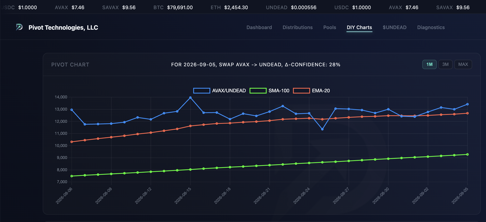
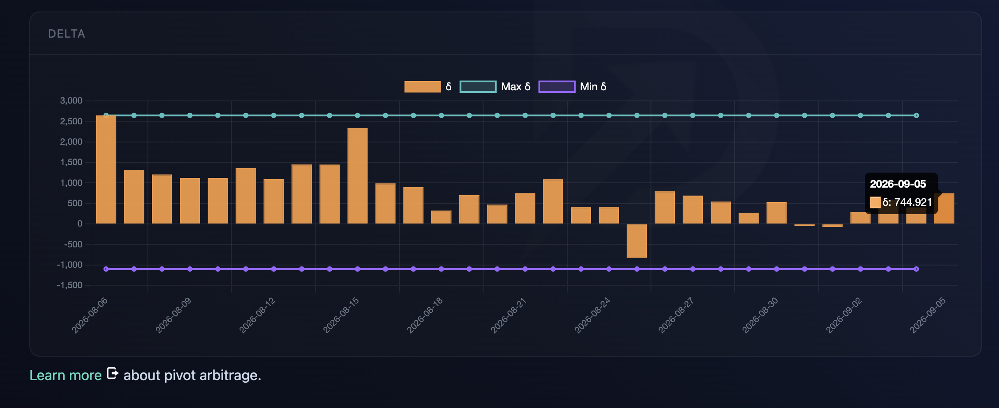
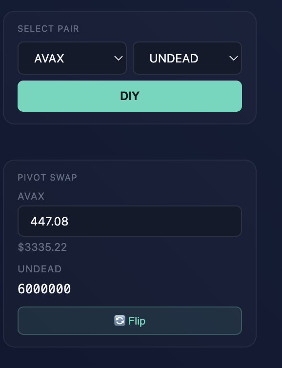
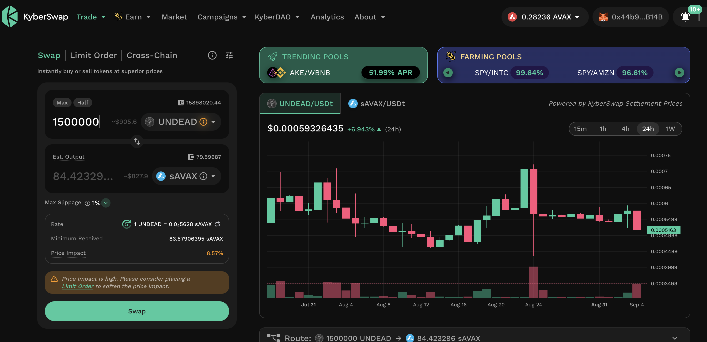
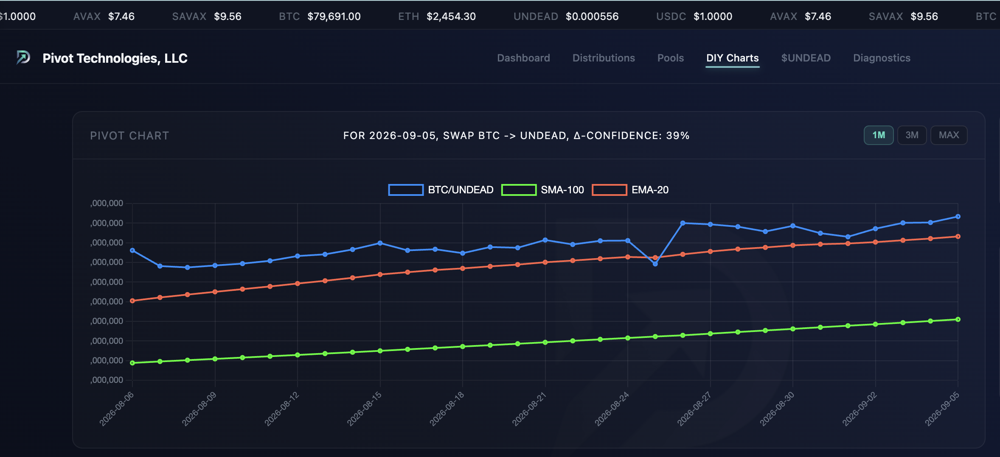
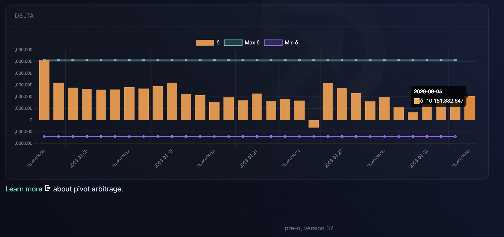
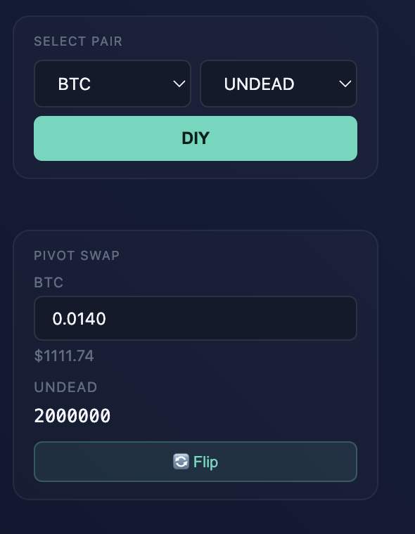
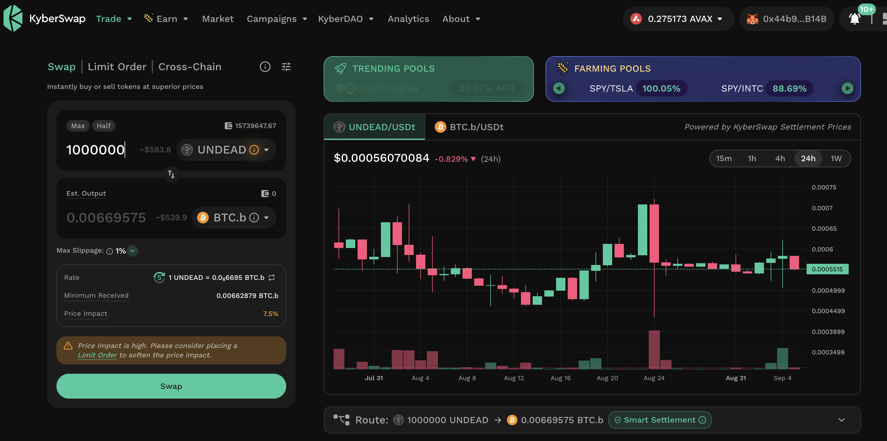

# Pivots

## AVAX+UNDEAD

HWÆT, pivoteurs

I open an AVAX-on-UNDEAD pivot and an UNDEAD-on-AVAX hedge per indicators.

## BTC+UNDEAD

Another new day, another new pivot.

From indicators, I open a BTC-on-UNDEAD pivot and an UNDEAD-on-BTC hedge.
