# Protocol Health

HWÆT, Pivoteurs!

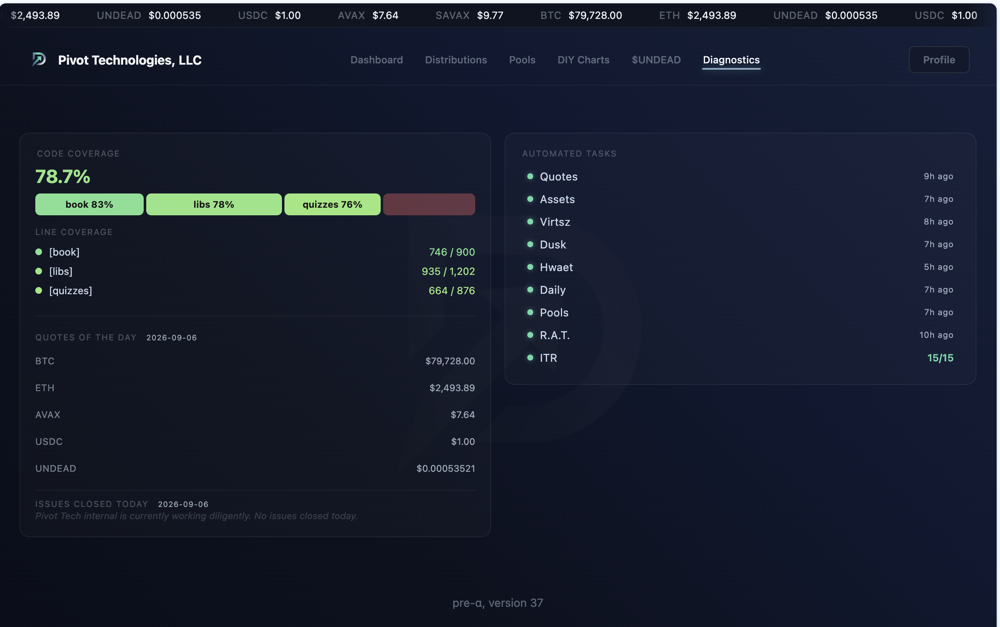
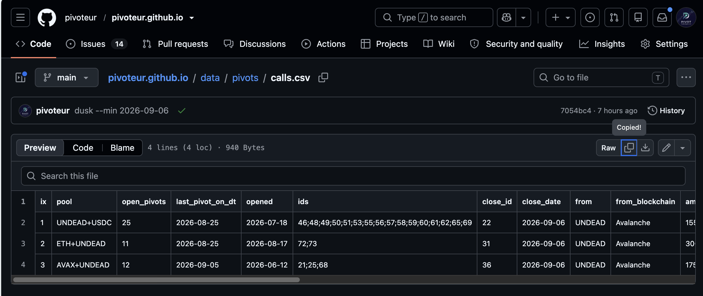

Protocol is operating nominally, giving a set of pivots for today.

Lots of work to be done today, so let's get to work!

# Liquidity Pool

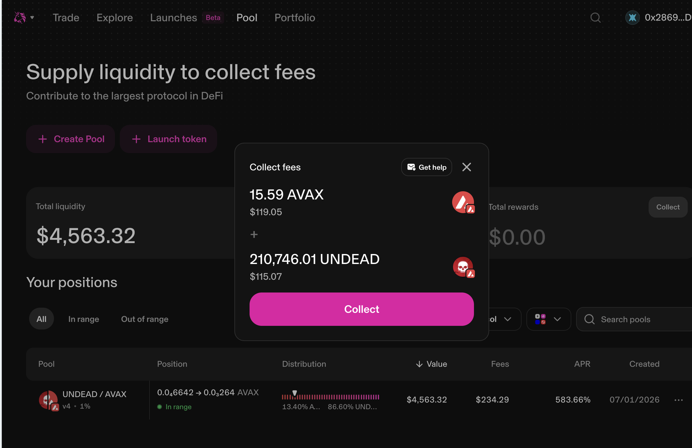
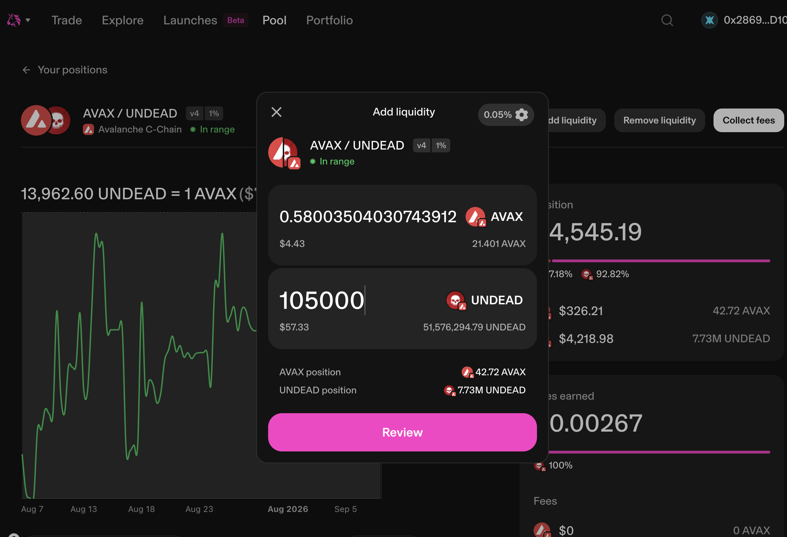

First up, I claim swap-fees from the @Uniswap $UNDEAD LP and provide 
liquidity to that pool to assist in reducing slippage. 

# Pivoting

## ETH+UNDEAD

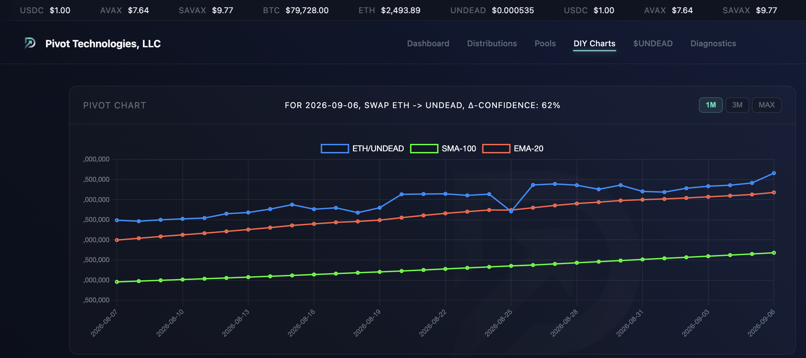
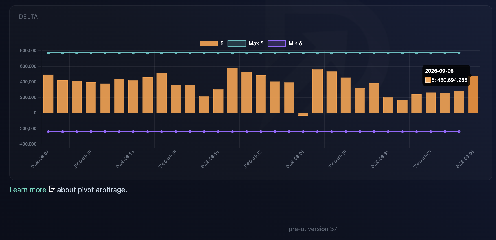
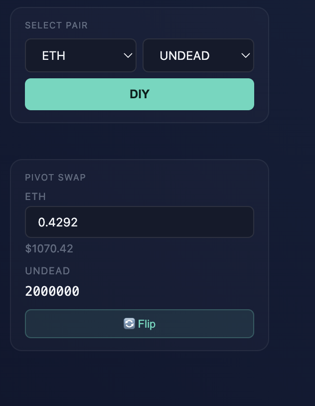
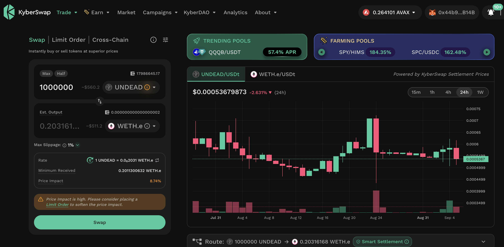

I open an ETH-on-UNDEAD pivot and a UNDEAD-on-ETH hedge. 

## AVAX+UNDEAD

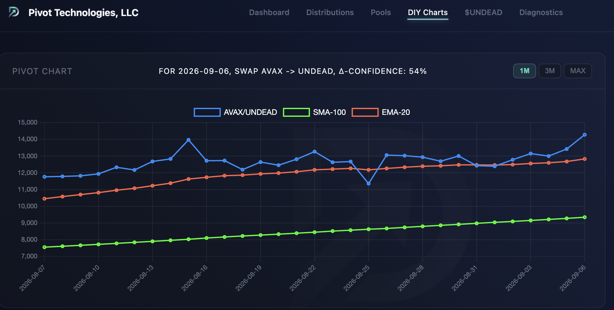
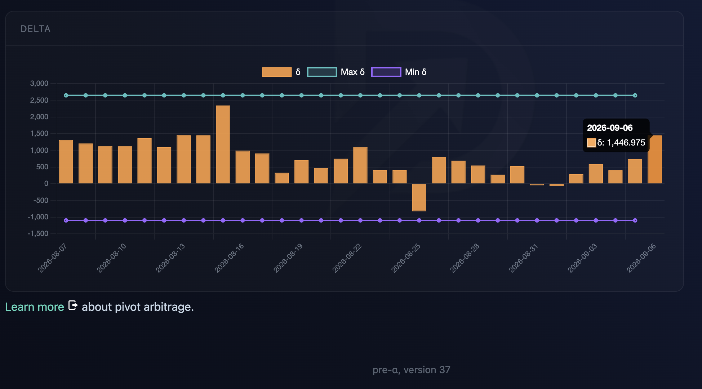
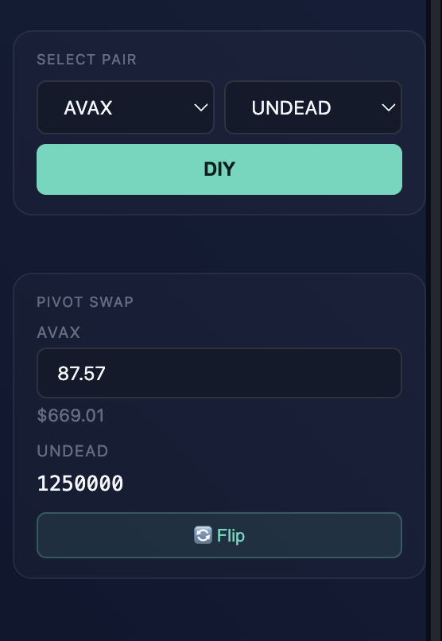
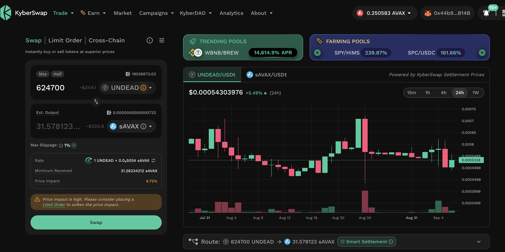

Indicators recommend opening an AVAX-on-UNDEAD pivot, which I do. I also open 
an UNDEAD-on-AVAX hedge. 

# Auto-trading

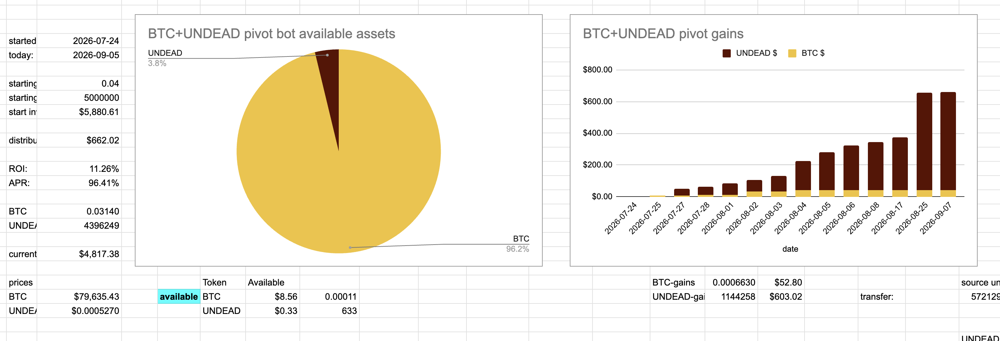

There's a close UNDEAD-on-BTC pivot with gains of:

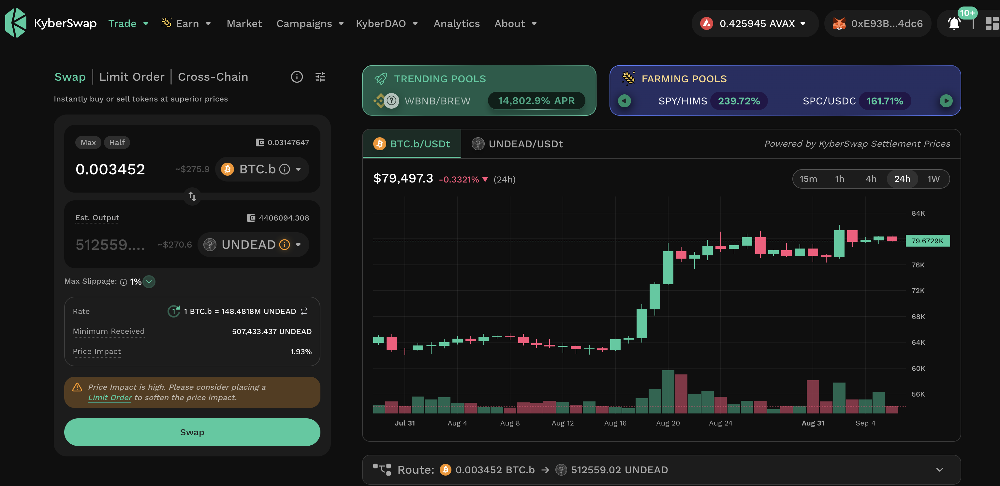

* actual ROI: 2.51% / 71.04% APR projected

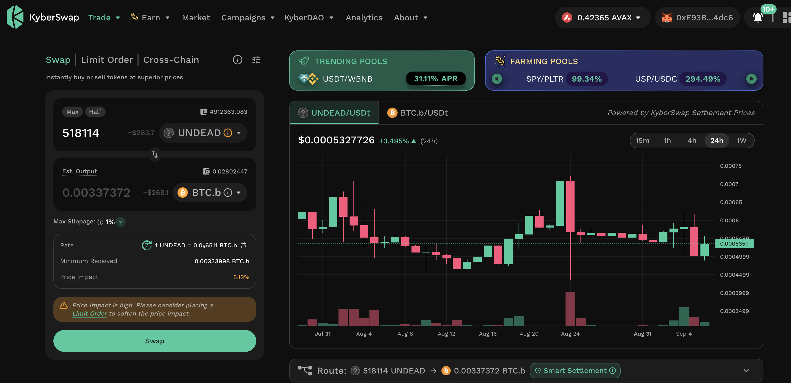

And the system opens an UNDEAD-on-BTC pivot with all remaining UNDEAD. 

