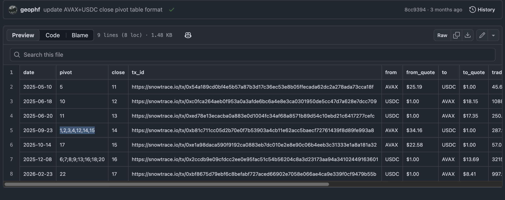

# `convcls` dapp

HWÆT, pivoteurs, and well-met!

`convcls` CONVerts CLoSe pivot tables to the current, new, format that easily 
computes ROIs and APRs.

Usually old close pivot tables separated open pivot ids by the semicolon, but 
some cases they were comma-separated.

`convcls` chokes on this.

## debugging

Actually, debugging shows that the `new_to_actual` column can be a CommaFloat, 
and the parser is choking on the comma.

I'm learning something: every day! 

Progress tracked with [issue
263](https://github.com/pivoteur/protocol/issues/263).

## fix

* `convcls` is now fixed.

# `offrian` dapp

* But now I notice that `offrian` allows counteroffers of more than the 
proposed close, which is not a good thing.

Created an issue and [tracking it
here](https://github.com/pivoteur/protocol/issues/266).

