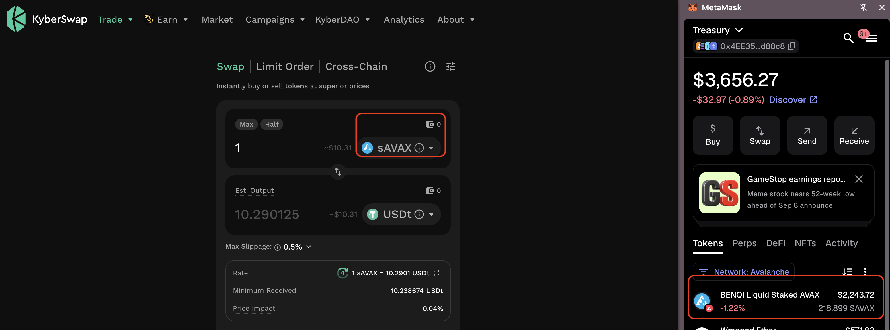
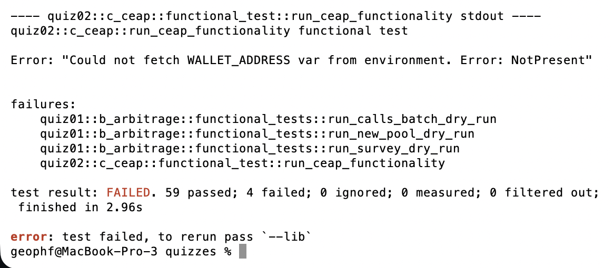

# HWAET

HWÆT, pivoteurs and well-met!

Fun fact: Hwæt is Old English, meaning: "What?" or "Huh?" which is a 
predecessor of the English "Hullo!?" which turned into "Hello."

Well-met is Middle English. The Old English greeting is welcum, which is short 
for: "You come here, well/nicely."

# Wallet balances on Kyber

I currently store my AVAX as sAVAX (for now; that might change going forward). 
Kyber is showing a 0 balance of sAVAX for my wallet, even though I have sAVAX 
in the wallet.

This makes opening new pivots... difficult.

Kyber is looking into this issue. 

# Failing tests

Besides a certain 'masqueð' wallet, I have my own program that queries an 
address-balance on the blockchain, `gelic`, ... and I have my own program that 
trades tokens, `ceap` (pronounced: cart).

Why am I not using them?

I have failing tests.

[Issue 85 on trading-repository](https://github.com/pivoteur/trading/issues/85)

