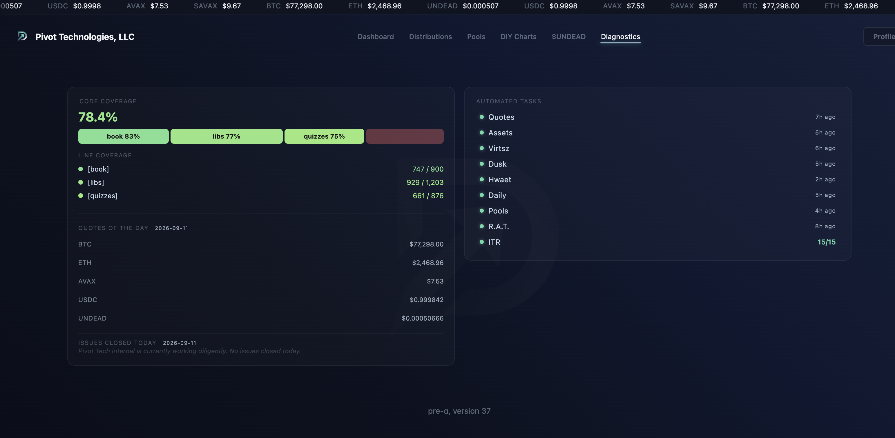
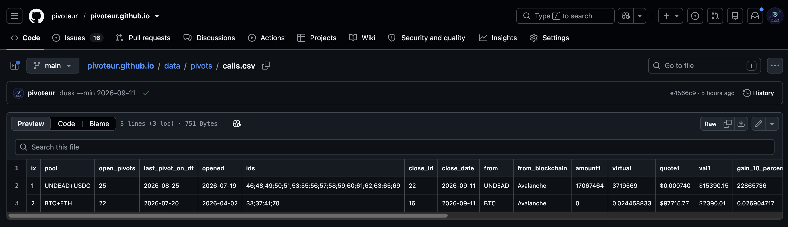

# Update

HWÆT, pivoteurs, and well-met!

I've spent the last three days head-down in the code, and I still haven't 
come up for air, but, whilst doing that, the protocol is up and it is 
recommending calls, so let's look at those today, as well as continuing to 
code to improve automation.

